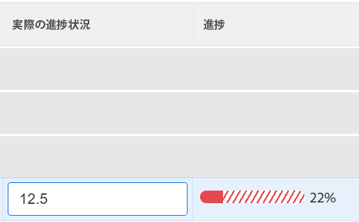

# Adobe Workfront Goals での問題の発生している目標の確認

<!--

(NOTE: the status of goals in "red" used to be called At Risk. Now, it is "in trouble") 

-->

問題の進行を伴う目標は達成されない危険があり、Adobe Workfront目標では赤いプログレスバーで表されます。 目標を頻繁に確認し、進行が遅れている理由を理解する必要があります。 目標の進捗について詳しくは、 [Adobe Workfront目標の目標の達成状況と条件の概要](../../workfront-goals/goal-management/calculate-goal-progress.md).

## アクセス要件

<!--drafted for P&P release: replace the existing requirements with this:

You must have the following: 

<table style="table-layout:auto">
 <col>
 </col>
 <col>
 </col>
 <tbody>
  <tr>
   <td role="rowheader">Adobe Workfront plan*</td>
   <td>
   
Current plan: Select or higher

   Or
   
Legacy plan: Pro or higher

   
   </td>
  </tr>
  <tr>
   <td role="rowheader">Adobe Workfront license*</td>
   <td>
   
Current license: Contributor or higher

   Or
   
Legacy license: Request or higher
 
For more information, see <a href="../../administration-and-setup/add-users/access-levels-and-object-permissions/wf-licenses.md" class="MCXref xref">Adobe Workfront licenses overview</a>.
 </td>
  </tr>
  <tr>
   <td role="rowheader">Product</td>
   <td>
   
 Current product requirement: If you have the Select or Prime Adobe Workfront plan, you must also buy an additional Adobe Workfront Goals license.  Workfront Goals are included in the Ultimate Workfront Plan.

   Or
   
Legacy product requirement: You must purchase an additional license for the Adobe Workfront Goals to access functionality described in this article. 
 
For information, see <a href="../../workfront-goals/goal-management/access-needed-for-wf-goals.md" class="MCXref xref">Requirements to use Workfront Goals</a>. 
 </td>
  </tr>
  <tr>
   <td role="rowheader">Access level*</td>
   <td> 
Edit access to Goals
 
<b>NOTE</b>
If you still don't have access, ask your Workfront administrator if they set additional restrictions in your access level. For information on how a Workfront administrator can change your access level, see:

     <ul>
      <li> 
<a href="../../administration-and-setup/add-users/configure-and-grant-access/create-modify-access-levels.md" class="MCXref xref">Create or modify custom access levels</a> 
 </li>
      <li> 
<a href="../../administration-and-setup/add-users/configure-and-grant-access/grant-access-goals.md" class="MCXref xref">Grant access to Adobe Workfront Goals</a> 
 </li>
     </ul> 
 </td>
  </tr>
  <tr data-mc-conditions="">
   <td role="rowheader">Object permissions</td>
   <td>
    

     
View or higher permissions to the goal to view it

     
Manage permissions to the goal to edit it

     
For information about sharing goals, see <a href="../../workfront-goals/workfront-goals-settings/share-a-goal.md" class="MCXref xref">Share a goal in Workfront Goals</a>. 

    
 </td>
  </tr>
 </tbody>
</table>

-->

以下が必要です。

<table style="table-layout:auto"> 
 <col> 
 <col> 
 <tbody> 
  <tr> 
   <td role="rowheader">Adobe Workfront plan*</td> 
   <td> 
Pro 以上
 </td> 
  </tr> 
  <tr> 
   <td role="rowheader">Adobe Workfront license*</td> 
   <td> 
リクエスト以上
 
詳しくは、 <a href="../../administration-and-setup/add-users/access-levels-and-object-permissions/wf-licenses.md" class="MCXref xref">Adobe Workfrontライセンスの概要</a>.
 </td> 
  </tr> 
  <tr> 
   <td role="rowheader">製品</td> 
   <td> 
この記事で説明する機能にアクセスするには、 Adobe Workfront Goals の追加ライセンスを購入する必要があります。 
 
詳しくは、 <a href="../../workfront-goals/goal-management/access-needed-for-wf-goals.md" class="MCXref xref">Workfront目標の使用要件</a>. 
 </td> 
  </tr> 
  <tr> 
   <td role="rowheader">アクセスレベル設定*</td> 
   <td> 
目標以降へのアクセスを編集
 
<b>メモ</b>
まだアクセス権がない場合は、Workfront管理者に、アクセスレベルに追加の制限を設定しているかどうかを問い合わせてください。 Workfront管理者がアクセスレベルを変更する方法について詳しくは、以下を参照してください。
 
     <ul> 
      <li> 
<a href="../../administration-and-setup/add-users/configure-and-grant-access/create-modify-access-levels.md" class="MCXref xref">カスタムアクセスレベルの作成または変更</a> 
 </li> 
      <li> 
<a href="../../administration-and-setup/add-users/configure-and-grant-access/grant-access-goals.md" class="MCXref xref">Adobe Workfront目標へのアクセス権の付与</a> 
 </li> 
     </ul> 
 </td> 
  </tr> 
  <tr data-mc-conditions=""> 
   <td role="rowheader">オブジェクト権限</td> 
   <td> 
    
 
     
目標に対する権限の管理
 
     
目標の共有について詳しくは、 <a href="../../workfront-goals/workfront-goals-settings/share-a-goal.md" class="MCXref xref">Workfront目標での目標の共有</a>. 
 
    
 </td> 
  </tr> 
 </tbody> 
</table>

&#42;保有しているプラン、ライセンスの種類、アクセス権を確認するには、Workfront管理者に問い合わせてください。

## 前提条件

を起動する前に、次の条件を満たす必要があります。

* メインメニューの目標領域を含むレイアウトテンプレート。

## Recommendations：トラブルの進行に達する目標を防ぐため

目標が問題の進行に達する前に、頻繁に監視し、リスクが高い状態の進行に達した場合にその進捗を調整することができます。 危険な目標は困難に陥る恐れがある。 目標の進捗について詳しくは、 [Adobe Workfront目標の目標の達成状況と条件の概要](../../workfront-goals/goal-management/calculate-goal-progress.md)

目標が「問題あり」の進行に達する前に、以下をお勧めします。

* 多くの場合、自分に割り当てられる「リスクが高い」条件を持つ目標と、自分のチーム、グループまたは自分の組織に割り当てられ、目標の進捗に影響を受ける可能性のある組織の目標をレビューします。 危険な目標は問題の中の目標になる危険性にある。 危険度の高い目標は、黄色のプログレスバーで示されます。 目標リストを使用して、自分、チーム、グループまたは組織に属する目標を表示します。

## 目標リストで問題のある目標を確認

目標は、Workfront目標の任意のセクションで確認できます。 Workfront目標の節について詳しくは、 [「Adobe Workfront目標」セクションの概要](../../workfront-goals/goal-review-and-workfront-goals-sections/overview-of-wf-goals-sections.md).

この記事では、目標リストで目標を確認する方法について説明します。

1. 次をクリック： **メインメニュー** アイコン  > **目標** をクリックします。

   <!-- Add this when Shell is available to all: or (if available), click the **Main Menu** icon  in the upper-left corner)
   -->

   「 Workfront目標」領域が開き、デフォルトで「目標リスト」セクションが表示されます。

1. （推奨）「目標リスト」領域で以下のフィルターを調整して、リスクの高い目標を確認します。

   * クリック **会社**&#x200B;を、 **マイチーム**&#x200B;を、 **マイグループ**&#x200B;を、 **個人** 目標を設定して、組織、チーム、グループおよび自分の目標に属する目標を表示します。

      >[!TIP]
      >
      >「Adobe Workfront目標」では、「会社」フィルターに、組織が所有者として選択された目標が表示されます。
      >
      >
      >このフィールドを使用して会社を検索することはできません。 デフォルトでは、Workfrontインスタンスの所有者である組織のみが選択されています。

   * 上で選択した各組織単位で、 **新しいフィルター** > **進行状況** > **トラブル状態** >**適用**
   * （オプション）目標を表示する期間を選択します。

      目標リスト内の各目標について、進行状況バーのインジケーターが赤で表示されます。

      右パネルにある他のすべての条件を使用した目標のフィルタリングについて詳しくは、 [Adobe Workfront目標での情報のフィルター](../../workfront-goals/goal-management/filter-information-wf-goals.md).

1. 進行状況バーのインジケーターの上にマウスポインターを置くと、実際の進行状況の割合と、現在の日の期待値が表示されます。

   

1. （オプション）フィルターを使用して、特定の所有者に属する目標を検索します。

   選択したユーザーのトラブル内目標が目標リストに表示されます。

1. 目標名をクリックして目標ページを開き、「 **進行状況インジケーター** をクリックします。 目標を達成する前に目標を表示し、指標の進行状況を **実際の進捗状況** 「進行状況指標」リストの列

   結果とアクティビティの更新について詳しくは、 [Adobe Workfront目標での目標の進捗状況の更新](../goal-review-and-workfront-goals-sections/check-in-goals.md)

   

   >[!NOTE]
   >
   >進行状況インジケーターリストでは、結果とアクティビティのみを更新できます。 子の目標の進捗状況インジケーターを更新するには、目標にアクセスし、接続されたプロジェクトのタスクを更新して、プロジェクトの進捗状況を更新する必要があります。

