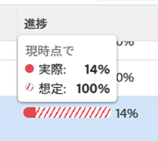

# Adobe Workfront Goals でイシューがある目標を確認

<!--Audited: 4/2025-->

<!--

(NOTE: the status of goals in "red" used to be called At Risk. Now, it is "in trouble") 

-->

進捗が「トラブル発生中」と表示された目標は達成されない危険性があり、Adobe Workfront Goals では赤い進捗バーで表示されます。目標を頻繁に確認し、進行が遅れている理由を理解する必要があります。目標の進行状況について詳しくは、[Adobe Workfront Goals の目標の進行状況と条件の概要](../../workfront-goals/goal-management/calculate-goal-progress.md)を参照してください。

## アクセス要件

+++ 展開すると、この記事の機能のアクセス要件が表示されます。

以下が必要です。

<table style="table-layout:auto">
<col>
</col>
<col>
</col>
<tbody>
 <tr> 
   <td role="rowheader">Adobe Workfront プラン*</td> 
   <td> 
   
新しいプランとライセンス構造の場合：
  <ul><li>Ultimateプラン </li></ul>
   

現在のプランおよびライセンス構造の場合： 
<ul><li> プロまたはそれ以上 </li>
  <li>Workfront ライセンスに加えて、Adobe Workfront Goals ライセンス。</li></ul>

   </td> 
  </tr>
 <tr>
 <td role="rowheader">Adobe Workfront プラン*</td>
 <td>
 
新規ライセンス：コントリビューター以上

 または
 
現在のライセンス：リクエスト以上
 
詳しくは、<a href="../../administration-and-setup/add-users/access-levels-and-object-permissions/wf-licenses.md" class="MCXref xref">Adobe Workfront ライセンスの概要</a>を参照してください。
 </td>
 </tr>
 <tr>
 <td role="rowheader">製品*</td>
 <td>
  
 新しい製品要件：Workfront

  または
  
現在の製品要件：Workfront ライセンスに加えて、Adobe Workfront Goals のライセンスを購入する必要があります。 
 
詳しくは、<a href="../../workfront-goals/goal-management/access-needed-for-wf-goals.md" class="MCXref xref">Workfront Goals の使用要件</a>を参照してください。 
 </td>
 </tr>
 <tr>
 <td role="rowheader">アクセスレベル</td>
 <td> 
Goals への編集アクセス権
</td>
 </tr>
 <tr data-mc-conditions="">
 <td role="rowheader">オブジェクト権限</td>
 <td>
  

  
目標の表示には表示権限以上が必要

  
目標に対する編集権限を管理

  
目標の共有について詳しくは、<a href="../../workfront-goals/workfront-goals-settings/share-a-goal.md" class="MCXref xref">Workfront Goals での目標の共有</a>を参照してください。 

  
 </td>
 </tr>
 <tr>
   <td role="rowheader">
レイアウトテンプレート
</td>
   <td> 
Workfront 管理者を含むすべてのユーザーには、メインメニューに「目標」エリアが含まれるレイアウトテンプレートを割り当てる必要があります。 
  
</td>
  </tr>
</tbody>
</table>

*詳しくは、[Workfront ドキュメントのアクセス要件](/help/quicksilver/administration-and-setup/add-users/access-levels-and-object-permissions/access-level-requirements-in-documentation.md)を参照してください。

+++

## 目標が「トラブル発生中」の進行状況に至ることを防ぐための推奨事項

目標が、「トラブル発生中」の進行状況に至る前に、頻繁にモニタリングして、「危険あり」の進行状況になったときに、その進行状況を調整することができます。「危険あり」の目標は「トラブル発生中」の進行状況に至る恐れがあります。目標の進行状況について詳しくは、[Adobe Workfront Goals の目標の進行状況と条件の概要](../../workfront-goals/goal-management/calculate-goal-progress.md)を参照してください。

目標が「トラブル発生中」の進行状況に至る前に、次のことをお勧めします。

* 多くの場合、自分の目標の進行状況によって影響を受ける可能性のある、自分に割り当てられた「危険あり」の状況の目標とチーム、グループ、または組織に割り当てられた組織目標も確認します。「リスクあり」の目標は「トラブル発生中」の目標になる恐れがあります。「リスクあり」の目標は、黄色の進行状況バーで表示されます。目標リストを使用して、自分、チーム、グループまたは組織に属する目標を表示します。

## 目標リストで「トラブル発生中」の目標を確認

目標は、Workfront Goals のどのセクションでも確認できます。Workfront Goals のセクションについて詳しくは、[Adobe Workfront Goals セクションの概要](../../workfront-goals/goal-review-and-workfront-goals-sections/overview-of-wf-goals-sections.md)を参照してください。

この記事では、目標リストで目標を確認する方法について説明します。

1. 右上隅の **メインメニュー** アイコン /**目標** をクリックします。

   <!-- Add this when Shell is available to all: or (if available), click the **Main Menu** icon  in the upper-left corner)
   -->

   Workfront Goal エリアが開き、デフォルトで「目標リスト」セクションが表示されます。

1. （推奨）目標リストのエリアで、以下のフィルターを調整して、「リスクあり」の目標を確認します。

   * **会社情報**／**マイチーム**／**マイグループ**／**個人**&#x200B;の順にクリックすると、組織、チーム、グループおよび自分の目標の順に表示されます。

     >[!TIP]
     >
     >Adobe Workfront Goals では、会社情報フィルターに、組織が所有者として選択されている目標が表示されます。
     >
     >
     >このフィールドを使用して会社を検索することはできません。デフォルトでは、Workfront インスタンスの所有者である組織のみが選択されます。

   * 上記で選択した各組織の単位で、**新しいフィルター**／**進捗**／**トラブル発生中**／**適用**&#x200B;の順でクリックします。
   * （オプション）目標を表示する期間を選択します。

     目標リスト内の各目標について、進行状況バーのインジケーターが赤で表示されます。

     右側のパネルにある他のすべての条件を使用した目標のフィルタリングに関して詳しくは、[Adobe Workfront Goalsでの情報のフィルター](../../workfront-goals/goal-management/filter-information-wf-goals.md)を参照してください。

1. 進行状況バーのインジケーターの上にポインタを合わせると、実際の進行状況の割合と、今日の期待値が表示されます。

   

1. （オプション）フィルターを使用して、特定の所有者に属する目標を検索します。

   選択したユーザーのトラブル中の目標が、目標リストに表示されます。

1. 目標名をクリックして目標ページを開き、左側のパネルで&#x200B;**進捗状況インジケーター**&#x200B;をクリックします。どの進行状況インジケーターが目標の遅れを引き起こしているかを表示し、進捗状況インジケーターリストの&#x200B;**実際の進行状況**&#x200B;の列で、インジケーターの進行状況をインラインでアップデートします。

   結果とアクティビティのアップデートについて詳しくは、[Adobe Workfront Goals での目標の進行状況のアップデート](../goal-review-and-workfront-goals-sections/check-in-goals.md)を参照してください。

   

   >[!NOTE]
   >
   >進捗状況インジケーターリストでは、結果とアクティビティのみをアップデートすることができます。子の目標の進捗状況インジケーターをアップデートするには、目標にアクセスし、接続されたプロジェクトのタスクをアップデートして、プロジェクトの進行状況をアップデートする必要があります。

