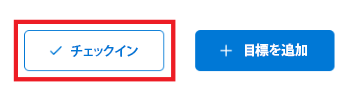
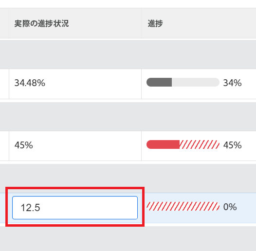

# Adobe Workfront目標での目標の進捗状況の更新

目標を定期的に確認し、進捗を更新して、目標が遅れていないか、達成されない危険が生じていないかを確認する必要があります。

<!--And: take this last sentence ^^ out when you update this for goal redesign production.-->

## アクセス要件

<!--drafted for P&P release:

You must have the following: 

<table style="table-layout:auto">
 <col>
 </col>
 <col>
 </col>
 <tbody>
  <tr>
   <td role="rowheader">Adobe Workfront plan*</td>
   <td>
   
Current plan: Select or higher

   Or
   
Legacy plan: Pro or higher

   
   </td>
  </tr>
  <tr>
   <td role="rowheader">Adobe Workfront license*</td>
   <td>
   
Current license: Contributor or higher

   Or
   
Legacy license: Request or higher
 
For more information, see <a href="../../administration-and-setup/add-users/access-levels-and-object-permissions/wf-licenses.md" class="MCXref xref">Adobe Workfront licenses overview</a>.
 </td>
  </tr>
  <tr>
   <td role="rowheader">Product</td>
   <td>
   
 Current product requirement: If you have the Select or Prime Adobe Workfront plan, you must also buy an additional Adobe Workfront Goals license.  Workfront Goals are included in the Ultimate Workfront Plan.

   Or
   
Legacy product requirement: You must purchase an additional license for the Adobe Workfront Goals to access functionality described in this article. 
 
For information, see <a href="../../workfront-goals/goal-management/access-needed-for-wf-goals.md" class="MCXref xref">Requirements to use Workfront Goals</a>. 
 </td>
  </tr>
  <tr>
   <td role="rowheader">Access level*</td>
   <td> 
Edit access to Goals
 
<b>NOTE</b>
If you still don't have access, ask your Workfront administrator if they set additional restrictions in your access level. For information on how a Workfront administrator can change your access level, see:

     <ul>
      <li> 
<a href="../../administration-and-setup/add-users/configure-and-grant-access/create-modify-access-levels.md" class="MCXref xref">Create or modify custom access levels</a> 
 </li>
      <li> 
<a href="../../administration-and-setup/add-users/configure-and-grant-access/grant-access-goals.md" class="MCXref xref">Grant access to Adobe Workfront Goals</a> 
 </li>
     </ul> 
 </td>
  </tr>
  <tr data-mc-conditions="">
   <td role="rowheader">Object permissions</td>
   <td>
    

     
View or higher permissions to the goal to view it

     
Manage permissions to the goal to edit it

     
For information about sharing goals, see <a href="../../workfront-goals/workfront-goals-settings/share-a-goal.md" class="MCXref xref">Share a goal in Workfront Goals</a>. 

    
 </td>
  </tr>
 </tbody>
</table>

-->

以下が必要です。

<table style="table-layout:auto"> 
 <col> 
 <col> 
 <tbody> 
  <tr> 
   <td role="rowheader">Adobe Workfront plan*</td> 
   <td> 
Pro 以上
 </td> 
  </tr> 
  <tr> 
   <td role="rowheader">Adobe Workfront license*</td> 
   <td> 
リクエスト以上
 
詳しくは、 <a href="../../administration-and-setup/add-users/access-levels-and-object-permissions/wf-licenses.md" class="MCXref xref">Adobe Workfrontライセンスの概要</a>.
 </td> 
  </tr> 
  <tr> 
   <td role="rowheader">製品</td> 
   <td> 
この記事で説明する機能にアクセスするには、 Adobe Workfront Goals の追加ライセンスを購入する必要があります。 
 
詳しくは、 <a href="../../workfront-goals/goal-management/access-needed-for-wf-goals.md" class="MCXref xref">Workfront目標の使用要件</a>. 
 </td> 
  </tr> 
  <tr> 
   <td role="rowheader">アクセスレベル設定*</td> 
   <td> 
目標以降へのアクセスを編集
 
<b>メモ</b>
まだアクセス権がない場合は、Workfront管理者に、アクセスレベルに追加の制限を設定しているかどうかを問い合わせてください。 Workfront管理者がアクセスレベルを変更する方法について詳しくは、以下を参照してください。
 
     <ul> 
      <li> 
<a href="../../administration-and-setup/add-users/configure-and-grant-access/create-modify-access-levels.md" class="MCXref xref">カスタムアクセスレベルの作成または変更</a> 
 </li> 
      <li> 
<a href="../../administration-and-setup/add-users/configure-and-grant-access/grant-access-goals.md" class="MCXref xref">Adobe Workfront目標へのアクセス権の付与</a> 
 </li> 
     </ul> 
 </td> 
  </tr> 
  <tr data-mc-conditions=""> 
   <td role="rowheader">オブジェクト権限</td> 
   <td> 
    
 
     
目標に対する権限の管理
 
     
目標の共有について詳しくは、 <a href="../../workfront-goals/workfront-goals-settings/share-a-goal.md" class="MCXref xref">Workfront目標での目標の共有</a>. 
 
    
 </td> 
  </tr> 
 </tbody> 
</table>

*保有するプラン、ライセンスの種類、アクセス権を確認するには、Workfront管理者にお問い合わせください。

## 前提条件

を起動する前に、次の条件を満たす必要があります。

* メインメニューの目標領域を含むレイアウトテンプレート。
* アクティブな目標。 ドラフト、非アクティブまたはクローズ済みの目標に関する進捗を更新することはできません。

## 目標を更新する際の考慮事項

目標の進捗状況を更新する際は、以下の点を考慮してください。

* Workfront目標の進行状況インジケーターの進行状況を更新すると、目標の進行状況が自動的に計算されます。

   >[!TIP]
   >
   >目標に関する進捗を直接更新することはできません。 目標の進捗状況インジケーター（アクティビティ、結果、接続されたプロジェクト）の進捗状況を更新し、目標の進捗状況を更新する必要があります。 プロジェクトの進捗状況を更新するには、プロジェクトのタスクを更新する必要があります。

   次の記事も参照してください。

   * アクティビティを目標に追加する方法について詳しくは、 [Adobe Workfront目標での目標へのアクティビティの追加](../../workfront-goals/results-and-activities/add-activities-to-goals.md).
   * 目標に結果を追加する方法について詳しくは、 [Adobe Workfront目標の目標に結果を追加](../../workfront-goals/results-and-activities/add-results-to-goals.md).
   * Workfront目標での目標の進捗状況の計算方法について詳しくは、 [Adobe Workfront目標の目標の達成状況と条件の概要](../../workfront-goals/goal-management/calculate-goal-progress.md).

* 進行状況を更新する前に、目標を作成してアクティブ化する必要があります。

   次の記事も参照してください。

   * 目標の作成について詳しくは、 [Adobe Workfront目標での目標の作成](../../workfront-goals/goal-management/create-goals.md).
   * 目標のアクティブ化について詳しくは、 [Adobe Workfront目標で目標を有効化](../../workfront-goals/goal-management/activate-goals.md).

   >[!IMPORTANT]
   >
   >下書き、クローズまたは非アクティブになっている目標の進捗状況は更新できません。

* 目標に関する結果やアクティビティの進行状況を初めて更新する場合、「新規目標からの進行状況の変更」と「Workfront目標」の目標が進行状況の記録と目標に関する進捗状況の更新を開始します。

<!--

## Update goal progress by using Check-in in the Production environment

>[!IMPORTANT]
>
>  The Check-in functionality has been removed from the Preview environment and will be removed from Workfront Goals with the 23.1 release. See the [Update goal progress in the Preview environment](#update-goal-progress-in-the-preview-environment) section in this article to update goal progress in Preview. 

You can check in on goals at the individual goal level, or you can check in on multiple goals from the Check-in section of Workfront Goals.

* [Update individual goals](#update-individual-goals) 
* [Update goals in the Check-in section](#update-goals-in-the-check-in-section)

### Update individual goals {#update-individual-goals}

When you check in on a goal at the goal level, you can update the progress of the results and activities that are assigned to you or other users.

For information about how to update additional information about results and activities, see [Edit results and activities in Adobe Workfront Goals](../../workfront-goals/results-and-activities/edit-results-and-activities.md).

1. Click the **Main Menu** icon  > **Goals** in the upper-right corner.

   (!-- Add this when Shell is available to all: or (if available), click the **Main Menu** icon  in the upper-left corner)
   --)

   This opens the Workfront Goals area.

   All goals display by default. 

1. (Optional) Click any of the following sections in the left panel to access a list of goals:

   * Goal Alignment 
   * Pulse 
   * Check-in

   Or

   From the Goal List, click the name of a goal to open the **Goal Details** panel on the right.

   >[!TIP]
   >
   >You must have Edit access to Goals in your Access Level to view the Check-in section or the Check in button.

1. Click **Check in**.

   

   The progress of results and activities becomes editable.

1. Update the current progress on each of the results. Depending on what type of result you selected, you can do one of the following:

   * Update the quantity 
   * Update the currency amount
   * Update the percent complete

1. Update the percent complete on the Manual progress bar activity.

   >[!TIP]
   >
   >When you add projects as activities to your goals, you cannot manually update projects at the goal level. Workfront automatically updates project progress based on the project of their tasks. When the project percent complete updates in Workfront, the goal progress associated with the project also updates automatically.

1. Click **Back to Summary** to return to the Goal Details panel.

   Your goal progress updates as you update the results and activities of your goal. 

1. Click the **X icon** in the upper-right corner of the Goal Details panel to close it.

### Update goals in the Check-in section {#update-goals-in-the-check-in-section}

You can use the Check-in section to check in on goals when you want to quickly provide updates for several goals at the same time.

>[!TIP]
>
>You can access the Check-in section from any of the following sections:
>
>* Goal List 
>* Goal Alignment 
>* Pulse 
>

When you check in on a goal in the Check-in section, you can update the progress of the results and activities that are assigned only to you. You cannot update the progress of results and activities that are assigned to other users in this section.

1. Click the **Main Menu** icon  > **Goals** in the upper-right corner.

   (!-- Add this when Shell is available to all: or (if available), click the **Main Menu** icon  in the upper-left corner)
   --)

   This opens the Workfront Goals area and the Goal List section displays by default. 

1. Click Check-in in the left panel.

   Or

   (Conditional) If you are in the Goal List, Goal Alignment, or Pulse sections, click the **Check in** button in the upper-right of the screen. This opens the Check-in section.

   

   Goals display in a list and results and activities are listed under each goal.

   

1. (Optional) Click **Show all results**, **Show all activities**, or **Show all aligned goals** to the far right of the goal name to display all results, activities, and aligned goals of a goal whose progress you want to update.

   >[!CAUTION]
   >
   >You cannot directly update aligned goals, but you can update their results and activities.

1. Update the current progress on each of the results assigned to you. Depending on what type of result you selected, you can do one of the following:

   * Update the quantity 
   * Update the currency amount
   * Update the percent complete

   The result and the goal progress updated automatically and you receive a confirmation of your changes.

1. Update the percent complete on your Manual progress bar activity.

   >[!TIP]
   >
   >When you add projects as activities to your goals, you cannot manually update projects at the goal level. Workfront automatically updates project progress based on the project of their tasks. When the project percent complete updates in Workfront, the goal progress associated with the project also updates automatically.

   The activity and the goal progress updated automatically and you receive a confirmation of your changes.

1. (Optional) Add a comment for your goal, then click **Post** to save your comment.

-->

目標に関する進捗を更新する手順は、次のとおりです。

1. 次をクリック： **メインメニュー** アイコン  > **目標** をクリックします。

   <!-- Add this when Shell is available to all: or (if available), click the **Main Menu** icon  in the upper-left corner)
   -->

   目標リストが開きます。 デフォルトでは、表示するためのアクセス権を持つすべての目標が表示されます。

   または、左側のパネルで「目標の整列」をクリックします。

1. 「目標リスト」で目標の名前をクリックし、目標ページを開きます。
1. クリック **進行状況指標** をクリックします。

   「進捗状況指標」リストには、選択した目標に関するすべての進捗状況指標が表示されます。

   >[!NOTE]
   >
   >  * 更新できるのは、結果とアクティビティのみです。
   >  * 子の目標の進捗状況を表示するには、子の目標の進捗状況インジケーターを更新する必要があります。
   >  * プロジェクトの進行状況を表示するには、接続されたプロジェクトのタスクを更新する必要があります。

      >   
      >    次に、子の目標の進行状況とプロジェクトの進行状況が、選択した目標の進行状況を左右します。

1. 結果またはアクティビティの進行状況を更新するには、 **実際の進捗状況** 結果またはアクティビティの列に数値を入力して値を更新し、Enter キーを押します。

   

   「進行状況」列の進行状況インジケーターの進行状況バーと、目標ヘッダーの目標の進行状況は直ちに更新されます。

