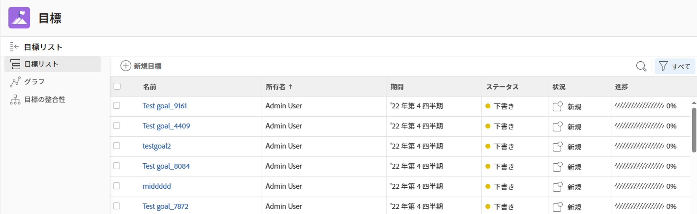
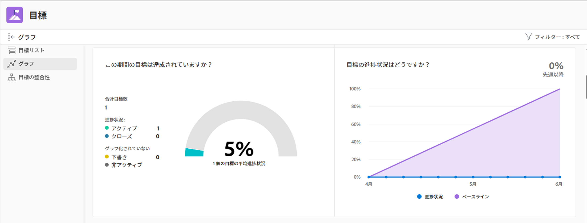
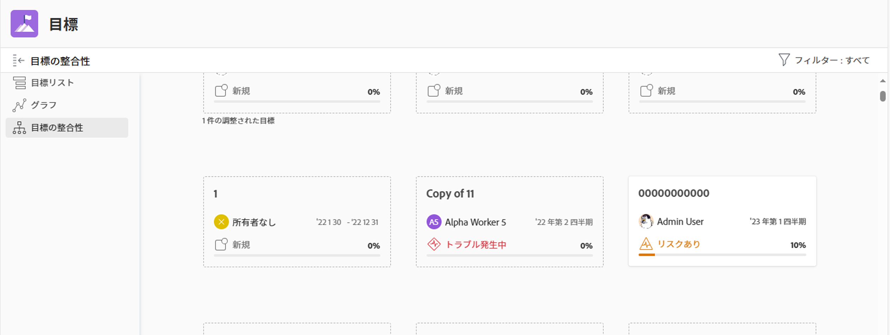
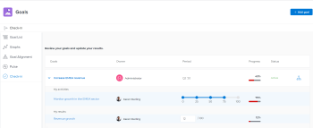

# 「Adobe Workfront目標」セクションの概要

>[!NOTE]
>
>この記事で説明する機能を使用するには、以下が必要です。
>
>* プロ以上 [Adobe Workfrontプラン](https://www.workfront.com/plans).
>* Workfrontライセンスに加えて、Adobe Workfront Goals ライセンスが必要です。
>
>  Workfront Goals ライセンスについて詳しくは、Workfrontのアカウントマネージャーにお問い合わせください。
>
>Workfront Goals へのアクセスについて詳しくは、 [Workfront目標の使用要件](../../workfront-goals/goal-management/access-needed-for-wf-goals.md).

Workfront管理者がWorkfront目標へのアクセス権を付与したら、自分または組織内の任意のユーザーがWorkfront目標領域で作成した目標を表示できます。

目標または個々の目標のリストにアクセスし、Workfront目標の複数のセクションから管理できます。 どのセクションを使用するかは、目標を扱う際に達成したい目的によって異なります。

フィルターを適用して、各セクションで重要な目標のみを表示できます。

>[!TIP]
>
>1 つのセクションで更新されたフィルターは、「目標リスト」、「グラフ」、「目標の整列」の各セクションに自動的に適用されます。 この方法では、更新は 1 回のみ可能です。 詳しくは、 [Adobe Workfront目標での情報のフィルター](../../workfront-goals/goal-management/filter-information-wf-goals.md).

以下に、Workfront目標の節と目標の管理に使用できるオプションの概要を示します。 Workfront目標の各セクションで実行できる追加のアクションについて詳しくは、次の記事もお勧めします。

* [Adobe Workfront目標での目標の作成](../../workfront-goals/goal-management/create-goals.md)
* [Adobe Workfront目標での目標の進捗状況の更新](../../workfront-goals/goal-review-and-workfront-goals-sections/check-in-goals.md)
* [Adobe Workfront目標での情報のフィルター](../../workfront-goals/goal-management/filter-information-wf-goals.md)

## 目標リスト

目標リストを使用して、自分、チーム、グループまたは組織に属する目標をレビューできます。 目標は、任意のステータスで、任意の期間から表示できます。

目標リストの移動と目標の管理について詳しくは、 [Adobe Workfront目標の目標リストで目標を管理](../../workfront-goals/goal-review-and-workfront-goals-sections/manage-goals-in-goal-list.md).

目標リストを使用して、次の操作を実行します。

* 自分、自分のチーム、グループまたは組織に属する目標を表示します。
* 目標とその情報（名前、所有者、進行状況、条件など）を確認します。
* 新しい目標を追加します。

   詳しくは、 [Adobe Workfront目標での目標の作成](../../workfront-goals/goal-management/create-goals.md).

* 目標のページにアクセスし、目標、その結果またはアクティビティを編集および更新します

   詳しくは、 [Adobe Workfront目標で目標を編集](../../workfront-goals/goal-management/edit-goals.md).

* 目標を編集します。

## グラフ

「グラフ」セクションを使用して、自分や組織に属する目標の正常性を総合的に把握できます。 このセクションでは、任意の期間の任意のステータスで目標の進捗情報を表示できます。

グラフのセクションの使用について詳しくは、 [グラフを確認してAdobe Workfront目標の目標の進行状況の傾向を理解する](../../workfront-goals/goal-review-and-workfront-goals-sections/review-goal-graphs.md).

「グラフ」セクションでは、次の操作を実行できます。

* 自分、自分のチーム、グループまたは組織に属する目標のパフォーマンスを表示します。
* 特定の進捗状況ステータスを持つ目標の数を表示します。
* 目標が週単位でどのように実行されているかを把握します。

## 目標の整合性

目標が互いに一致している場合は、「目標の整列」セクションを使用して、組織内のすべての目標と、その目標との整合性を表示およびレビューできます。 連結されたカード上に、互いの位置合わせを示すために、整列された目標がここに表示されます。 親目標が最初に表示され、子目標がその後に積み重ねられます。 このセクションでは、任意のステータスおよび任意の期間の目標を表示できます。

目標の管理に関する目標の整列セクションのナビゲーションについて詳しくは、 [Adobe Workfront目標の目標の目標揃えセクションに移動](../../workfront-goals/goal-alignment/navigate-goal-alignment-chart.md).

目標の調整について詳しくは、次の記事を参照してください。

* [目標をAdobe Workfront目標に結び付けて整列させる](../../workfront-goals/goal-alignment/align-goals-by-connecting-them.md)
* [結果とアクティビティを目標に変換して目標を揃える](../../workfront-goals/goal-alignment/align-goals-by-converting-results-activities.md)

「目標の整列」セクションでは、次の操作を実行できます。

* 自分または組織に属する目標をカード形式で表示します。
* 目標階層を表示し、整列した子目標を表示します。
* 目標ページにアクセスし、目標、その結果またはアクティビティを更新します。

<!--
## Pulse

 The Pulse section has been removed from the Preview environment and will be removed from Workfront Goals with the 23.1 release. Use the Goal List area to review goals that you or your teams are responsible for. 

You can use the Pulse section to review and request updates to goals that might influence the progress of your goals. These could be your own goals, or goals that belong to your teams, groups, or your organization. You can view goals in any status and from any time period in this section.

>[!TIP]
>
>Only goals that have been checked in on at least once display in the Pulse section.

For information about reviewing goals using the Pulse section, see [Review goals in the Adobe Workfront Goals Pulse section](../../workfront-goals/goal-review-and-workfront-goals-sections/review-goals-in-pulse.md).

Use the Pulse section to do the following:

* View goals that belong to your teams, groups, or organization. 
* Review goal progress and updates, including aligned goals, their results, and activities. 
* Make or ask for updates to a goal by adding a comment. 
* Access the Goal Details panel and edit and update the goal, its results, or activities.
* Add new goals. 
* Check in on goals.

  >[!TIP]
  >
  >Clicking Check in opens the Check-in section in the left panel.

## Check-in

 The Check-in section has been removed from the Preview environment and will be removed from Workfront Goals with the 23.1 release. Use the Goal List area to review goals that you or your teams are responsible for.

You must have access to Edit Goals in your access level before you can access the Check- in section. For information about granting access to Goals, see  [Grant access to Adobe Workfront Goals](../../administration-and-setup/add-users/configure-and-grant-access/grant-access-goals.md).

You can use the Check-in section to update active goals and any results and activities that you are the owner of. You can primarily view only goals in an Active status in this section. Children goals aligned to active parents also display in the Check-in section, regardless of their status.

>[!IMPORTANT]
>
>* A goal displays in the Check-in section only if it is assigned to you or if it has a result or activity that is assigned to you. 
>* If a goal assigned to you is the child goal of a parent that is not assigned to you and your goal (the child goal) is closed, inactive, or a draft, the parent goal does not display in your Check-in section. 
>

For information about managing goals in the Goal List, see [Manage goals in the Goal List of Adobe Workfront Goals](../../workfront-goals/goal-review-and-workfront-goals-sections/manage-goals-in-goal-list.md).

Use the Check-in section to do the following:

* Review goal progress and updates, including aligned goals, their results, and activities. 
* Update the progress on the results and activities that are assigned to you. For information about updating goals by checking in on them, see [Update goal progress in Adobe Workfront Goals](../../workfront-goals/goal-review-and-workfront-goals-sections/check-in-goals.md).

  >[!IMPORTANT]
  >
  >You can check in only on the results and activities assigned to you in the Check-in section, and not those that are assigned to other entities.

* Add a comment to a goal, then click Post to make or ask for updates to a goal. 
* Access the Goal Details panel and edit and update the goal, its results, or activities.
* Add new goals.
-->
