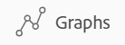
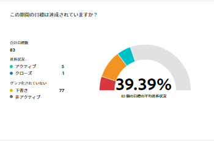
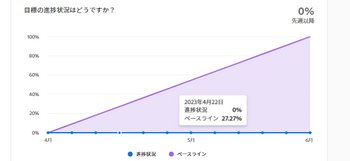

# グラフを確認して Adobe Workfront Goals の目標進捗の傾向を理解する

<!-- drafted mostly for P&P release-->

目標の全体的な正常性とその進捗の経時的な傾向は、Adobe Workfront Goals の「グラフ」セクションで確認できます。このセクションのグラフでは、各目標の進捗を分類することはできませんが、代わりに、すべての目標の進捗ステータスと指定した期間の進捗の全体的なスナップショットが表示されます。

>[!IMPORTANT]
>
>選択した期間の目標の合計数を「グラフ」セクションで確認できます。ただし、Workfront Goals では、全体的な目標の進捗ステータスと完了率を計算する際に、ステータスがアクティブおよびクローズの目標のみを考慮します。

## アクセス要件

<!--drafted for P&P release: 

<table style="table-layout:auto">
 <col>
 </col>
 <col>
 </col>
 <tbody>
  <tr>
   <td role="rowheader">Adobe Workfront plan*</td>
   <td>
   
Current plan: Select or higher

   Or
   
Legacy plan: Pro or higher

   
   </td>
  </tr>
  <tr>
   <td role="rowheader">Adobe Workfront license*</td>
   <td>
   
Current license: Contributor or higher

   Or
   
Legacy license: Request or higher
 
For more information, see <a href="../../administration-and-setup/add-users/access-levels-and-object-permissions/wf-licenses.md" class="MCXref xref">Adobe Workfront licenses overview</a>.
 </td>
  </tr>
  <tr>
   <td role="rowheader">Product</td>
   <td>
   
 Current product requirement: If you have the Select or Prime Adobe Workfront plan, you must also buy an additional Adobe Workfront Goals license.  Workfront Goals are included in the Ultimate Workfront Plan.

   Or
   
Legacy product requirement: You must purchase an additional license for the Adobe Workfront Goals to access functionality described in this article. 
 
For information, see <a href="../../workfront-goals/goal-management/access-needed-for-wf-goals.md" class="MCXref xref">Requirements to use Workfront Goals</a>. 
 </td>
  </tr>
  <tr>
   <td role="rowheader">Access level*</td>
   <td> 
Edit access to Goals
 
<b>NOTE</b>
If you still don't have access, ask your Workfront administrator if they set additional restrictions in your access level. For information on how a Workfront administrator can change your access level, see:

     <ul>
      <li> 
<a href="../../administration-and-setup/add-users/configure-and-grant-access/create-modify-access-levels.md" class="MCXref xref">Create or modify custom access levels</a> 
 </li>
      <li> 
<a href="../../administration-and-setup/add-users/configure-and-grant-access/grant-access-goals.md" class="MCXref xref">Grant access to Adobe Workfront Goals</a> 
 </li>
     </ul> 
 </td>
  </tr>
  <tr data-mc-conditions="">
   <td role="rowheader">Object permissions</td>
   <td>
    

     
View or higher permissions to the goal to view it

     
Manage permissions to the goal to edit it

     
For information about sharing goals, see <a href="../../workfront-goals/workfront-goals-settings/share-a-goal.md" class="MCXref xref">Share a goal in Workfront Goals</a>. 

    
 </td>
  </tr>
 </tbody>
</table>

-->

この記事で説明する操作を実行するには、次のアクセス権が必要です。

<table style="table-layout:auto"> 
 <col> 
 <col> 
 <tbody> 
  <tr> 
   <td role="rowheader">Adobe Workfront プラン*</td> 
   <td> 
Pro 以上
 </td> 
  </tr> 
  <tr> 
   <td role="rowheader">Adobe Workfront ライセンス*</td> 
   <td> 
リクエスト以上
 
詳しくは、<a href="../../administration-and-setup/add-users/access-levels-and-object-permissions/wf-licenses.md" class="MCXref xref">Adobe Workfront ライセンスの概要</a>を参照してください。
 </td> 
  </tr> 
  <tr> 
   <td role="rowheader">製品</td> 
   <td> 
この記事で説明する機能にアクセスするには、Adobe Workfront Goals の追加ライセンスを購入する必要があります。 
 
詳しくは、<a href="../../workfront-goals/goal-management/access-needed-for-wf-goals.md" class="MCXref xref">Workfront Goals の使用要件</a>を参照してください。 
 </td> 
  </tr> 
  <tr> 
   <td role="rowheader">アクセスレベル*</td> 
   <td> 
目標に対する表示以上のアクセス権
 
<b>メモ</b>
まだアクセス権がない場合は、Workfront 管理者に問い合わせて、アクセスレベルに追加の制限が設定されているかどうかを確認してください。Workfront 管理者がユーザーのアクセスレベルを変更する方法について詳しくは、以下を参照してください。
 
     <ul> 
      <li> 
<a href="../../administration-and-setup/add-users/configure-and-grant-access/create-modify-access-levels.md" class="MCXref xref">カスタムアクセスレベルの作成または変更</a> 
 </li> 
      <li> 
<a href="../../administration-and-setup/add-users/configure-and-grant-access/grant-access-goals.md" class="MCXref xref">Adobe Workfront Goals へのアクセス権の付与</a> 
 </li> 
     </ul> 
 </td> 
  </tr> 
  <tr data-mc-conditions=""> 
   <td role="rowheader">オブジェクト権限</td> 
   <td> 
    
 
     
目標の表示以上の権限
 
     
目標の共有について詳しくは、<a href="../../workfront-goals/workfront-goals-settings/share-a-goal.md" class="MCXref xref">Workfront Goals での目標の共有</a>を参照してください。 
 
    
 </td> 
  </tr> 
 </tbody> 
</table>

*保有するプラン、ライセンスタイプまたはアクセス権を確認するには、Workfront 管理者にお問い合わせください。

## 前提条件

開始するには、まず以下が必要です。

* メインメニューの目標エリアを含むレイアウトテンプレート。

## Workfront Goals のグラフのタイプ

グラフのセクションまたは Workfront Goals では、次のグラフを使用できます。

<table style="table-layout:auto"> 
 <col> 
 <col> 
 <tbody> 
  <tr> 
   <td role="rowheader">目標ヘルスチャート</td> 
   <td> 
次を表示するゲージチャート。
 
    <ul> 
     <li>選択した期間の目標の合計数。ステータスの異なる目標が考慮されます。 </li> 
     <li>ステータスがアクティブおよびクローズの目標の進捗ステータス。</li> 
    </ul> 
Workfront Goals での進捗ステータスの決定方法について詳しくは、<a href="../../workfront-goals/goal-management/calculate-goal-progress.md" class="MCXref xref">Adobe Workfront Goals の目標進捗と状況の概要</a>を参照してください。
 </td> 
  </tr> 
  <tr> 
   <td role="rowheader">目標進捗グラフ</td> 
   <td> 
目標期間中の目標に対する更新を週単位で表示する折れ線グラフです。目標の進捗チャートには、次の情報が表示されます。
 
    <ul> 
     <li>選択した期間内のすべてのアクティブな目標およびクローズした目標の平均予想および実際の完了率。完了率の進捗は、ノードで示される週単位の増分に分割されます。 </li> 
     <li>前週以降のアクティブな目標とクローズした目標の全体的な進捗の平均割合。 </li> 
    </ul> 
ヒント：目標の進捗チャートは、選択した期間外で目標に対して更新が行われた場合、情報が表示されない場合があります。 
 </td> 
  </tr> 
 </tbody> 
</table>

## グラフでの目標の進捗の確認

1. 右上隅にある&#x200B;**メインメニュー**&#x200B;アイコン ／**目標**&#x200B;をクリックします。

   <!-- Add this when Shell is available to all: or (if available), click the **Main Menu** icon  in the upper-left corner)
   -->

   Workfront Goals エリアが開きます。

1. 左側のパネルで「**グラフ**」をクリックします。

   

   「グラフ」セクションが表示されます。

   デフォルトでは、「グラフ」セクションに表示される目標は、次の条件によって制限されます。

   * 「グラフ」エリアに適用されるフィルター。
   * ステータスがアクティブおよびドラフトの目標。

1. （オプション）グラフのセクションの右上隅にあるフィルターを更新して、表示する情報のタイプを選択します。

   目標のフィルタリングについて詳しくは、[Adobe Workfront Goals での情報のフィルター](../../workfront-goals/goal-management/filter-information-wf-goals.md)を参照してください。

   >[!TIP]
   >
   複数の期間を表示するように選択した場合は、各期間のヘルスチャート（ゲージ）と進捗チャート（線）が表示されます。

1. 以下の表の情報を確認し、目標のヘルスチャートを確認してください。

   

   | 目標の合計数 | チャートの下部にある数は、選択した期間内のすべての目標の数を、選択したすべてのステータスで示します。 |
   |---|---|
   | 平均完了率 | チャートの上部にあるこの数は、選択した期間のアクティブな目標とクローズした目標の平均完了率を示します。 |
   | 目標とその進捗 | チャートのセグメントにポインタを合わせた際の各進捗ステータスセグメントの目標数。アクティブまたはクローズのステータスの目標のみがセグメントでカウントされます。 |

1. 目標進捗チャートを確認する際に、以下の表の情報を確認してください。

   

   <table style="table-layout:auto"> 
    <col> 
    <col> 
    <tbody> 
     <tr> 
      <td>ベースラインの進捗</td> 
      <td>緑色の傾き線は、選択した期間のアクティブな目標とクローズした目標の、予想される全体的な完了率の平均を示します。ある期間内のすべての目標は完了すると予想されるので、ベースラインの進捗は常にその期間の終わりに 100%になります。 </td> 
     </tr> 
     <tr> 
      <td>実際の進捗状況</td> 
      <td> 
青色の線は、選択した期間のアクティブな目標とクローズした目標の、週単位の増分での実際の完了率平均を示します。目標期間中の各週は、行内のノードでマークされます。 
 </td> 
     </tr> 
    </tbody> 
   </table>

1. 目標の進捗チャートで 1 週間のノードにポインタを合わせて、次の内容を確認します。

   * **週の日付**：選択した週の月、日および年。
   * **進捗**：選択した週のすべての目標の実際の完了率の平均。
   * **ベースライン**：選択した週のすべての目標の予想完了率の平均。

1. （オプション）進捗チャートの下部にある「**進捗**」をクリックして、実際の進捗の行全体を削除します。

   または

   チャートの下部にある「**ベースライン**」をクリックすると、チャートから予想される進捗が削除されます。

 
