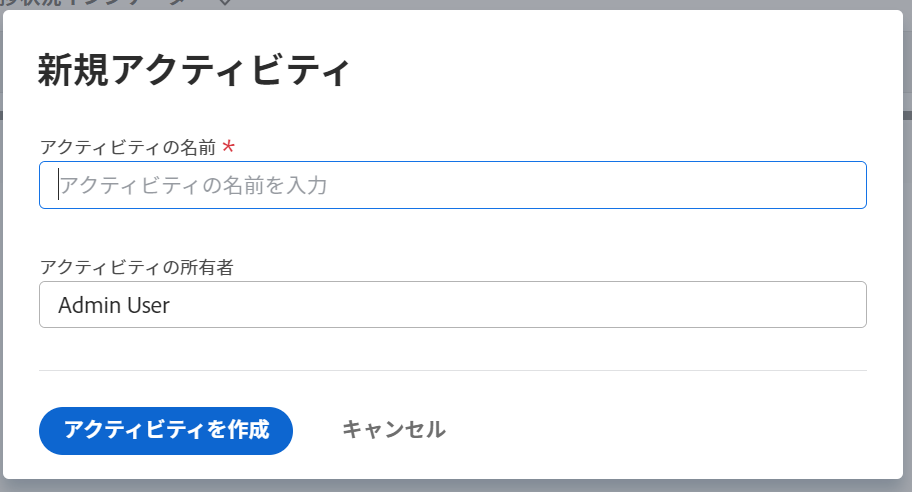

# Adobe Workfront目標での目標へのアクティビティの追加

アクティビティは目標の進行状況を測定します。 結果、アクティビティ、プロジェクトまたは整列された目標を関連付けないと、目標をアクティブ化できず、目標に対する進行状況を記録できません。

## アクセス要件

<!--drafted - replace the table below with this one when P&P releases: 

<table style="table-layout:auto">
 <col>
 </col>
 <col>
 </col>
 <tbody>
  <tr>
   <td role="rowheader">Adobe Workfront plan*</td>
   <td>
   
Current plan: Select or higher

   Or
   
Legacy plan: Pro or higher

   
   </td>
  </tr>
  <tr>
   <td role="rowheader">Adobe Workfront license*</td>
   <td>
   
Current license: Contributor or higher

   Or
   
Legacy license: Request or higher
 
For more information, see <a href="../../administration-and-setup/add-users/access-levels-and-object-permissions/wf-licenses.md" class="MCXref xref">Adobe Workfront licenses overview</a>.
 </td>
  </tr>
  <tr>
   <td role="rowheader">Product</td>
   <td>
   
 Current product requirement: If you have the Select or Prime Adobe Workfront plan, you must also buy an additional Adobe Workfront Goals license.  Workfront Goals are included in the Ultimate Workfront Plan.

   Or
   
Legacy product requirement: You must purchase an additional license for the Adobe Workfront Goals to access functionality described in this article. 
 
For information, see <a href="../../workfront-goals/goal-management/access-needed-for-wf-goals.md" class="MCXref xref">Requirements to use Workfront Goals</a>. 
 </td>
  </tr>
  <tr>
   <td role="rowheader">Access level*</td>
   <td> 
Edit access to Goals
 
<b>NOTE</b>
If you still don't have access, ask your Workfront administrator if they set additional restrictions in your access level. For information on how a Workfront administrator can change your access level, see:

     <ul>
      <li> 
<a href="../../administration-and-setup/add-users/configure-and-grant-access/create-modify-access-levels.md" class="MCXref xref">Create or modify custom access levels</a> 
 </li>
      <li> 
<a href="../../administration-and-setup/add-users/configure-and-grant-access/grant-access-goals.md" class="MCXref xref">Grant access to Adobe Workfront Goals</a> 
 </li>
     </ul> 
 </td>
  </tr>
  <tr data-mc-conditions="">
   <td role="rowheader">Object permissions</td>
   <td>
    

     
View or higher permissions to the goal to view it

     
Manage permissions to the goal to edit it

     
For information about sharing goals, see <a href="../../workfront-goals/workfront-goals-settings/share-a-goal.md" class="MCXref xref">Share a goal in Workfront Goals</a>. 

    
 </td>
  </tr>
 </tbody>
</table>
-->

以下が必要です。

<table style="table-layout:auto"> 
 <col> 
 <col> 
 <tbody> 
  <tr> 
   <td role="rowheader">Adobe Workfront plan*</td> 
   <td> 
Pro 以上
 </td> 
  </tr> 
  <tr> 
   <td role="rowheader">Adobe Workfront license*</td> 
   <td> 
リクエスト以上
 
詳しくは、 <a href="../../administration-and-setup/add-users/access-levels-and-object-permissions/wf-licenses.md" class="MCXref xref">Adobe Workfrontライセンスの概要</a>.
 </td> 
  </tr> 
  <tr> 
   <td role="rowheader">製品</td> 
   <td> 
この記事で説明する機能にアクセスするには、 Adobe Workfront Goals の追加ライセンスを購入する必要があります。 
 
詳しくは、 <a href="../../workfront-goals/goal-management/access-needed-for-wf-goals.md" class="MCXref xref">Workfront目標の使用要件</a>. 
 </td> 
  </tr> 
  <tr> 
   <td role="rowheader">アクセスレベル設定*</td> 
   <td> 
目標へのアクセスを編集
 
<b>メモ</b>

まだアクセス権がない場合は、Workfront管理者に、アクセスレベルに追加の制限を設定しているかどうかを問い合わせてください。 Workfront管理者がアクセスレベルを変更する方法について詳しくは、以下を参照してください。
 
     <ul> 
      <li> 
<a href="../../administration-and-setup/add-users/configure-and-grant-access/create-modify-access-levels.md" class="MCXref xref">カスタムアクセスレベルの作成または変更</a> 
 </li> 
      <li> 
<a href="../../administration-and-setup/add-users/configure-and-grant-access/grant-access-goals.md" class="MCXref xref">Adobe Workfront目標へのアクセス権の付与</a> 
 </li> 
     </ul> 
 </td> 
  </tr> 
  <tr data-mc-conditions=""> 
   <td role="rowheader">オブジェクト権限</td> 
   <td> 
    
 
     
目標に対する権限の管理
 
     
目標の共有について詳しくは、 <a href="../../workfront-goals/workfront-goals-settings/share-a-goal.md" class="MCXref xref">Workfront目標での目標の共有</a>. 
 
    
 </td> 
  </tr> 
 </tbody> 
</table>

*保有するプラン、ライセンスの種類、アクセス権を確認するには、Workfront管理者にお問い合わせください。

## 前提条件

を起動する前に、次の条件を満たす必要があります。

* メインメニューの目標領域を含むレイアウトテンプレート。
* 既存の目標。

   目標の作成について詳しくは、 [Adobe Workfront目標での目標の作成](../../workfront-goals/goal-management/create-goals.md).

>[!IMPORTANT]
>
>目標には、合計 1000 個を超えるアクティビティ、結果、または一致した目標を含めることはできません。

アクティビティについて詳しくは、 [Adobe Workfront目標の結果とアクティビティの概要](../../workfront-goals/results-and-activities/get-started-with-results-and-activities.md).

## 目標へのアクティビティの追加

<!--
Adding activities to goals differs depending on which environment you use.

### Add an activity to a goal in the Production environment

1. Go to the goal for which you want to add an activity and click the name to open the **Goal Details** panel.
1. Click **Add activities**.

   

1. From the **Activity Type** drop-down menu, select the type of activity you want to associate with your goal.&nbsp;Select **Manual progress bar** or **Project**. Manual progress bar is the default selection. 
1. (Conditional) Depending on which activity type you selected, do the following:

   1. If you selected **Manual progress bar**:

      1. Start typing a name for your activity in the **Activity** field. 
      1. (Optional) If you want to set the activity owner as someone other than yourself, click your name in the **Owner** field and begin typing the name of the user that you want to assign as the activity owner, then click it when it appears in the drop-down list.

         >[!NOTE]
         >
         >You cannot assign a team or group as an activity owner.

         When you update the progress of an activity, the progress of the goal automatically updates.

   1. If you selected **Project**:

      1. Click the **Connect projects** field.

         Existing projects that you have access to View display in the Connect projects list. Projects that are in a status of Dead do not display in the list. 
      
      1. Click the name of a project to add it as an activity to the goal. You can select several projects at one time.

         Workfront uses the project percent complete of all the attached projects to calculate the progress of the goal.

         For more information about associating projects with goals, see [Add projects to goals in Adobe Workfront Goals](../../workfront-goals/results-and-activities/connect-projects-to-goals-overview.md).

         >[!TIP]
         >
         >   
         >   * The owner of the project becomes the owner of this activity. If the project has no owner, then the activity has no owner. 
         >   * You cannot manually update the progress of a project. Workfront calculates the progress of the project based on the project percent complete. When the project percent complete updates in Workfront this also updates the connected project in Workfront Goals including the percent complete of the goal. 
         >   
         >

1. Click **Save**.

   The activity is saved for the selected goal. After you activate the goal, the progress of the goal automatically updates when you update the progress of an activity or when the percent complete of a project updates. For information about activating a goal, see [Activate goals in Adobe Workfront Goals](../../workfront-goals/goal-management/activate-goals.md).

-->

1. 次をクリック： **メインメニュー** を、 **目標**.
1. 「目標リスト」で目標の名前をクリックし、目標のページを開きます。
1. クリック **進行状況指標** をクリックします。
1. 新しい進行状況インジケータードロップダウンメニューで、 **アクティビティを作成**.

   「新規」アクティビティボックスが開きます。

   

1. 「アクティビティ名」フィールドにアクティビティの名前を入力します。 必須フィールドです。
1. （オプション） **アクティビティ所有者** フィールドを選択します。 デフォルトでは、作成したアクティビティの所有者です。

   >[!NOTE]
   >
   >チーム、グループまたは会社をアクティビティ所有者として割り当てることはできません。

1. クリック **アクティビティを作成** をクリックし、選択した目標に追加します。

   アクティビティが、目標ページの「進行状況指標」セクションの「アクティビティ」グループ化の下に表示されます。

