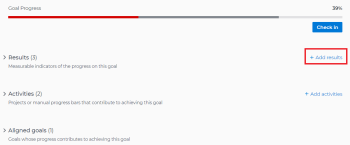

# Adobe Workfront目標の目標に結果を追加

結果は、目標の進捗を測定します。 結果、アクティビティまたは整列した目標を目標に関連付けないと、目標をアクティブ化できず、目標に対する進行状況を記録できません。

## アクセス要件

<!--drafted for P&P release: 

<table style="table-layout:auto">
 <col>
 </col>
 <col>
 </col>
 <tbody>
  <tr>
   <td role="rowheader">Adobe Workfront plan*</td>
   <td>
   
Current plan: Select or higher

   Or
   
Legacy plan: Pro or higher

   
   </td>
  </tr>
  <tr>
   <td role="rowheader">Adobe Workfront license*</td>
   <td>
   
Current license: Contributor or higher

   Or
   
Legacy license: Request or higher
 
For more information, see <a href="../../administration-and-setup/add-users/access-levels-and-object-permissions/wf-licenses.md" class="MCXref xref">Adobe Workfront licenses overview</a>.
 </td>
  </tr>
  <tr>
   <td role="rowheader">Product</td>
   <td>
   
 Current product requirement: If you have the Select or Prime Adobe Workfront plan, you must also buy an additional Adobe Workfront Goals license.  Workfront Goals are included in the Ultimate Workfront Plan.

   Or
   
Legacy product requirement: You must purchase an additional license for the Adobe Workfront Goals to access functionality described in this article. 
 
For information, see <a href="../../workfront-goals/goal-management/access-needed-for-wf-goals.md" class="MCXref xref">Requirements to use Workfront Goals</a>. 
 </td>
  </tr>
  <tr>
   <td role="rowheader">Access level*</td>
   <td> 
Edit access to Goals
 
<b>NOTE</b>
If you still don't have access, ask your Workfront administrator if they set additional restrictions in your access level. For information on how a Workfront administrator can change your access level, see:

     <ul>
      <li> 
<a href="../../administration-and-setup/add-users/configure-and-grant-access/create-modify-access-levels.md" class="MCXref xref">Create or modify custom access levels</a> 
 </li>
      <li> 
<a href="../../administration-and-setup/add-users/configure-and-grant-access/grant-access-goals.md" class="MCXref xref">Grant access to Adobe Workfront Goals</a> 
 </li>
     </ul> 
 </td>
  </tr>
  <tr data-mc-conditions="">
   <td role="rowheader">Object permissions</td>
   <td>
    

     
View or higher permissions to the goal to view it

     
Manage permissions to the goal to edit it

     
For information about sharing goals, see <a href="../../workfront-goals/workfront-goals-settings/share-a-goal.md" class="MCXref xref">Share a goal in Workfront Goals</a>. 

    
 </td>
  </tr>
 </tbody>
</table>

-->

以下が必要です。

<table style="table-layout:auto"> 
 <col> 
 <col> 
 <tbody> 
  <tr> 
   <td role="rowheader">Adobe Workfront plan*</td> 
   <td> 
Pro 以上
 </td> 
  </tr> 
  <tr> 
   <td role="rowheader">Adobe Workfront license*</td> 
   <td> 
リクエスト以上
 
詳しくは、 <a href="../../administration-and-setup/add-users/access-levels-and-object-permissions/wf-licenses.md" class="MCXref xref">Adobe Workfrontライセンスの概要</a>.
 </td> 
  </tr> 
  <tr> 
   <td role="rowheader">製品</td> 
   <td> 
この記事で説明する機能にアクセスするには、 Adobe Workfront Goals の追加ライセンスを購入する必要があります。 
 
詳しくは、 <a href="../../workfront-goals/goal-management/access-needed-for-wf-goals.md" class="MCXref xref">Workfront目標の使用要件</a>. 
 </td> 
  </tr> 
  <tr> 
   <td role="rowheader">アクセスレベル設定*</td> 
   <td> 
目標へのアクセスを編集
 
<b>メモ</b>

まだアクセス権がない場合は、Workfront管理者に、アクセスレベルに追加の制限を設定しているかどうかを問い合わせてください。 Workfront管理者がアクセスレベルを変更する方法について詳しくは、以下を参照してください。
 
     <ul> 
      <li> 
<a href="../../administration-and-setup/add-users/configure-and-grant-access/create-modify-access-levels.md" class="MCXref xref">カスタムアクセスレベルの作成または変更</a> 
 </li> 
      <li> 
<a href="../../administration-and-setup/add-users/configure-and-grant-access/grant-access-goals.md" class="MCXref xref">Adobe Workfront目標へのアクセス権の付与</a> 
 </li> 
     </ul> 
 </td> 
  </tr> 
  <tr data-mc-conditions=""> 
   <td role="rowheader">オブジェクト権限</td> 
   <td> 
    
 
     
目標に対する権限の管理
 
     
目標の共有について詳しくは、 <a href="../../workfront-goals/workfront-goals-settings/share-a-goal.md" class="MCXref xref">Workfront目標での目標の共有</a>. 
 
    
 </td> 
  </tr> 
 </tbody> 
</table>

*保有するプラン、ライセンスの種類、アクセス権を確認するには、Workfront管理者にお問い合わせください。

## 前提条件

を起動する前に、次の条件を満たす必要があります。

* メインメニューの目標領域を含むレイアウトテンプレート。
* 既存の目標。

   目標の作成について詳しくは、 [Adobe Workfront目標での目標の作成](../../workfront-goals/goal-management/create-goals.md).

>[!IMPORTANT]
>目標には、合計 1000 個を超えるアクティビティ、結果、プロジェクト、または整列した目標を含めることはできません。

## 目標に結果を追加

<!--

Adding results to goals differs depending on which environment you use.

### Add a result to a goal in the Production environment

1. Go to the goal for which you want to add a result and click the name to open the **Goal Details** panel.
1. Click **Add results**.

   

1. Start typing the result you want to achieve in the **Result** field. This is the name of the result and it displays wherever the goal displays. 
1. (Optional) If you want to set the Result Owner as someone other than yourself, click your name in the **Owner** field and start typing the name of the user that you want to assign as the owner of the result, then click it when it appears in the drop-down list.

   >[!NOTE]
   >
   >You cannot assign a team or group as a result owner.

1. In the Value drop-down menu, select the type of value that you want to measure your success by.

   

   Select from the following options:

   |Option|Value type|
   |---|---|
   | # |Number value |
   | % |Percentage value |
   |$, CN¥, DKK, KR, Mex$, R, R$, zł, £ , ¥ , &euro; , ₹, ฿, MYR, ₪  |Currency values |

   For example, if you want to increase profit to 8%, and profit is currently at 4%, you can select % as the Measured Value.

   >[!TIP]
   >
   >The result Type is always Metric and cannot be edited.

1. In the Initial field, indicate the value that the result has in the beginning, before any progress on it has been recorded. For example, if you want to increase profit to 8%, and profit is currently at 4%, you can enter 4 as the Starting At value. 
1. In the Target field, indicate the value that the result aims to achieve. For example, if you want to increase profit to 8%, and profit is currently at 4%, you can enter 8 as the Ending At value.
1. Click **Save**.

   The result is saved for the selected goal. The progress of the goal automatically updates when you update the progress of a result.

-->

1. メインメニューをクリックします。 を、 **目標**.

1. 次の **目標リスト**」、目標の名前をクリックして、目標ページを開きます。
1. クリック **進行状況指標** をクリックします。
1. を展開します。 **新しい進行状況インジケーター** ドロップダウンメニューで、 **結果を作成**.

   「新しい結果」(New result) ボックスが開きます。

   

1. 結果の名前を **結果名** フィールドに入力します。 必須フィールドです。
1. （オプション） **結果の所有者** フィールドを使用します。 デフォルトでは、作成したアクティビティの所有者です。

   >[!NOTE]
   >
   >チーム、グループ、または会社を結果所有者として割り当てることはできません。

1. 内 **結果の測定方法を指定してください。** 「 」領域で、次の情報を指定します。
   * **値のタイプ**:結果の進行状況を測定する方法を示します。 進行状況は、数値で、パーセント値で、または通貨額で測定できます。

      次の表に示すオプションから値のタイプを選択します。

      | 値タイプ | 説明 |
      |---------------------------------------------------------|------------------|
      | 数値 | 数値 |
      | % | 割合 (%) |
      | CN¥,DKK,KR,Mex$, R, R$, zl, £ , ¥ 、 € 、 ₹, ฿, MYR, ₪ $ | 通貨値 |

   * **初期値**:結果の進行状況が記録される前の、結果の先頭にある値。
   * **ターゲット値**:完了と見なされた結果が達成を目指す値。
1. クリック **結果を作成**.

   結果は、「結果」グループの下で、目標ページの「進捗状況インジケーター」セクションに表示されます。

   目標をアクティブ化すると、結果の進行状況を更新すると、目標の進行状況が自動的に更新されます。 目標のアクティブ化について詳しくは、 [Adobe Workfront目標で目標を有効化](../goal-management/activate-goals.md).
