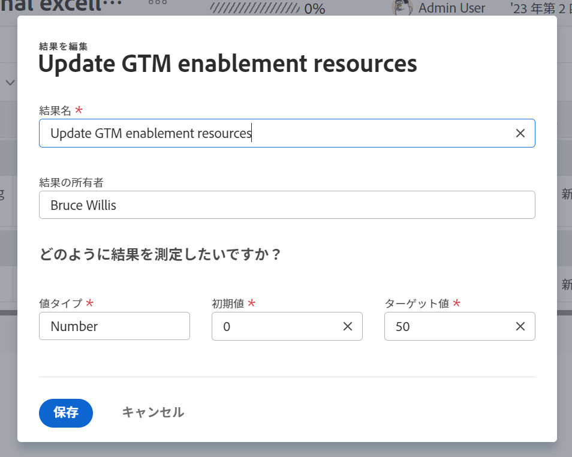
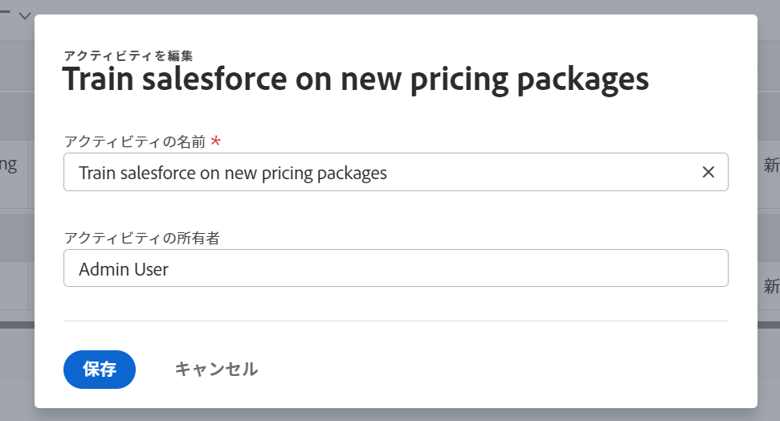

# Adobe Workfront Goals での結果とアクティビティの編集

Adobe Workfront 管理者から Adobe Workfront Goals への適切なアクセス権が付与されたら、目標、結果およびアクティビティを作成および編集できるようになります。

目標、結果、アクティビティの作成について詳しくは、次の記事を参照してください。

* [Adobe Workfront Goals での目標の作成](../../workfront-goals/goal-management/create-goals.md)
* [Adobe Workfront Goals での結果とアクティビティの編集に関する基本を学ぶ](../../workfront-goals/results-and-activities/get-started-with-results-and-activities.md)
* [Adobe Workfront Goals の目標への結果の追加](../../workfront-goals/results-and-activities/add-results-to-goals.md)
* [Adobe Workfront Goals の目標へのアクティビティの追加](../../workfront-goals/results-and-activities/add-activities-to-goals.md)

## アクセス要件

<!--drafted for P&P release: replace the table below with this: 

<table style="table-layout:auto">
 <col>
 </col>
 <col>
 </col>
 <tbody>
  <tr>
   <td role="rowheader">Adobe Workfront plan*</td>
   <td>
   
Current plan: Select or higher

   Or
   
Legacy plan: Pro or higher

   
   </td>
  </tr>
  <tr>
   <td role="rowheader">Adobe Workfront license*</td>
   <td>
   
Current license: Contributor or higher

   Or
   
Legacy license: Request or higher
 
For more information, see <a href="../../administration-and-setup/add-users/access-levels-and-object-permissions/wf-licenses.md" class="MCXref xref">Adobe Workfront licenses overview</a>.
 </td>
  </tr>
  <tr>
   <td role="rowheader">Product</td>
   <td>
   
 Current product requirement: If you have the Select or Prime Adobe Workfront plan, you must also buy an additional Adobe Workfront Goals license.  Workfront Goals are included in the Ultimate Workfront Plan.

   Or
   
Legacy product requirement: You must purchase an additional license for the Adobe Workfront Goals to access functionality described in this article. 
 
For information, see <a href="../../workfront-goals/goal-management/access-needed-for-wf-goals.md" class="MCXref xref">Requirements to use Workfront Goals</a>. 
 </td>
  </tr>
  <tr>
   <td role="rowheader">Access level*</td>
   <td> 
Edit access to Goals
 
<b>NOTE</b>
If you still don't have access, ask your Workfront administrator if they set additional restrictions in your access level. For information on how a Workfront administrator can change your access level, see:

     <ul>
      <li> 
<a href="../../administration-and-setup/add-users/configure-and-grant-access/create-modify-access-levels.md" class="MCXref xref">Create or modify custom access levels</a> 
 </li>
      <li> 
<a href="../../administration-and-setup/add-users/configure-and-grant-access/grant-access-goals.md" class="MCXref xref">Grant access to Adobe Workfront Goals</a> 
 </li>
     </ul> 
 </td>
  </tr>
  <tr data-mc-conditions="">
   <td role="rowheader">Object permissions</td>
   <td>
    

     
View or higher permissions to the goal to view it

     
Manage permissions to the goal to edit it

     
For information about sharing goals, see <a href="../../workfront-goals/workfront-goals-settings/share-a-goal.md" class="MCXref xref">Share a goal in Workfront Goals</a>. 

    
 </td>
  </tr>
 </tbody>
</table>

-->
以下が必要です。

<table style="table-layout:auto"> 
 <col> 
 <col> 
 <tbody> 
  <tr> 
   <td role="rowheader">Adobe Workfront プラン*</td> 
   <td> 
Pro 以上
 </td> 
  </tr> 
  <tr> 
   <td role="rowheader">Adobe Workfront ライセンス*</td> 
   <td> 
リクエスト以上
 
詳しくは、<a href="../../administration-and-setup/add-users/access-levels-and-object-permissions/wf-licenses.md" class="MCXref xref">Adobe Workfront ライセンスの概要</a>を参照してください。
 </td> 
  </tr> 
  <tr> 
   <td role="rowheader">製品</td> 
   <td> 
この記事で説明する機能にアクセスするには、Adobe Workfront Goals の追加ライセンスを購入する必要があります。 
 
詳しくは、<a href="../../workfront-goals/goal-management/access-needed-for-wf-goals.md" class="MCXref xref">Workfront Goals の使用要件</a>を参照してください。 
 </td> 
  </tr> 
  <tr> 
   <td role="rowheader">アクセスレベル設定*</td> 
   <td> 
Goals への編集アクセス権
 
<b>メモ</b>

まだアクセス権がない場合は、Workfront 管理者に問い合わせて、アクセスレベルに追加の制限が設定されているかどうかを確認してください。Workfront 管理者がユーザーのアクセスレベルを変更する方法について詳しくは、以下を参照してください。
 
     <ul> 
      <li> 
<a href="../../administration-and-setup/add-users/configure-and-grant-access/create-modify-access-levels.md" class="MCXref xref">カスタムアクセスレベルの作成または変更</a> 
 </li> 
      <li> 
<a href="../../administration-and-setup/add-users/configure-and-grant-access/grant-access-goals.md" class="MCXref xref">Adobe Workfront Goals へのアクセス権の付与</a> 
 </li> 
     </ul> 
 </td> 
  </tr> 
  <tr data-mc-conditions=""> 
   <td role="rowheader">オブジェクト権限</td> 
   <td> 
    
 
     
目標に対する権限の管理
 
     
目標の共有について詳しくは、<a href="../../workfront-goals/workfront-goals-settings/share-a-goal.md" class="MCXref xref">Workfront Goals での目標の共有</a>を参照してください。 
 
    
 </td> 
  </tr> 
 </tbody> 
</table>

*保有するプラン、ライセンスタイプまたはアクセス権を確認するには、Workfront 管理者にお問い合わせください。

## 前提条件

開始するには、まず以下が必要です。

* メインメニューの Workfront Goals 領域を含んだレイアウトテンプレート。

## 結果とアクティビティの編集に関する考慮事項

<!--
According to Vazgen, access levels will add more considerations.)
-->

* 作成した目標や管理権限を持つ目標に属している結果やアクティビティを編集できます。
* Workfront Goals のアクティビティとして、目標に関連付けられているプロジェクトの進行状況を編集することはできません。プロジェクトのタスクが完了すると、プロジェクトの進行状況が更新されます。プロジェクトを切断すると、目標からプロジェクトを削除できます。詳しくは、[Adobe Workfront Goals の目標からの結果、アクティビティ、プロジェクトの削除](../../workfront-goals/results-and-activities/remove-results-activities-from-goals.md)の記事のプロジェクトの切断の節を参照してください。

  >[!NOTE]
  >
  >次のプロジェクト情報がプロジェクトレベルで更新されると、Workfront Goals は該当する情報を目標レベルで自動的に更新します。
  >
  >   
  >   
  >   * プロジェクト所有者
  >   * プロジェクト名
  >   * プロジェクトの完了率
  >   
  >   
  >プロジェクトを目標に接続する方法について詳しくは、[Adobe Workfront Goals の目標へのプロジェクトの追加](../../workfront-goals/results-and-activities/connect-projects-to-goals-overview.md)を参照してください。

* 結果やアクティビティが目標の進行状況に関係なくなった場合は、目標から削除できます。削除した結果とアクティビティは復元できません。結果とアクティビティの削除について詳しくは、[Adobe Workfront Goals の目標からの結果、アクティビティ、プロジェクトの削除](../../workfront-goals/results-and-activities/remove-results-activities-from-goals.md)を参照してください。
* 過去を含めた任意の期間で、目標に関連付けられた結果やアクティビティを編集できます。
* 結果とアクティビティを編集すると設定が更新されますが、進行状況は更新されません。結果とアクティビティの進行状況を更新する必要があります。目標、結果およびアクティビティの進行状況の更新について詳しくは、[Adobe Workfront Goals の目標の進行状況の更新](../../workfront-goals/goal-review-and-workfront-goals-sections/check-in-goals.md)を参照してください。

## 結果を編集

<!--
Editing results differs depending on which environment you use.

### Edit results in the Production environment

1. Go to the goal for which you want to edit a result and click the goal name to open the **Goal Details** panel.
1. Click **Results**.
1. Click the **gear icon**  to the right of the result you want to edit.

   

1. Click **Edit** to edit the following information:

   | Field |Description|
   |---|---|
   | Name |The name of the result. |
   | Owner |The owner of result.  |
   | Value |How you measure the progress of the result. |
   | Initial |The original value of the result. |
   | Target |The desired value when the result is completed. |

1. Click **Save**.
-->

1. **メインメニュー**  をクリックして、「**目標**」をクリックします。
1. 目標リストで目標の名前をクリックし、目標ページを開きます。
1. 左パネルで「**進行状況インジケーター**」をクリックします。
1. 進行状況インジケーターリストで結果を選択し、**編集**&#x200B;アイコン  をクリックします。

   「結果を編集」ボックスが開きます。

   

1. 次の情報を編集します。
   * **結果名**：結果の名前。目標を完了するために取得しなければならない結果を示す、わかりやすい名前を付けます。
   * **結果の所有者**：結果の所有者。所有者は、アクティブな Workfront ユーザーである必要があります。
   * **値のタイプ**：結果の進行状況の測定方法。
   * **初期値**：結果の元の値。
   * **ターゲット値**：結果が完了したときの望ましい値。
「結果」フィールドについて詳しくは、[目標への結果の追加](../results-and-activities/add-results-to-goals.md)を参照してください。
1. 「**保存**」をクリックします。

## アクティビティを編集

<!--
Editing activities differs depending on which environment you use.

### Edit activities in the Production environment

>[!TIP]
>
>You cannot edit the Activity Type after you saved an activity on a goal.

1. Go to the goal for which you want to edit an activity and click the goal name to open the **Goal Details** panel.
1. Click **Activities**.
1. Click the **gear icon**  to the right of the activity you want to edit .

   

1. Click **Edit** to edit the following information:

   | Field |Description |
   |---|---|
   | Name |The name of the activity. |
   | Owner |The owner of activity.  |

1. Click **Save**.
-->

1. **メインメニュー**  をクリックして、「**目標**」をクリックします。
1. 目標リストで目標の名前をクリックし、目標ページを開きます。
1. 左パネルで&#x200B;**進行状況インジケーター**&#x200B;をクリックします。
1. 進行状況インジケーターリストでアクティビティを選択し、**編集**&#x200B;アイコン  をクリックします。

   「アクティビティを編集」ボックスが開きます。

   

1. 次の情報を編集します。
   * **アクティビティの名前**：アクティビティの名前。目標の完了を示すために実行しなければならないアクティビティを説明する、わかりやすい名前を付けます。
   * **アクティビティの所有者：**&#x200B;アクティビティの所有者。所有者は、アクティブな Workfront ユーザーである必要があります。\
     「アクティビティ」フィールドについて詳しくは、[目標へのアクティビティの追加](../results-and-activities/add-activities-to-goals.md)を参照してください。
1. 「**保存**」をクリックします。

