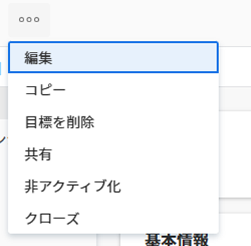
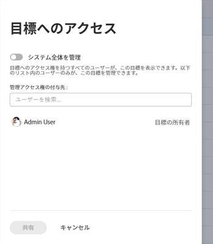

# Adobe Workfront Goals での目標の共有

目標を共有する場合、目標を作成していないユーザーに対して、目標に対する管理権限を付与します。

## アクセス要件

<!--drafted - replace the table below with this one when P&P releases: 

<table style="table-layout:auto">
 <col>
 </col>
 <col>
 </col>
 <tbody>
  <tr>
   <td role="rowheader">Adobe Workfront plan*</td>
   <td>
   
Current plan: Select or higher

   Or
   
Legacy plan: Pro or higher

   
   </td>
  </tr>
  <tr>
   <td role="rowheader">Adobe Workfront license*</td>
   <td>
   
Current license: Contributor or higher

   Or
   
Legacy license: Request or higher
 
For more information, see <a href="../../administration-and-setup/add-users/access-levels-and-object-permissions/wf-licenses.md" class="MCXref xref">Adobe Workfront licenses overview</a>.
 </td>
  </tr>
  <tr>
   <td role="rowheader">Product</td>
   <td>
   
 Current product requirement: If you have the Select or Prime Adobe Workfront plan, you must also buy an additional Adobe Workfront Goals license.  Workfront Goals are included in the Ultimate Workfront Plan.

   Or
   
Legacy product requirement: You must purchase an additional license for the Adobe Workfront Goals to access functionality described in this article. 
 
For information, see <a href="../../workfront-goals/goal-management/access-needed-for-wf-goals.md" class="MCXref xref">Requirements to use Workfront Goals</a>. 
 </td>
  </tr>
  <tr>
   <td role="rowheader">Access level*</td>
   <td> 
Edit access to Goals
 
<b>NOTE</b>
If you still don't have access, ask your Workfront administrator if they set additional restrictions in your access level. For information on how a Workfront administrator can change your access level, see:

     <ul>
      <li> 
<a href="../../administration-and-setup/add-users/configure-and-grant-access/create-modify-access-levels.md" class="MCXref xref">Create or modify custom access levels</a> 
 </li>
      <li> 
<a href="../../administration-and-setup/add-users/configure-and-grant-access/grant-access-goals.md" class="MCXref xref">Grant access to Adobe Workfront Goals</a> 
 </li>
     </ul> 
 </td>
  </tr>
  <tr data-mc-conditions="">
   <td role="rowheader">Object permissions</td>
   <td>
    

     
View or higher permissions to the goal to view it

     
Manage permissions to the goal to edit it

     
For information about sharing goals, see <a href="../../workfront-goals/workfront-goals-settings/share-a-goal.md" class="MCXref xref">Share a goal in Workfront Goals</a>. 

    
 </td>
  </tr>
 </tbody>
</table>
-->

以下が必要です。

<table style="table-layout:auto"> 
 <col> 
 <col> 
 <tbody> 
  <tr> 
   <td role="rowheader">Adobe Workfront プラン*</td> 
   <td> 
Pro 以上
 </td> 
  </tr> 
  <tr> 
   <td role="rowheader">Adobe Workfront ライセンス*</td> 
   <td> 
リクエスト以上
 
詳しくは、<a href="../../administration-and-setup/add-users/access-levels-and-object-permissions/wf-licenses.md" class="MCXref xref">Adobe Workfront ライセンスの概要</a>を参照してください。
 </td> 
  </tr> 
  <tr> 
   <td role="rowheader">製品</td> 
   <td> 
この記事で説明する機能にアクセスするには、Adobe Workfront Goals の追加ライセンスを購入する必要があります。 
 
詳しくは、<a href="../../workfront-goals/goal-management/access-needed-for-wf-goals.md" class="MCXref xref">Workfront Goals の使用要件</a>を参照してください。 
 </td> 
  </tr> 
  <tr> 
   <td role="rowheader">アクセスレベル設定*</td> 
   <td> 
Goals 以上への編集アクセス権
 
<b>メモ</b>
まだアクセス権がない場合は、Workfront 管理者に問い合わせて、アクセスレベルに追加の制限が設定されているかどうかを確認してください。Workfront 管理者がユーザーのアクセスレベルを変更する方法について詳しくは、以下を参照してください。
 
     <ul> 
      <li> 
<a href="../../administration-and-setup/add-users/configure-and-grant-access/create-modify-access-levels.md" class="MCXref xref">カスタムアクセスレベルの作成または変更</a> 
 </li> 
      <li> 
<a href="../../administration-and-setup/add-users/configure-and-grant-access/grant-access-goals.md" class="MCXref xref">Adobe Workfront Goals へのアクセス権の付与</a> 
 </li> 
     </ul> 
 </td> 
  </tr> 
  <tr data-mc-conditions=""> 
   <td role="rowheader">オブジェクト権限</td> 
   <td> 
    
 
     
目標に対する権限の管理
 
     
目標の共有について詳しくは、<a href="#" class="MCXref xref selected">Workfront Goals での目標の共有</a>を参照してください。 
 
    
 </td> 
  </tr> 
 </tbody> 
</table>

*保有するプラン、ライセンスタイプまたはアクセス権を確認するには、Workfront 管理者にお問い合わせください。

## 前提条件

開始する前に以下が必要です。

* メインメニューの Workfront Goals 領域を含んだレイアウトテンプレート。

## 目標の共有に関する考慮事項

* ユーザーは、目標に対して次の権限を持つことができます。

  <table style="table-layout:auto"> 
   <col> 
   </col> 
   <col> 
   </col> 
   <tbody> 
   <tr> 
      <td role="rowheader">
<b>目標の権限</b>
</td> 
      <td>
      
<b>説明</b>
 </td> 
   </tr> 
   <tr> 
      <td role="rowheader">
表示
</td> 
      <td>
      
ユーザーには目標を表示する権限がありますが、目標の情報を編集することはできません。また、結果やアクティビティに関する情報の追加や編集、ステータスの更新、目標の削除を行うことはできません。
      
      
デフォルトでは、目標へのアクセス権を持つすべてのユーザーが、システム内のすべての目標を表示できます。アクセスレベルで目標に対する編集アクセス権を持っている場合、ユーザーは目標をコピーできます。
 </td> 
   </tr> 
   <tr> 
      <td role="rowheader">
管理
</td> 
      <td> 
ユーザーは、結果やアクティビティを含む、目標に関するすべての情報を編集できます。これには削除も含まれます。
 
      
目標の作成者、または特に目標に対する管理権限を付与されたユーザーのみが、目標を管理できます。
 
      目標に対する管理権限を持つユーザーのみが、目標を他のユーザーと共有して、目標に対する管理権限を付与できます。 
 </td> 
   </tr> 
   </tbody> 
   </table>

* 以下のタイプの目標を他のユーザーと共有できます。

   * 自身が作成した目標
   * 他のユーザーが作成し、管理権限を付与されている目標。

* 目標に対する管理権限を持っている場合は、目標の作成者が持つ目標に対する権限を変更できます。デフォルトでは、目標の作成時に管理権限を持っていますが、権限を表示に変更することができます。

## 目標を共有する

1. 右上隅にある&#x200B;**メインメニュー**&#x200B;アイコン ／**目標**&#x200B;をクリックします。

   <!-- Add this when Shell is available to all: or (if available), click the **Main Menu** icon  in the upper-left corner)
   -->

   目標リストが表示されます。

1. リストで目標の名前をクリックします。目標ページが開きます。

1. 目標名の横の&#x200B;**詳細アイコン**&#x200B;をクリックし、「**共有**」をクリックします。

   

   目標アクセスボックスが表示されます。

   

1. 次のいずれかの操作を行います。

   * **システム全体の管理**&#x200B;設定を選択して、アクセスレベルで目標への編集アクセス権を持つシステム内の全員に、管理権限を付与します。これは、すべての新しい目標に対してデフォルトでは選択されていません。
   * 管理権限を付与するユーザーの名前を「**管理権限を与える**」ボックスに入力し始めます。名前がリストに表示されたら、選択します。

     >[!TIP]
     >
     >他のユーザーとのみ目標を共有できます。目標をグループや、チーム、会社と共有することはできません。

1. 「**共有**」をクリックします。

   目標は指定したユーザーと共有されます。目標の詳細パネルの「管理アクセス権」フィールドに、「システム全体」のラベルまたは目標に対する管理権限を持つユーザーの名前が表示されます。

## 目標の権限オプション

次の表に、目標を共有する際に付与できる権限を示します。ユーザーがライセンスに基づいて取得するアクセスについて詳しくは、[Adobe Workfront Goals へのアクセス権の付与](../../administration-and-setup/add-users/configure-and-grant-access/grant-access-goals.md)を参照してください。

<table border="1" cellspacing="15" cellpadding="1"> 
 <col> 
 </col> 
 <col> 
 </col> 
 <col> 
 </col> 
 <thead> 
  <tr> 
   <th> 
<strong>アクション</strong> 
 </th> 
   <th> 
<strong>管理</strong> 
 </th> 
   <th> 
<strong>ビュー</strong> 
 </th> 
  </tr> 
 </thead> 
 <tbody> 
  <tr> 
   <td> 
目標を表示
 </td> 
   <td> 
✓
 </td> 
   <td> 
✓
 </td> 
  </tr> 
  <tr> 
   <td> 
結果やアクティビティを表示
 </td> 
   <td> 
✓
 </td> 
   <td> 
✓
 </td> 
  </tr> 
  <tr> 
   <td>目標をコピー* </td> 
   <td>✓ </td> 
   <td>✓</td> 
  </tr> 
  <tr data-mc-conditions=""> 
   <td>結果やアクティビティを他の目標に変換*</td> 
   <td>✓</td> 
   <td>✓</td> 
  </tr> 
  <tr> 
   <td>アクティビティとして追加されたプロジェクトを表示** </td> 
   <td>✓</td> 
   <td>✓</td> 
  </tr> 
  <tr> 
   <td>目標を編集</td> 
   <td>✓</td> 
   <td> </td> 
  </tr> 
  <tr> 
   <td>結果やアクティビティを編集</td> 
   <td>✓</td> 
   <td> </td> 
  </tr> 
  <tr> 
   <td>目標の結果やアクティビティを追加</td> 
   <td>✓</td> 
   <td> </td> 
  </tr> 
  <tr> 
   <td>プロジェクトをアクティビティとして目標に関連付け**</td> 
   <td>✓</td> 
   <td> </td> 
  </tr> 
  <tr> 
   <td> 
目標を削除
 </td> 
   <td> 
✓
 </td> 
   <td> 
 
 </td> 
  </tr> 
  <tr> 
   <td> 
結果やアクティビティを削除
 </td> 
   <td> 
✓
 </td> 
   <td> 
 
 </td> 
  </tr> 
  <tr> 
   <td>目標からプロジェクトを切断</td> 
   <td>✓</td> 
   <td> </td> 
  </tr> 
 </tbody> 
</table>

*結果やアクティビティを目標に変換するには、アクセスレベルで目標に対する編集アクセス権が必要です。

**プロジェクトを表示するアクセス権と、追加されたプロジェクトまたは目標に追加して表示するプロジェクトに対する表示権限を持っている必要があります。

プロジェクトのアクセスレベルについては、[プロジェクトへのアクセス権を付与](../../administration-and-setup/add-users/configure-and-grant-access/grant-access-projects.md)を参照してください。

プロジェクト権限については、[Adobe Workfront でプロジェクトを共有](../../workfront-basics/grant-and-request-access-to-objects/share-a-project.md)を参照してください。

 
