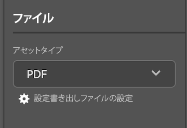

# からドキュメントと配達確認をアップロード [!DNL Adobe Workfront plugin] から [!DNL Creative Cloud]

プロジェクトをドキュメントとしてアップロードして、すばやいレビューと承認をおこなうか、単ににに保存することができます。 [!DNL Adobe Workfront].

>[!NOTE]
>
>ドキュメントと配達確認のアップロードは、現在、Premiere ProおよびAfter Effectsではサポートされていません。

## ドキュメントの制限

この節では、 [!DNL Workfront for Adobe Creative Cloud plugins].

### 新しいドキュメントバージョンでは、1 つのファイルのみをアップロードできます

理由： [!DNL Workfront] ドキュメントに複数のファイルを含めることはできません。新しいドキュメントバージョンをWorkfrontにアップロードするには、特定の設定を無効にする必要があります。

>[!NOTE]
>
>複数のファイルを生成する必要がある場合は、代わりに配達確認を作成できます。 新しい配達確認は元のドキュメントに関連付けられません。

スイッチをで 1 つのファイルに戻すには [!DNL InDesign]:

1. を開きます。 **書き出しファイル設定の設定** ダイアログボックス

   

1. 書き出すアセットタイプを見つけ、以下のように設定を調整します。

   <table>
    <tr>
    <td><strong>PDF及びPDF印刷</strong>
    </td>
    <td>選択を解除 <strong>個別のPDFファイルを作成</strong>.
    </td>
    </tr>
    <tr>
    <td><strong>EPS</strong>
    </td>
    <td>選択 <strong>範囲</strong> をクリックし、単一のページ番号を入力します。 
    

    <strong>注意</strong>:ドキュメント全体をアップロードする場合は、配達確認を作成する必要があります。 
    </td>
    </tr>
    <tr>
    <td><strong>ePubとEPUB固定</strong>
    </td>
    <td>調整は不要です。
    </td>
    </tr>
    <tr>
    <td><strong>IDML</strong>
    </td>
    <td>調整は不要です。
    </td>
    </tr>
    <tr>
    <td><strong>JPG</strong>
    </td>
    <td>選択 <strong>範囲</strong> をクリックし、単一のページ番号を入力します。 
    

    <strong>注意</strong>:ドキュメント全体をアップロードする場合は、配達確認を作成する必要があります。 
    </td>
    </tr>
    <tr>
    <td><strong>PNG</strong>
    </td>
    <td>選択 <strong>範囲</strong> をクリックし、単一のページ番号を入力します。 
    

    <strong>注意</strong>:ドキュメント全体をアップロードする場合は、配達確認を作成する必要があります。 
    </td>
    </tr>
    <tr>
    <td><strong>XML</strong>
    </td>
    <td>調整は不要です。 
    </td>
    </tr>
    </table>
