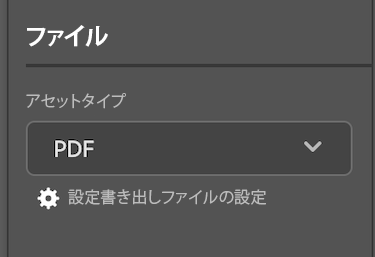

# ドキュメントのアップロード元 [!DNL InDesign]

プロジェクトをドキュメントとしてアップロードして、すばやいレビューと承認をおこなうか、単ににに保存することができます。 [!DNL Adobe Workfront].

## アクセス要件

この記事の手順を実行するには、次のアクセス権が必要です。

<table style="table-layout:auto"> 
 <col> 
 <col> 
 <tbody> 
  <!-- <tr> 
   <td role="rowheader">[!DNL Adobe Workfront] plan*</td> 
   <td> 
[!UICONTROL Pro] or higher
 </td> 
  </tr> 
  <tr data-mc-conditions=""> 
   <td role="rowheader">[!DNL Adobe Workfront] license*</td> 
   <td> 
[!UICONTROL Work] or [!UICONTROL Plan]
 </td> 
  </tr> 
  <tr> -->
   <td role="rowheader">製品</td> 
   <td>次が必要です： [!DNL Adobe Creative Cloud] に加えてライセンス [!DNL Workfront] ライセンス。</td> 
  </tr> 
  <tr> 
   <td role="rowheader">アクセスレベル設定*</td> 
   <td> 
[!UICONTROL ドキュメント ] へのアクセスの編集
 
注意：まだアクセス権がない場合は、 [!DNL Workfront] 管理者（アクセスレベルに追加の制限を設定している場合） を参照してください。 [!DNL Workfront] 管理者はアクセスレベルを変更できます。詳しくは、 <a href="../../administration-and-setup/add-users/configure-and-grant-access/create-modify-access-levels.md" class="MCXref xref">カスタムアクセスレベルの作成または変更</a>.
 </td> 
  </tr> 
  <tr> 
   <td role="rowheader">オブジェクト権限</td> 
   <td> 
ドキュメントをアップロードするオブジェクトへのアクセス権以上の表示。
 
追加のアクセス権のリクエストについて詳しくは、 <a href="../../workfront-basics/grant-and-request-access-to-objects/request-access.md" class="MCXref xref">オブジェクトへのアクセスのリクエスト </a>.
 </td> 
  </tr> 
 </tbody> 
</table>

&#42;ご利用のプラン、ライセンスの種類、アクセス権を確認するには、 [!DNL Workfront] 管理者。

## 前提条件

* 次をインストールする必要があります： [!DNL Adobe Workfront for design and video] プラグインを使用して、次の場所からドキュメントをアップロードする [!DNL InDesign].

   手順については、 [インストール [!DNL Adobe Workfront for design and video]](/help/quicksilver/workfront-integrations-and-apps/adobe-workfront-for-creative-cloud/wf-install-cc.md).

## にドキュメントをアップロード [!DNL InDesign]

1. 次をクリック： **[!UICONTROL メニュー]** アイコンをクリックし、「 **[!UICONTROL 作業用リスト]**. メニューを使用して親オブジェクトに移動することもできます。

   

1. ドキュメントをアップロードする作業項目に移動します。
1. 次をクリック： **[!UICONTROL 文書]** アイコン  をクリックします。

1. クリック **[!UICONTROL 新規ファイル]** プラグインの下部付近にある。
1. （オプション） **[!UICONTROL 更新]** 領域
1. を選択します。 **[!UICONTROL アセットタイプ]** を選択します。
1. を開きます。 **[!UICONTROL 書き出しファイル設定の設定]** ダイアログボックスで、上で選択したアセットタイプに基づいて必要な書き出しオプションを設定します。

   
1. クリック **[!UICONTROL アップロード]**.
ドキュメントが [!UICONTROL ドキュメント] 領域がプラグインおよびデスクトップアプリケーションに表示される問題を修正しました。
