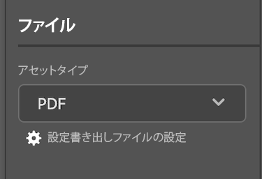

# [!DNL InDesign] からドキュメントをアップロード

アートボードをドキュメントとしてアップロードすると、すばやくレビューや承認を行ったり、単に [!DNL Adobe Workfront] に保存したりすることができます。

## アクセス要件

+++ 展開すると、この記事の機能のアクセス要件が表示されます。

この記事の手順を実行するには、次のアクセス権が必要です。

<table style="table-layout:auto"> 
 <col> 
 <col> 
 <tbody> 
  <!--
   <tr> 
   <td role="rowheader">[!DNL Adobe Workfront] package</td> 
   <td> Any</td> 
  </tr> 
  <tr data-mc-conditions=""> 
   <td role="rowheader">[!DNL Adobe Workfront] license</td> 
   <td>
   
Standard

   
Work or higher
 </td> 
  </tr> 
  <tr>
  -->
   <td role="rowheader">その他の製品</td> 
   <td>[!DNL Workfront] ライセンスに加えて [!DNL Adobe Creative Cloud] ライセンスが必要です。</td> 
  </tr> 
  <tr> 
   <td role="rowheader">アクセスレベル設定</td> 
   <td> 
[!UICONTROL Documents]の編集権限
 </td> 
  </tr> 
  <tr> 
   <td role="rowheader">オブジェクト権限</td> 
   <td> 
ドキュメントをアップロードするオブジェクトに対する表示以上の権限。
</td> 
  </tr> 
 </tbody> 
</table>

詳しくは、[Workfront ドキュメントのアクセス要件](/help/quicksilver/administration-and-setup/add-users/access-levels-and-object-permissions/access-level-requirements-in-documentation.md)を参照してください。

+++

## 前提条件

* [!DNL InDesign] からドキュメントをアップロードする前に、[!DNL Adobe Workfront for design and video] プラグインをインストールしてください。

  手順については、[インストール [!DNL Adobe Workfront for design and video]](/help/quicksilver/workfront-integrations-and-apps/adobe-workfront-for-creative-cloud/wf-install-cc.md)を参照してください。

## [!DNL InDesign] へドキュメントをアップロード

1. 右上隅にある&#x200B;**[!UICONTROL メニュー]**&#x200B;アイコンをクリックし、「**[!UICONTROL 作業リスト]**」を選択します。 メニューを使用して親オブジェクトに移動することもできます。

   

1. ドキュメントをアップロードする作業アイテムに移動します。
1. ナビゲーションバーの&#x200B;**[!UICONTROL ドキュメント]** アイコン をクリックします。

1. プラグインの下部近くにある「**[!UICONTROL 新規ファイル]**」をクリックします。
1. （オプション）**[!UICONTROL 更新]**&#x200B;エリアにコメントを入力します。
1. ドロップダウンメニューから「**[!UICONTROL アセットタイプ]**」を選択します。
1. 「**[!UICONTROL 設定書き出しファイルの設定]**」ダイアログボックスを開き、上で選択したアセットタイプに基づいて必要な書き出しオプションを設定します。

   
1. 「**[!UICONTROL アップロード]**」をクリックします。
ドキュメントは、プラグインとデスクトップアプリの[!UICONTROL  ドキュメント ]領域に表示されます。
