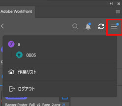
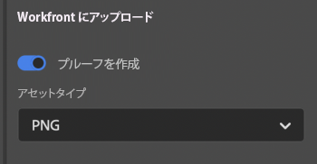
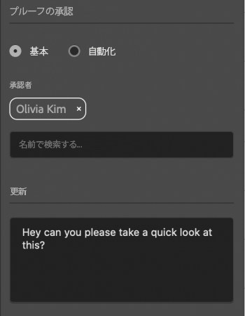
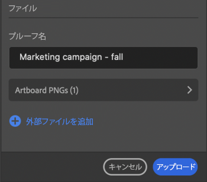
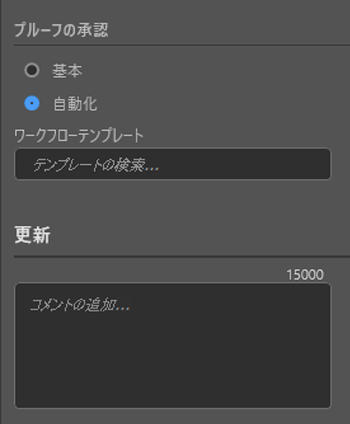

# 配達確認のアップロード元 [!DNL Illustrator]

アートボードを配達確認としてに直接アップロードできます。 [!DNL Adobe Workfront] 徹底的なレビューと承認を行う

## アクセス要件

この記事の手順を実行するには、次のアクセス権が必要です。

<table style="table-layout:auto"> 
 <col> 
 <col> 
 <tbody> 
 <tr> 
   <td role="rowheader">[!DNL Adobe Workfront] 計画*</td> 
   <td> 
現在のプラン：[!UICONTROL Pro] 以降
 
または
 
レガシープラン：[!UICONTROL Premium]
 
様々なプランでのアクセス権の校正について詳しくは、を参照してください。
 </td> 
  </tr> 
  <tr> 
   <td role="rowheader">[!DNL Adobe Workfront] ライセンス*</td> 
   <td> 
現在のプラン：[!UICONTROL Work] または [!UICONTROL Proof]
 
レガシープラン：任意（ユーザーの校正が有効になっている必要があります）
 </td> 
  </tr> 
  <tr> 
   <td role="rowheader">製品</td> 
   <td>次が必要です： [!DNL Adobe Creative Cloud] に加えてライセンス [!DNL Workfront] ライセンス。</td> 
  </tr> 
  <tr> 
   <td role="rowheader">プルーフ権限プロファイル </td> 
   <td>[!UICONTROL Manager] 以降</td> 
  </tr> 
  <tr> 
   <td role="rowheader">オブジェクト権限</td> 
   <td> 
[!UICONTROL ドキュメント ] へのアクセスの編集
 
追加のアクセス権のリクエストについて詳しくは、 <a href="../../workfront-basics/grant-and-request-access-to-objects/request-access.md" class="MCXref xref">オブジェクトへのアクセスのリクエスト </a>.
 </td> 
  </tr> 
 </tbody> 
</table>

&#42;保有するプラン、役割、または配達確認権限プロファイルを確認するには、 [!DNL Workfront] または [!DNL Workfront Proof] 管理者。

## 前提条件

* 次をインストールする必要があります： [!DNL Adobe Workfront for design and video] プラグインを使用して、次の配達確認をアップロードする必要があります： [!DNL Illustrator].

   手順については、 [インストール [!DNL Adobe Workfront for design and video]](/help/quicksilver/workfront-integrations-and-apps/adobe-workfront-for-creative-cloud/wf-install-cc.md).

## 基本配達確認のアップロード

1. 次をクリック： **[!UICONTROL メニュー]** アイコンをクリックし、「 **[!UICONTROL 作業用リスト]**. メニューを使用して親オブジェクトに移動することもできます。

   

1. 配達確認をアップロードする作業項目に移動します。
1. 次をクリック： **[!UICONTROL 文書]** アイコン  をクリックします。
1. クリック **[!UICONTROL 新規ファイル]** プラグインの下部付近にある。
1. を有効にします。 **[!UICONTROL 配達確認の作成]** 切り替え
1. を選択します。 **[!UICONTROL アセットタイプ]** を選択します。

   

1. 内 **[!UICONTROL 配達確認の承認]** セクション、選択 **[!UICONTROL 基本]**.
1. （オプション）承認者を追加します。
1. （オプション） **[!UICONTROL 更新]** 領域

   

1. （オプション）配達確認の名前を **[!UICONTROL 配達確認名]** テキストボックス
1. （オプション）「 」を選択します。 **[!UICONTROL 外部ファイルを追加]** をクリックして、コンピュータからファイルを追加します。
1. クリック **[!UICONTROL アップロード]**&#x200B;を選択し、上で選択したアセットタイプに基づいて、必要な書き出しオプションを設定します。

   \
   ドキュメントが [!UICONTROL ドキュメント] 領域がプラグインおよびデスクトップアプリケーションに表示される問題を修正しました。

## 自動配達確認のアップロード

1. 次をクリック： **[!UICONTROL メニュー]** アイコンをクリックし、「 **[!UICONTROL 作業用リスト]**. メニューを使用して親オブジェクトに移動することもできます。

   

1. 配達確認をアップロードする作業項目に移動します。
1. 次をクリック： **[!UICONTROL 文書]** アイコン  をクリックします。

1. クリック **[!UICONTROL 新規ファイル]** プラグインの下部付近にある。
1. を有効にします。 **[!UICONTROL 配達確認の作成]** 切り替えて、 **[!UICONTROL アセットタイプ]** を選択します。

   

1. 内 **[!UICONTROL 配達確認の承認]** セクション、選択 **[!UICONTROL 自動]**.
1. （オプション） **[!UICONTROL ワークフローテンプレート]** 「 」ボックスに、配達確認ワークフローテンプレートの名前を入力します。

{{adjust-proof-settings}}

1. （オプション） **[!UICONTROL 更新]** 領域

    <!-- new screenshot -->

1. （オプション）配達確認の名前を **[!UICONTROL 配達確認名]** テキストボックス
1. （オプション）「 」を選択します。 **[!UICONTROL 外部ファイルを追加]** をクリックして、コンピュータからファイルを追加します。
1. クリック **[!UICONTROL アップロード]**&#x200B;を選択し、上で選択したアセットタイプに基づいて、必要な書き出しオプションを設定します。

   \
   ドキュメントが [!UICONTROL ドキュメント] 領域がプラグインおよびデスクトップアプリケーションに表示される問題を修正しました。

## 新しい配達確認バージョンをアップロード

新しいバージョンの配達確認をアップロードできます。 このプラグインでは以前のバージョンで設定された校正ワークフローが記憶されますが、必要に応じて変更できます。

1. 次をクリック： **[!UICONTROL メニュー]** アイコンをクリックし、「 **[!UICONTROL 作業用リスト]**. メニューを使用して親オブジェクトに移動することもできます。

   

1. ドキュメントのアップロード先の作業項目に移動します。
1. 次をクリック： **[!UICONTROL 文書]** アイコン をクリックします。

1. クリック **[!UICONTROL 新しいバージョン]** プラグインの下部付近にある。
1. を選択します。 **[!UICONTROL アセットタイプ]** を選択します。
1. を有効にします。 **[!UICONTROL 配達確認の作成]** 切り替えて、 **[!UICONTROL アセットタイプ]** を選択します。

   

1. 内 *[!UICONTROL *配達確認の承認]**セクションで、「 **[!UICONTROL 基本]** または **[!UICONTROL 自動]**.

1. 追加 **[!UICONTROL レビュー担当者]** または **[!UICONTROL ワークフローテンプレート]** 手順 7 で選択した承認タイプに基づいて

1. （オプション） **[!UICONTROL 更新]** 領域
1. クリック **[!UICONTROL アップロード]**を選択し、上で選択したアセットタイプに基づいて、必要な書き出しオプションを設定します。
ドキュメントが [!UICONTROL ドキュメント] 領域がプラグインおよびデスクトップアプリケーションに表示される問題を修正しました。
