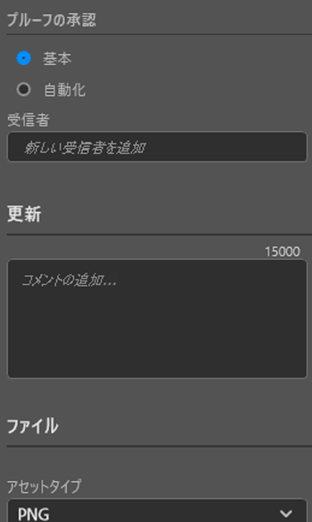
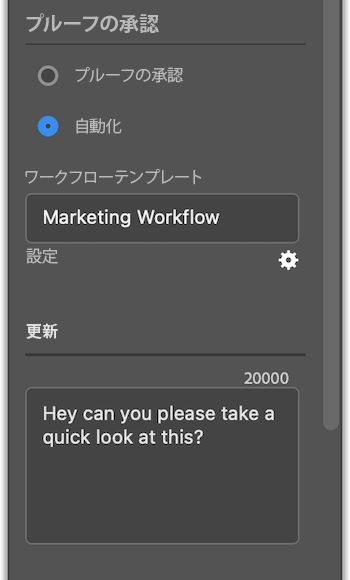

# [!DNL Illustrator] からプルーフをアップロード

アートボードをプルーフとして [!DNL Adobe Workfront] に直接アップロードすると、徹底的なレビューと承認を行うことができます。

## アクセス要件

+++ 展開すると、この記事の機能のアクセス要件が表示されます。

<table style="table-layout:auto"> 
 <col> 
 <col> 
 <tbody> 
 <tr> 
   <td role="rowheader">[!DNL Adobe Workfront] package</td> 
   <td> 任意</td> 
  </tr> 
  <tr> 
   <td role="rowheader">[!DNL Adobe Workfront] ライセンス</td> 
   <td> 
標準
 
ワークまたはそれ以上
 </td> 
  </tr> 
  <tr> 
   <td role="rowheader">製品</td> 
   <td>[!DNL Workfront] ライセンスに加えて [!DNL Adobe Creative Cloud] ライセンスが必要です。</td> 
  </tr> 
  <tr> 
   <td role="rowheader">プルーフ権限プロファイル </td> 
   <td>[!UICONTROL Manager] 以上</td> 
  </tr> 
  <tr> 
   <td role="rowheader">オブジェクト権限</td> 
   <td> 
[!UICONTROL Documents]の編集権限
 
追加のアクセス権のリクエストについて詳しくは、<a href="../../workfront-basics/grant-and-request-access-to-objects/request-access.md" class="MCXref xref">オブジェクトへのアクセス権のリクエスト</a>を参照してください。
 </td> 
  </tr> 
 </tbody> 
</table>

詳しくは、[Workfront ドキュメントのアクセス要件](/help/quicksilver/administration-and-setup/add-users/access-levels-and-object-permissions/access-level-requirements-in-documentation.md)を参照してください。

+++

## 前提条件

* [!DNL Illustrator] からプルーフをアップロードする前に、[!DNL Adobe Workfront for design and video] をインストールする必要があります。

  手順については、[インストール [!DNL Adobe Workfront for design and video]](/help/quicksilver/workfront-integrations-and-apps/adobe-workfront-for-creative-cloud/wf-install-cc.md)を参照してください。

## 基本プルーフをアップロード

1. 右上隅にある&#x200B;**[!UICONTROL メニュー]**&#x200B;アイコンをクリックし、「**[!UICONTROL 作業リスト]**」を選択します。メニューを使用して親オブジェクトに移動することもできます。

   

1. プルーフをアップロードする作業アイテムに移動します。
1. ナビゲーションバーの **[!UICONTROL ドキュメント]** アイコン  をクリックします。
1. プラグインの下部近くにある「**[!UICONTROL 新規ファイル]**」をクリックします。
1. **[!UICONTROL プルーフを作成]**&#x200B;切替スイッチを有効にします。
1. （オプション）**[!UICONTROL プルーフ名]**&#x200B;テキストボックスにプルーフ名を入力します。
1. 「**[!UICONTROL プルーフの承認]**」セクションで、「**[!UICONTROL 基本]**」を選択します。
1. （オプション）承認者を追加します。
1. （オプション）**[!UICONTROL アップデート]**&#x200B;エリアにコメントを入力します。

   

1. ドロップダウンメニューから「**[!UICONTROL アセットタイプ]**」を選択します。

1. （オプション）「**[!UICONTROL 外部ファイルを追加]**」を選択して、コンピューターからファイルを追加します。
1. 「**[!UICONTROL アップロード]**」をクリックし、上で選択したアセットタイプに基づいて、必要な書き出しオプションを設定します。

   \
   ドキュメントが、プラグインとデスクトップアプリの[!UICONTROL ドキュメント]エリアに表示されます。

## 自動プルーフをアップロード

1. 右上隅にある&#x200B;**[!UICONTROL メニュー]**&#x200B;アイコンをクリックし、「**[!UICONTROL 作業リスト]**」を選択します。メニューを使用して親オブジェクトに移動することもできます。

   

1. プルーフをアップロードする作業アイテムに移動します。
1. ナビゲーションバーの **[!UICONTROL ドキュメント]** アイコン  をクリックします。

1. プラグインの下部近くにある「**[!UICONTROL 新規ファイル]**」をクリックします。
1. **[!UICONTROL プルーフを作成]**&#x200B;切替スイッチを有効にします。
1. （オプション）「**[!UICONTROL プルーフ名]**」テキストボックスにプルーフ名を入力します。
1. 「**[!UICONTROL プルーフの承認]**」セクションで、「**[!UICONTROL 自動化]**」を選択します。
1. （オプション）「**[!UICONTROL ワークフローテンプレート]**」ボックスに、プルーフワークフローテンプレートの名前を入力します。

{{adjust-proof-settings}}

>[!NOTE]
>
> ワークフローテンプレートに空白の必須フィールドがある場合は、自動プルーフ設定が自動的に開きます。また、プルーフをアップロードするには、これらのフィールドに値を入力する必要があります。

1. （オプション）**[!UICONTROL アップデート]**&#x200B;エリアにコメントを入力します。

   

1. ドロップダウンメニューから「**[!UICONTROL アセットタイプ]**」を選択します。
1. （オプション）「**[!UICONTROL 外部ファイルを追加]**」を選択して、コンピューターからファイルを追加します。
1. 「**[!UICONTROL アップロード]**」をクリックし、上で選択したアセットタイプに基づいて、必要な書き出しオプションを設定します。
ドキュメントが、プラグインとデスクトップアプリの[!UICONTROL ドキュメント]エリアに表示されます。

## 新しいプルーフのバージョンをアップロード

新しいバージョンのプルーフをアップロードできます。プラグインは以前のバージョンで設定されたプルーフワークフローを記憶しますが、必要に応じてこれを変更できます。

1. 右上隅にある&#x200B;**[!UICONTROL メニュー]**&#x200B;アイコンをクリックし、「**[!UICONTROL 作業リスト]**」を選択します。メニューを使用して親オブジェクトに移動することもできます。

   

1. ドキュメントのアップロード先の作業アイテムに移動します。
1. ナビゲーションバーの **[!UICONTROL ドキュメント]** アイコン  をクリックします。

1. プラグインの下部近くにある「**[!UICONTROL 新しいバージョン]**」をクリックします。
1. **[!UICONTROL プルーフを作成]**&#x200B;切替スイッチを有効にします。

1. 「*[!UICONTROL プルーフの承認]*」セクションで、「**[!UICONTROL 基本]**」または「**[!UICONTROL 自動化]**」を選択します。

1. 手順 7 で選択した承認タイプに基づいて、「**[!UICONTROL レビュアー]**」または「**[!UICONTROL ワークフローテンプレート]**」を追加します。

1. （オプション）**[!UICONTROL アップデート]**&#x200B;エリアにコメントを入力します。
1. ドロップダウンメニューから「**[!UICONTROL アセットタイプ]**」を選択します。
1. 「**[!UICONTROL アップロード]**」をクリックし、上で選択したアセットタイプに基づいて、必要な書き出しオプションを設定します。
ドキュメントが、プラグインとデスクトップアプリの[!UICONTROL ドキュメント]エリアに表示されます。
