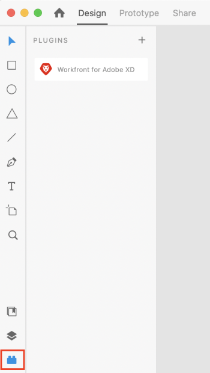

# [!DNL Adobe Workfront for XD] をインストールして開く

[!DNL Adobe Workfront for XD] プラグインは、Adobe Marketplace からインストールできます。このプラグインでは、次の言語をサポートしています。

* Japanese
* フランス語
* ドイツ語
* イタリア語
* スペイン語
* ポルトガル語
* 日本語
* 簡体字中国語
* 繁体字中国語
* 韓国語

## アクセス要件

+++ 展開すると、この記事の機能のアクセス要件が表示されます。

<table style="table-layout:auto"> 
 <col> 
 </col> 
 <col> 
 </col> 
 <tbody> 
 <!-- <tr> 
   <td role="rowheader">[!DNL Adobe Workfront] package/td> 
   <td> 
Any
 </td> 
  </tr> 
  <tr data-mc-conditions=""> 
   <td role="rowheader">[!DNL Adobe Workfront] license*</td> 
   <td>
   
Standard

    
Work or higher
 </td> 
  </tr> -->
  <tr> 
   <td role="rowheader">その他の製品</td> 
   <td>
[!DNL Workfront] ライセンスに加えて [!DNL Adobe Creative Cloud] ライセンスが必要です。
</td> 
  </tr> 
 </tbody> 
</table>

詳しくは、[Workfront ドキュメントのアクセス要件](/help/quicksilver/administration-and-setup/add-users/access-levels-and-object-permissions/access-level-requirements-in-documentation.md)を参照してください。

+++

## 前提条件

* Workfront プラグインをインストールする前に、[!DNL Adobe XD] アプリをインストールする必要があります。

## 組織への [!DNL Adobe Workfront for XD] プラグインのインストール

[!DNL Adobe Admin Console] 管理者は、プラグインを [!DNL Creative Cloud] デプロイメントパッケージに含めることができます。詳しくは、[パッケージへのプラグインの追加](https://helpx.adobe.com/jp/enterprise/using/manage-extensions.html)を参照してください。

[ こちらのビデオチュートリアルをご覧ください ](https://www.youtube.com/watch?v=zzvXNLIBzrc){target=_blank}。

また、[!DNL Adobe Admin Console] 管理者は、ユーザーに配布するプラグイン専用のパッケージを作成できます。詳しくは、「[[!UICONTROL [!DNL Adobe Workfront] for [!DNL Creative Cloud]] packages for your users in the [!DNL Adobe Admin Console]](/help/quicksilver/administration-and-setup/configure-integrations/create-plugin-only-packages.md)の作成」を参照してください

## [!DNL Adobe Workfront for XD] プラグインの個別インストール

[!DNL Adobe Exchange] から自分用に [!DNL Adobe Workfront for XD] プラグインをインストールできます。

1. Adobe Exchange の [Adobe Workfront for XD のインストールページ](https://exchange.adobe.com/apps/cc/4c3566f9?pluginId=4c3566f9&workflow=share)に移動します。
1. 表示されるダイアログで、「**[!DNL Adobe Creative Cloud] デスクトップアプリを開く**」をクリックします。
1. [!DNL Adobe XD] プラグインマネージャーを開いたら、「**[!UICONTROL インストール]**」をクリックします。
1. ダイアログボックスの情報を読み、「**[!UICONTROL OK]**」をクリックします。
1. プラグインを開く方法については、次の節を参照してください。

## [!DNL Adobe Workfront for XD] プラグインを開きます。

1. [!DNL Adobe XD] を開きます。.

1. 新規ファイルを作成するか、既存のファイルを開きます。

1. 左下隅で、**プラグイン**&#x200B;アイコンをクリックします。

1. **[!UICONTROL プラグインパネル]**&#x200B;で、**[!UICONTROL Adobe Workfront for XD]** を検索します。

1. プラグインへのログイン方法については、次の節を参照してください。

## [!DNL Adobe Workfront for XD] にログイン

1. プラグインパネルが開いていることを確認し、「**[!DNL Adobe Workfront for XD]**」をクリックします。
1. ドメインを入力し、「**[!UICONTROL ログイン]**」をクリックします。ブラウザーページが開きます。

   >[!TIP]
   >
   >* ドメインを検索するには、ブラウザーを開いて [!DNL Workfront] インスタンスに移動し、次の URL の最初の部分をコピーします。\
   >
   >
   >* Workfront インスタンスがExperience Cloudと統合されていて、ドメインが「`experience.adobe.com`」で始まる場合は、Admin Consoleの製品/WorkfrontにあるWorkfront ドメインを提供するように管理者に依頼します。

1. ブラウザーで、[!DNL Adobe] 資格情報を入力し、「**[!DNL Log in]**」をクリックします。会社がシングルサインオン（SSO）を使用している場合は、SSO プロバイダーのページにリダイレクトされ、そこからログインします。

   >[!NOTE]
   >
   >最近ログインした場合は、[!DNL Workfront] の資格情報の入力を求められない場合があります。

1. 画面のプロンプトに従って、[!DNL Workfront] にログインします。

   >[!NOTE]
   >
   >* [!DNL Workfront] と [!DNL Adobe Creative Cloud] との接続には OAuth 2.0 を使用します。これはほとんどの Web ベースの統合で、ユーザーの認証と承認に使用される安全な規格です。

1. 「**[!UICONTROL アクセスを許可]**」をクリックしてログインを完了し、[!DNL Adobe XD] に戻って自分の作業を確認します。

### ログインエラーのトラブルシューティング

**ログインしようとすると、「エラーが発生しました」というエラーが表示される**

`experience.adobe.com` で始まる URL を使用してプラグインにログインすることはできません。

 

この問題を修正するには、

1. Adobe Workfront for XD プラグインをアンインストールして再インストールし、ドメインとエラーをクリアします。

1. Workfront ドメインを入力します。 ドメインは、`company-name.my.workfront.com` ではなく `experience.adobe.com` である必要があります。

Adobe Unified Experience を使用している場合にWorkfront ドメインを見つけるには、に移動します。
