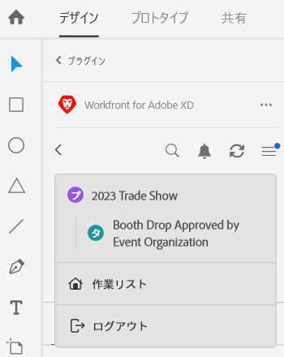
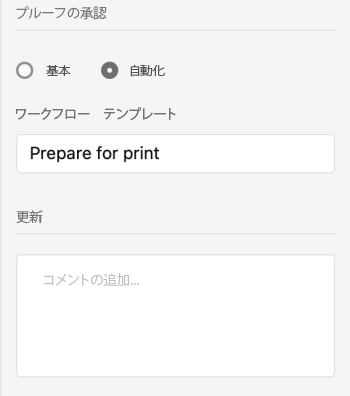
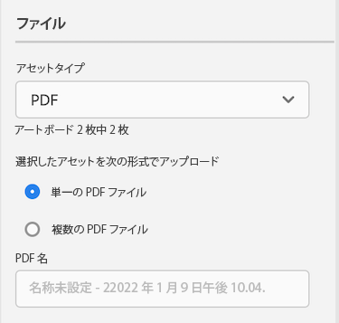
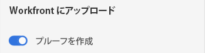

# [!DNL XD] アートボードをプルーフとして [!DNL Workfront] にアップロード

アートボードをプルーフとして [!DNL Adobe Workfront] に直接アップロードすると、詳細なレビューと承認ができます。

## アクセス要件

この記事の手順を実行するには、次のアクセス権が必要です。

<table style="table-layout:auto"> 
 <col> 
 <col> 
 <tbody> 
  <tr> 
   <td role="rowheader">[!DNL Adobe Workfront] プラン*</td> 
   <td> 
現在のプラン：[!UICONTROL Pro] 以上
 
または
 
従来のプラン：[!UICONTROL Premium]
 
様々なプランでのプルーフのアクセス権について詳しくは、以下を参照してください。
 </td> 
  </tr> 
  <tr> 
   <td role="rowheader">[!DNL Adobe Workfront] ライセンス*</td> 
   <td> 
現在のプラン：[!UICONTROL Work] または [!UICONTROL Proof]
 
従来のプラン：任意（ユーザーのプルーフ機能が有効になっている必要があります）
 </td> 
  </tr> 
  <tr> 
   <td role="rowheader">製品</td> 
   <td>[!DNL Workfront] ライセンスに加えて [!DNL Adobe Creative Cloud] ライセンスが必要です。</td> 
  </tr> 
  <tr> 
   <td role="rowheader">プルーフ権限プロファイル </td> 
   <td>[!UICONTROL Manager] 以上</td> 
  </tr> 
  <tr> 
   <td role="rowheader">オブジェクト権限</td> 
   <td> 
[!UICONTROL Documents]の編集権限
 
追加のアクセス権のリクエストについて詳しくは、<a href="../../workfront-basics/grant-and-request-access-to-objects/request-access.md" class="MCXref xref">オブジェクトへのアクセス権のリクエスト</a> を参照してください。
 </td> 
  </tr> 
 </tbody> 
</table>

&#42;ご利用のプラン、役割またはプルーフ権限プロファイルを確認するには、[!DNL Workfront] または [!DNL Workfront Proof] の管理者にお問い合わせください。

## 前提条件

* [!DNL Adobe XD] からプルーフをアップロードする前に、[!DNL Adobe Workfront for XD] プラグインをインストールする必要があります。

  手順については、[ [!DNL Adobe Workfront for XD]](/help/quicksilver/workfront-integrations-and-apps/adobe-workfront-for-creative-cloud/wf-adobe-xd-install.md) のインストールを参照してください。

## 静的プルーフのアップロード

1. 右上隅の&#x200B;**[!UICONTROL メニュー]**&#x200B;アイコンをクリックし、「**[!UICONTROL 作業リスト]**」を選択します。メニューを使用して親オブジェクトに移動することもできます。

   

1. 静的プルーフをアップロードする作業アイテムに移動します。
1. ナビゲーションバーの&#x200B;**[!UICONTROL ドキュメント]**&#x200B;アイコン  をクリックします。

1. プラグインの下部付近にある&#x200B;**[!UICONTROL 新規ファイル]**&#x200B;をクリックします。
1. アップロードするアートボードを選択します。

   >[!TIP]
   >
   >* アートボードは、選択した順序でプルーフに表示されます。選択した最初のアートボードがプルーフの最初のページになります。
   >* 複数のアートボードをすばやく選択するには、目的のアートボード上でマウスをクリックしてドラッグします。これにより、プルーフでのアートボードの順序は制御できません。

1. 「**[!UICONTROL プルーフを作成]**」を有効にします。

1. プルーフに名前を付けます。

1. 希望するプルーフ承認のタイプを選択します。

   <table style="table-layout:auto"> 
    <col> 
    <col> 
    <tbody> 
     <tr> 
      <td role="rowheader">[!UICONTROL Basic]： </td> 
      <td> 
基本的な承認プロセスはアドホックで、必要に応じて様々なレビュアーを含めることができます。 
 
       <ul> 
        <li> 
（オプション）「<strong>承認者</strong>」と入力します。
 </li> 
       </ul> </td> 
     </tr> 
     <tr> 
      <td role="rowheader">[!UICONTROL Automated]</td> 
      <td> 
自動承認プロセスは、管理者が事前に作成したもので、特定のレビュアーとステージが含まれています。詳しくは、<a href="../../review-and-approve-work/proofing/proofing-overview/automated-workflow.md" class="MCXref xref">自動ワークフローの概要</a>を参照してください。
 
       <ul> 
        <li> 
ドロップダウンメニューから [!UICONTROL Workflow Template] を選択します。
 </li> 
       </ul> </td> 
     </tr> 
    </tbody> 
   </table>

{{adjust-proof-settings}}

1. （オプション）**[!UICONTROL 更新]**&#x200B;エリアにコメントを入力します。

   

1. **[!UICONTROL アセットタイプ]**&#x200B;ドロップダウンメニューから書き出し形式を選択します。

1. (オプション）アセットタイプとして PDF を選択し、複数のアートボードを選択している場合、アートボードを&#x200B;**[!UICONTROL 単一の PDF ファイル]**&#x200B;または&#x200B;**複数の[!UICONTROL PDFファイル]**&#x200B;として書き出すかどうかを選択します。

1. （オプション）PDF に名前を付けます。

   

1. 「**[!UICONTROL アップロード]**」をクリックします。\
   ドキュメントが、プラグインとデスクトップアプリの[!UICONTROL ドキュメント]エリアに表示されます。

## インタラクティブなプルーフをアップロード {#upload-an-interactive-proof}

[!DNL Workfront for Adobe] のプラグインを使用すると、アートボードのインタラクティブなプルーフを作成できます。これは 2 段階のプロセスです。まず、インタラクティブリンクを作成してから、プルーフを作業アイテムにアップロードする必要があります。

### アートボード用のインタラクティブリンクを作成  {#create-an-interactive-link-for-your-art-board}

1. アートボードを開き、画面の左上隅にある「**[!UICONTROL 共有]**」をクリックします。
1. リンク設定を指定します。

   1. リンクに名前を付けます。
   1. 表示設定を選択します。
   1. 「**[!UICONTROL リンクアクセス]**」セクションで、**[!UICONTROL このリンクのすべてのユーザー]** が選択されていることを確認します。

      インタラクティブなプルーフを生成するには、このタイプのアクセスを有効にする必要があります。

   1. 「**[!UICONTROL リンクを作成]**」をクリックします。

1. 画面の左上隅にある&#x200B;**[!UICONTROL デザイン]**&#x200B;をクリックしして戻ります。以下の[インタラクティブなプルーフをアップロード](#upload-an-interactive-proof)の節に進みます。

   >[!NOTE]
   >
   >画面の左下隅にあるプラグインパネルを再度開く必要が生じる場合があります。

### インタラクティブなプルーフをアップロード

1. 右上隅の&#x200B;**[!UICONTROL メニュー]**&#x200B;アイコンをクリックし、**[!UICONTROL 作業リスト]**&#x200B;を選択します。メニューを使用して親オブジェクトに移動することもできます。

   

1. インタラクティブなプルーフをアップロードする作業アイテムに移動します。
1. ナビゲーションバーの&#x200B;**[!UICONTROL ドキュメント]**&#x200B;アイコン  をクリックします。

1. プラグインの下部近くにある「**[!UICONTROL 新規ファイル]**」をクリックします。
1. 「**[!UICONTROL プルーフを作成]**」を有効にします。

1. 希望するプルーフ承認のタイプを選択します。

   <table style="table-layout:auto"> 
    <col> 
    <col> 
    <tbody> 
     <tr> 
      <td role="rowheader">[!UICONTROL Basic]： </td> 
      <td> 
基本的な承認プロセスはアドホックで、必要に応じて様々なレビュアーを含めることができます。 
 
       <ul> 
        <li> 
（オプション）ボックスに「<strong>承認者</strong>」と入力します。
 </li> 
       </ul> </td> 
     </tr> 
     <tr> 
      <td role="rowheader">[!UICONTROL Automated]</td> 
      <td> 
自動承認プロセスは、管理者が事前に作成したもので、特定のレビュアーとステージが含まれています。詳しくは、<a href="../../review-and-approve-work/proofing/proofing-overview/automated-workflow.md" class="MCXref xref">自動ワークフローの概要</a>を参照してください。
 
       <ul> 
        <li> 
ドロップダウンメニューから [!UICONTROL Workflow Template] を選択します。
 </li> 
       </ul> </td> 
     </tr> 
    </tbody> 
   </table>

{{adjust-proof-settings}}

1. （オプション）**[!UICONTROL アップデート]**&#x200B;エリアにコメントを入力します。

   

1. **[!UICONTROL アセットタイプ]**&#x200B;ドロップダウンメニューから、「**共有リンク**」タブの下に先ほど作成したリンクをクリックします。詳しくは、[アートボード用のインタラクティブリンクを作成](#create-an-interactive-link-for-your-artboard)を参照してください。\
   

1. 「**[!UICONTROL アップロード]**」をクリックします。

   ドキュメントが、プラグインとデスクトップアプリの[!UICONTROL ドキュメント]エリアに表示されます。

   >[!IMPORTANT]
   >
   >ユーザーはインタラクティブなプルーフを確認および承認するには、ユーザーが[!UICONTROL デスクトッププルーフビューアー]へのアクセス権を持つ必要があります。詳しくは、[[!UICONTROL デスクトッププルーフビューア]](../../review-and-approve-work/proofing/use-the-desktop-proofing-viewer/installing-desktop-proofing-viewer.md)のインストールを参照してください。

## 新しいプルーフのバージョンをアップロード

新しいバージョンのプルーフをアップロードできます。プラグインは以前のバージョンで設定されたプルーフワークフローを記憶しますが、必要に応じてこれを変更できます。

1. 右上隅にある&#x200B;**[!UICONTROL メニュー]**&#x200B;アイコンをクリックし、**[!UICONTROL 作業リスト]**&#x200B;を選択します。メニューを使用して親オブジェクトに移動することもできます。

   

1. ドキュメントのアップロード先の作業アイテムに移動します。
1. ナビゲーションバーで&#x200B;**[!UICONTROL ドキュメント]**&#x200B;アイコン  をクリックします。

1. プラグインの下部近くにある&#x200B;**[!UICONTROL 新しいバージョン]**&#x200B;をクリックします。
1. **[!UICONTROL プルーフを作成]**&#x200B;を有効にします。
1. アップロードするアートボードを選択します。

   >[!NOTE]
   >
   >新しいバージョンの .SVG、.PNG や .JPG をアップロードする場合は、1 つのアートボードのみをアップロードできます。

1. 希望するプルーフ承認のタイプを選択します。

   <table style="table-layout:auto"> 
    <col> 
    <col> 
    <tbody> 
     <tr> 
      <td role="rowheader">[!UICONTROL Basic]： </td> 
      <td> 
基本的な承認プロセスはアドホックで、必要に応じて様々なレビュアーを含めることができます。 
 
       <ul> 
        <li> 
（オプション）ボックスに「<strong>承認者</strong>」と入力します。
 </li> 
       </ul> </td> 
     </tr> 
     <tr> 
      <td role="rowheader">[!UICONTROL Automated]</td> 
      <td> 
自動承認プロセスは、管理者が事前に作成したもので、特定のレビュアーとステージが含まれています。詳しくは、<a href="../../review-and-approve-work/proofing/proofing-overview/automated-workflow.md" class="MCXref xref">自動ワークフローの概要</a>を参照してください。
 
       <ul> 
        <li> 
ドロップダウンメニューから [!UICONTROL Workflow Template] を選択します。
 </li> 
       </ul> </td> 
     </tr> 
    </tbody> 
   </table>

{{adjust-proof-settings}}

1. 書き出し形式を&#x200B;**[!UICONTROL アセットタイプ]**&#x200B;ドロップダウンメニューから選択します。

   

1. （オプション）**[!UICONTROL アップロード]**&#x200B;エリアにコメントを入力します。

   

1. (オプション）アセットタイプとして PDF を選択し、複数のアートボードを選択している場合、アートボードを&#x200B;**[!UICONTROL 単一の PDF ファイル]s**&#x200B;または&#x200B;**複[!UICONTROL 数のPDFファイル]**&#x200B;として書き出すかどうかを選択します。

1. （オプション）PDF に名前を付けます。

   

1. 「**[!UICONTROL アップロード]**」をクリックします。\
   ドキュメントが、プラグインとデスクトップアプリの[!UICONTROL ドキュメント]エリアに表示されます。
