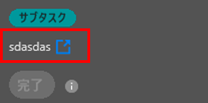

# 次を使用して作業項目を完了済みとマーク [!DNL Adobe Workfront] プラグイン

次の場所に留まることができます [!DNL Adobe Creative Cloud] アプリケーションとシームレスに、 [!DNL Adobe Workfront] プラグインを使用：

{{cc-app-list}}

## アクセス要件

この記事の手順を実行するには、次のアクセス権が必要です。

<table style="table-layout:auto"> 
 <col> 
 <col> 
 <tbody> 
  <tr> 
   <!-- <td role="rowheader">[!DNL Adobe Workfront] plan*</td> 
   <td> 
[!UICONTROL Pro] or higher
 </td> 
  </tr> 
  <tr data-mc-conditions=""> 
   <td role="rowheader">[!DNL Adobe Workfront] license*</td> 
   <td> 
Work or higher
 </td> 
  </tr> --> 
  <tr> 
   <td role="rowheader">製品</td> 
   <td>次が必要です： [!DNL Adobe Creative Cloud] に加えてライセンス [!DNL Workfront] ライセンス。</td> 
  </tr> 
  <tr> 
   <td role="rowheader">オブジェクト権限</td> 
   <td> 
[!UICONTROL 編集 ]：完了するオブジェクトへのアクセス権。
 
追加のアクセス権のリクエストについて詳しくは、 <a href="../../workfront-basics/grant-and-request-access-to-objects/request-access.md" class="MCXref xref">オブジェクトへのアクセスのリクエスト </a>.
 </td> 
  </tr> 
 </tbody> 
</table>

ご利用のプラン、ライセンスの種類、アクセス権を確認するには、 [!DNL Workfront] 管理者。

## 前提条件

{{cc-install-prereq}}

## 作業項目を完了

1. 次をクリック： **[!UICONTROL メニュー]** アイコンをクリックし、「 **[!UICONTROL 作業用リスト]**. メニューを使用して親オブジェクトに移動することもできます。

   

1. 次の **[!UICONTROL 作業用リスト]**、完了とマークするタスクまたは問題を選択します。
1. クリック **[!UICONTROL 完了]**.\
   これにより、Workfrontで項目が完了したことを示します。

   >[!NOTE]
   >
   >作業項目に先行タスクがある場合、先行タスクが完了とマークされるまで、[ 完了 ] ボタンは灰色で表示されます。 内の先行タスクを表示するには [!DNL Workfront]、タスク名をクリックします。
   >

<!-- I dont think we need this one  -->
