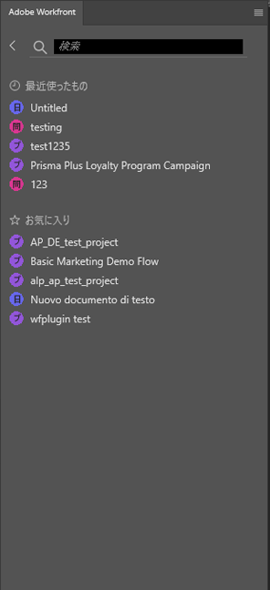

# を使用して作業内容を見つける [!DNL Adobe Workfront] プラグイン

で自分に割り当てられている作業を見つけます。 [!DNL Adobe Workfront] 次のものを残さずに [!DNL Adobe Creative Cloud] アプリケーション：

{{cc-app-list}}

## アクセス要件

この記事の手順を実行するには、次のアクセス権が必要です。

<table style="table-layout:auto"> 
 <col> 
 <col> 
 <tbody> 
 <!-- <tr> 
   <td role="rowheader">[!DNL Adobe Workfront] plan*</td> 
   <td> 
[!UICONTROL Pro] or higher
 </td> 
  </tr> 
  <tr data-mc-conditions=""> 
   <td role="rowheader">[!DNL Adobe Workfront] license*</td> 
   <td> 
[!UICONTROL Work] or [!UICONTROL Plan]
 </td> 
  </tr> -->
  <tr> 
   <td role="rowheader">製品</td> 
   <td>次が必要です： [!DNL Adobe Creative Cloud] に加えてライセンス [!DNL Workfront] ライセンス。</td> 
  </tr> 
 </tbody> 
</table>

&#42;ご利用のプラン、ライセンスの種類、アクセス権を確認するには、 [!DNL Workfront] 管理者。

## 前提条件

{{cc-install-prereq}}

## 以下を使用： [!UICONTROL 作業用リスト] 重要な情報にアクセスする

この [!UICONTROL 作業用リスト] 割り当てられたすべてのタスクと問題を 1 か所で表示できます。 以下を使用して、 [!UICONTROL 並べ替え基準] 項目をグループ化し、 [!UICONTROL フィルター] 完成させる必要のある仕事に集中する。

### 類似した作業項目を [!DNL Sort By] オプション

以下を使用： [!UICONTROL 並べ替え基準] 同様の項目を [!UICONTROL 作業用リスト]. 並べ替え基準は次のとおりです。

<table style="table-layout:auto"> 
 <col> 
 <col> 
 <tbody> 
  <tr> 
   <td> 
    <ul> 
     <li>[!UICONTROL 期限 ]</li> 
     <li>[!UICONTROL 名前 ]</li> 
     <li>[!UICONTROL プロジェクト名 ]</li> 
     <li>[!UICONTROL マイ優先度 ]</li> 
    </ul> </td> 
   <td>  </td> 
  </tr> 
 </tbody> 
</table>

### フィルターでフォーカスを絞り込む

以下を使用： [!UICONTROL フィルター] 特定の作業項目に焦点を絞る フィルターの使用方法はいくつかあります。

 

<table style="table-layout:auto"> 
 <col> 
 <col> 
 <tbody> 
  <tr> 
   <td> 
1 つ目は、作業項目のタイプまたは属性のみに基づいてフィルタリングする方法です。
 
    <ul> 
     <li><strong>作業項目</strong>:タスク、サブタスク、タスクまたは個人用タスク</li> 
     <li><strong>作業項目の状態</strong>:[!UICONTROL 作業中 ]、[!UICONTROL 開始の準備完了 ]、[!UICONTROL 準備ができていません ]</li> 
    </ul> 
2 つ目は、作業項目と作業項目の状態を一緒に使用してフィルタリングする方法です。 例えば、「タスク」と「[!UICONTROL 開始準備完了 ]」を選択して、作業の準備が整った作業リスト内のタスクをすべて検索できます。
 
[!UICONTROL Field Match] を使用して、フィルターセット内の特定の項目を検索することもできます。 
 </td> 
   <td>  </td> 
  </tr> 
 </tbody> 
</table>

## 作業内容を検索

以下を使用： [!UICONTROL 検索] バーを使用して、必要なプロジェクト、タスク、問題、ドキュメントを検索できます。

<table style="table-layout:auto"> 
 <col> 
 <col> 
 <tbody> 
  <tr> 
   <td> 
    <ul> 
     <li>最近使用した項目を表示：最新の作業項目のうち、最大 5 つをデスクトップまたはプラグインバージョンのWorkfrontで表示できます。</li> 
     <li>ピン留めされた項目を検索：新しいAdobe Workfrontエクスペリエンスで固定したプロジェクト、タスク、問題およびドキュメントにアクセスできます。</li> 
     <li>お気に入りを検索：お気に入りとして保存した任意のプロジェクト、タスク、タスク、イシュー、ドキュメントを表示できます。</li> 
    </ul> </td> 
   <td>  </td> 
  </tr> 
 </tbody> 
</table>

## 以下を使用： [!UICONTROL メニュー] プロジェクトに移動する

以下を使用して、 [!UICONTROL メニュー] アイコンをクリックして、プロジェクト内の親アイテムに移動します。

