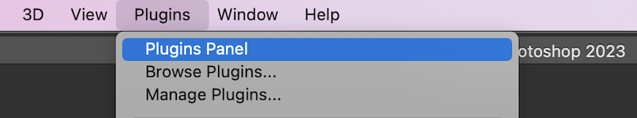

# [!DNL Adobe Workfront for Photoshop] のインストールと起動

[!DNL Adobe Workfront for Photoshop] プラグインは [!DNL Adobe Marketplace] からインストールできます。 このプラグインでは、次の言語をサポートしています。

* Japanese
* フランス語
* ドイツ語
* イタリア語
* スペイン語
* ポルトガル語
* 日本語
* 簡体字中国語
* 繁体字中国語
* 韓国語

## アクセス要件

+++ 展開すると、この記事の機能のアクセス要件が表示されます。

<table style="table-layout:auto"> 
 <col> 
 <col> 
 <tbody> 
  <tr> 
   <td role="rowheader">その他の製品</td> 
   <td>
[!DNL Workfront] ライセンスに加えて [!DNL Adobe Creative Cloud] ライセンスが必要です。
</td> 
  </tr> 
 </tbody> 
</table>

詳しくは、[Workfront ドキュメントのアクセス要件](/help/quicksilver/administration-and-setup/add-users/access-levels-and-object-permissions/access-level-requirements-in-documentation.md)を参照してください。

+++

## 前提条件

* [!DNL Workfront] プラグインをインストールするには、まず [!DNL Adobe Photoshop] アプリをインストールする必要があります。

## 組織用の [!DNL Adobe Workfront for Photoshop] プラグインのインストール

[!DNL Adobe Admin Console] 管理者は、プラグインを [!DNL Creative Cloud] デプロイメントパッケージに含めることができます。 詳しくは、[パッケージへのプラグインの追加](https://helpx.adobe.com/jp/enterprise/using/manage-extensions.html)を参照してください。

[ ビデオチュートリアルをここで表示](https://www.youtube.com/watch?v=zzvXNLIBzrc){target=_blank}。

また、[!DNL Adobe Admin Console] 管理者は、ユーザーに配布するプラグイン専用のパッケージを作成できます。 詳しくは、「[[!UICONTROL [!DNL Adobe Workfront] for [!DNL Creative Cloud]] packages for your users in the [!DNL Adobe Admin Console]](/help/quicksilver/administration-and-setup/configure-integrations/create-plugin-only-packages.md)の作成」を参照してください

## [!DNL Adobe Workfront for Photoshop] プラグインの個別インストール

[!DNL Adobe Exchange] から自分用に [!DNL Adobe Workfront for Photoshop] プラグインをインストールできます。

1. Adobe Exchange で [Adobe Workfront for Photoshop のインストールページ](https://adobe.com/go/cc_plugins_discover_plugin?pluginId=37722a55&workflow=share)に移動します。
1. 表示されるダイアログで、「**[!DNL Adobe Creative Cloud] デスクトップアプリを開く**」をクリックします。
1. [!DNL Adobe Photoshop] プラグインマネージャーを開いたら、「**[!UICONTROL インストール]**」をクリックします。
1. ダイアログボックスの情報を読み、**[!UICONTROL OK]**&#x200B;をクリックし、画面の指示に従ってインストールを完了します。

1. プラグインを開く方法については、次の節を参照してください。

## [!DNL Adobe Workfront for Photoshop] プラグインを開きます。

1. [!DNL Photoshop] を開きます。.

1. 新規ファイルを作成するか、既存のファイルを開きます。

1. 上部のメニューで、**[!UICONTROL プラグイン]**／**[!UICONTROL プラグインパネル]**&#x200B;をクリックします。

   

1. **[!UICONTROL プラグインパネル]**&#x200B;で、「**[!UICONTROL プラグイン]**」タブを選択して、**[!UICONTROL Workfront for Adobe Photoshop]** を見つけます。

   >[!TIP]
   >
   >   [!UICONTROL プラグインパネル]から開いてもプラグインが表示されない場合は、Photoshop アプリの背後にある可能性があります。 プラグインを見つけるには、Photoshop を最小化してみてください。

1. プラグインへのログイン方法については、次の節を参照してください。

## [!DNL Adobe Workfront for Photoshop] へのログイン

1. 画面上部の「**[!UICONTROL プラグイン]**」メニューから、「**[!UICONTROL プラグインパネル]**」を選択します。
1. 「**[!DNL Adobe Workfront for Photoshop]**」を選択します。
1. ドメインを入力して、「**[!UICONTROL ログイン]**」をクリックします。 ブラウザーページが開きます。 場合によっては、ブラウザーを開く権限を Photoshop に付与する必要があります。

   >[!TIP]
   >
   >* ドメインを検索するには、ブラウザーを開き、[!DNL Workfront] インスタンスに移動し、URL の最初の部分をコピーします。\
   >
   >
   >* Workfront インスタンスがExperience Cloudと統合され、ドメインが`experience.adobe.com`で始まる場合は、管理者に対して、Admin ConsoleのProduct > WorkfrontにあるWorkfront ドメインを提供するように依頼します。

1. ブラウザーで [!DNL Adobe] の資格情報を入力し、「**[!UICONTROL ログイン]**」をクリックします。 会社がシングルサインオン（SSO）を使用している場合は、SSO プロバイダーのページにリダイレクトされ、そこからログインします。

   >[!NOTE]
   >
   >最近ログインした場合は、[!DNL Workfront] の資格情報の入力を求められない場合があります。

1. 画面のプロンプトに従って、[!DNL Workfront] にログインします。

   >[!NOTE]
   >
   >* [!DNL Workfront] と [!DNL Adobe Creative Cloud] との接続には OAuth 2.0 を使用します。これはほとんどの Web ベースの統合で、ユーザーの認証と承認に使用される安全な規格です。

1. 「**[!UICONTROL アクセスを許可]**」をクリックして、ログインを完了します。
1. [!UICONTROL Adobe Photoshop] に戻って、作業内容を確認します。

### ログインエラーのトラブルシューティング

ログインしようとすると、**「エラーが発生しました」エラーが表示される**

`experience.adobe.com`で始まるURLを使用してプラグインにログインすることはできません。

 

この問題を修正するには，

1. プラグインのドメインを保存するフォルダーを削除します。

   >[!TIP]
   >
   >MacでFinderに移動し、**Command+Shift+.**&#x200B;を押します。 非表示のフォルダーを表示するには、**/Users//Library/Application Support**&#x200B;に移動し、**Workfront** フォルダーを削除します。

1. プラグインに戻り、Workfront ドメインを入力します。 ドメインは`experience.adobe.com`ではなく`company-name.my.workfront.com`である必要があります。

   [Workfront ドメインを見つけるには](/help/quicksilver/wf-api/tips-tricks-and-troubleshooting/locate-domain-for-api.md)、セットアップ、お客様情報に移動します。
