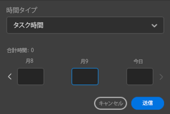

# を使用したログ時間 [!DNL Adobe Workfront] プラグイン

作業中のプロジェクト、タスク、問題に関する時間は、次のいずれかで直接記録できます [!DNL Adobe Creative Cloud] アプリケーション：

{{cc-app-list}}

## アクセス要件

この記事の手順を実行するには、次のアクセス権が必要です。

<table style="table-layout:auto"> 
 <col> 
 <col> 
 <tbody> 
  <tr> 
   <!--<td role="rowheader">[!DNL Adobe Workfront] plan*</td> 
   <td> 
[!UICONTROL Pro] or higher
 </td> 
  </tr> 
  <tr data-mc-conditions=""> 
   <td role="rowheader">[!DNL Adobe Workfront] license*</td> 
   <td> 
[!UICONTROL Work] or [!UICONTROL Plan]
 </td> 
  </tr> 
  <tr> 
   <td role="rowheader">Product</td> 
   <td>You must have an [!DNL Adobe Creative Cloud] license in addition to a [!DNL Workfront] license.</td> 
  </tr> -->
  <tr> 
   <td role="rowheader">アクセスレベル設定*</td> 
   <td> 
タスクまたはイシューへの [!UICONTROL 編集 ] アクセス
 
注意：まだアクセス権がない場合は、 [!DNL Workfront] 管理者（アクセスレベルに追加の制限を設定している場合） を参照してください。 [!DNL Workfront] 管理者はアクセスレベルを変更できます。詳しくは、 <a href="../../administration-and-setup/add-users/configure-and-grant-access/create-modify-access-levels.md" class="MCXref xref">カスタムアクセスレベルの作成または変更</a>.
 </td> 
  </tr> 
  <tr> 
   <td role="rowheader">オブジェクト権限</td> 
   <td> 
タスクまたはイシューに対する [!UICONTROL Log Hours] 権限
 
追加のアクセス権のリクエストについて詳しくは、 <a href="../../workfront-basics/grant-and-request-access-to-objects/request-access.md" class="MCXref xref">オブジェクトへのアクセスのリクエスト </a>.
 </td> 
  </tr> 
 </tbody> 
</table>

&#42;ご利用のプラン、ライセンスの種類、アクセス権を確認するには、 [!DNL Workfront] 管理者。

## 前提条件

{{cc-install-prereq}}

## Adobe Workfrontプラグインを使用したログ時間

この [!DNL Workfront] 管理者は、 [時間タイプの管理](../../administration-and-setup/set-up-workfront/configure-timesheets-schedules/hour-types.md).

Workfrontプラグインを使用して時刻を記録するには：

1. 次をクリック： **[!UICONTROL メニュー]** アイコンをクリックし、「 **[!UICONTROL 作業用リスト]**. メニューを使用して親オブジェクトに移動することもできます。

   

1. 次の **[!UICONTROL 作業用リスト]**、ログに記録する必要のある作業項目を選択します。
1. クリック **[!UICONTROL 時間]** をクリックします。

   

1. （オプション） **[!UICONTROL 時間タイプ]** を選択します。
1. 必要な日の時間を時間単位で入力します。

   

1. クリック **[!UICONTROL 送信]**.
