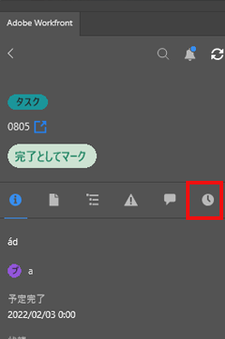

# [!DNL Adobe Workfront] プラグインを使用して時間を記録

作業中のプロジェクト、タスク、イシューに関する時間を、以下の [!DNL Adobe Creative Cloud] アプリケーションのうちのいずれかで直接記録できます。

{{cc-app-list}}

## アクセス要件

+++ 展開すると、この記事の機能のアクセス要件が表示されます。

<table style="table-layout:auto"> 
 <col> 
 <col> 
 <tbody> 
  <tr> 
   <!--<td role="rowheader">[!DNL Adobe Workfront] package</td> 
   <td> Any</td> 
  </tr> 
  <tr data-mc-conditions=""> 
   <td role="rowheader">[!DNL Adobe Workfront] license</td> 
   <td>
   
Standard

    
Work or higher
 </td> 
  </tr> -->
  <tr> 
   <td role="rowheader">その他の製品</td> 
   <td>[!DNL Workfront] ライセンスに加えて [!DNL Adobe Creative Cloud] ライセンスが必要です。</td> 
  </tr> 
  <tr> 
   <td role="rowheader">アクセスレベル設定</td> 
   <td> 
タスクまたはイシューへの [!UICONTROL Edit]アクセス権
</td> 
  </tr> 
  <tr> 
   <td role="rowheader">オブジェクト権限</td> 
   <td> 
タスクまたはイシューに対する [!UICONTROL Log Hours] 権限
 </td> 
  </tr> 
 </tbody> 
</table>

詳しくは、[Workfront ドキュメントのアクセス要件](/help/quicksilver/administration-and-setup/add-users/access-levels-and-object-permissions/access-level-requirements-in-documentation.md)を参照してください。

+++

## 前提条件

{{cc-install-prereq}}

## Adobe Workfront プラグインを使用して時間を記録

[!DNL Workfront]管理者は、[時間タイプの管理](../../administration-and-setup/set-up-workfront/configure-timesheets-schedules/hour-types.md)で説明されているように、どのプロジェクト固有の時間タイプを使用できるかを決定します。

Workfront プラグインを使用して時刻を記録するには、以下のように行います。

1. 右上隅にある&#x200B;**[!UICONTROL メニュー]**&#x200B;アイコンをクリックし、「**[!UICONTROL 作業リスト]**」を選択します。メニューを使用して親オブジェクトに移動することもできます。

   

1. **[!UICONTROL 作業リスト]**&#x200B;から、時間を記録する必要のある作業アイテムを選択します。
1. **[!UICONTROL 時間]**&#x200B;をクリックします。

   

1. （オプション）ドロップダウンメニューから&#x200B;**[!UICONTROL 時間タイプ]**&#x200B;を選択します。
1. 必要な日の時間を時間単位で入力します。

   

1. 「**[!UICONTROL 送信]**」をクリックします。
