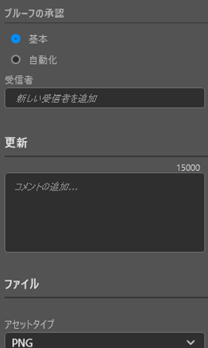
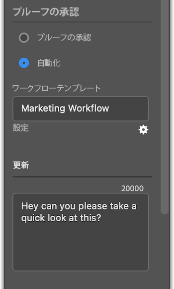

# [!DNL Photoshop] からプルーフをアップロード

アートボードをプルーフとして [!DNL Adobe Workfront] に直接アップロードすると、徹底的なレビューと承認を行うことができます。

## アクセス要件

+++ 展開すると、この記事の機能のアクセス要件が表示されます。

この記事の手順を実行するには、次のアクセス権が必要です。

<table style="table-layout:auto"> 
 <col> 
 <col> 
 <tbody> 
  <tr> 
   <td role="rowheader">[!DNL Adobe Workfront] プラン*</td> 
   <td> 
現在のプラン：[!UICONTROL Pro] 以上
 
または
 
従来のプラン：[!UICONTROL Premium]
 
様々なプランでのプルーフのアクセス権について詳しくは、以下を参照してください。
 </td> 
  </tr> 
  <tr> 
   <td role="rowheader">[!DNL Adobe Workfront] ライセンス*</td> 
   <td> 
現在のプラン：[!UICONTROL Work] または [!UICONTROL Proof]
 
従来のプラン：任意（ユーザーのプルーフ機能が有効になっている必要があります）
 </td> 
  </tr> 
  <tr> 
   <td role="rowheader">製品</td> 
   <td>[!DNL Workfront] ライセンスに加えて [!DNL Adobe Creative Cloud] ライセンスが必要です。</td> 
  </tr> 
  <tr> 
   <td role="rowheader">プルーフ権限プロファイル </td> 
   <td>[!UICONTROL Manager] 以上</td> 
  </tr> 
  <tr> 
   <td role="rowheader">オブジェクト権限</td> 
   <td> 
[!UICONTROL Documents]の編集権限
 
追加のアクセス権のリクエストについて詳しくは、<a href="../../workfront-basics/grant-and-request-access-to-objects/request-access.md" class="MCXref xref">オブジェクトへの利用申請</a>を参照してください。
 </td> 
  </tr> 
 </tbody> 
</table>

&#42;ご利用のプラン、役割またはプルーフ権限プロファイルを確認するには、Workfront または Workfront Proof 管理者にお問い合わせください。

+++

## 前提条件

* [!DNL Adobe Photoshop] からプルーフをアップロードする前に、[!DNL Adobe Workfront for Photoshop] をインストールする必要があります。

  手順については、[インストール [!DNL Adobe Workfront for Photoshop]](../../workfront-integrations-and-apps/adobe-workfront-for-creative-cloud/wf-cc-install-ps.md)を参照してください。

## 基本プルーフをアップロード

1. 右上隅にある&#x200B;**[!UICONTROL メニュー]**&#x200B;アイコンをクリックし、「**[!UICONTROL 作業リスト]**」を選択します。メニューを使用して親オブジェクトに移動することもできます。

   

1. プルーフをアップロードする作業アイテムに移動します。
1. ナビゲーションバーの **[!UICONTROL ドキュメント]** アイコン  をクリックします。
1. [!DNL Workfront] パネルの下部近くにある「**[!UICONTROL 新規ファイル]**」をクリックします。
1. **[!UICONTROL プルーフを作成]**&#x200B;切替スイッチを有効にします。
1. （オプション）**[!UICONTROL プルーフ名]**&#x200B;テキストボックスにプルーフ名を入力します。
1. 「**[!UICONTROL プルーフの承認]**」セクションで、「**[!UICONTROL 基本]**」を選択します。
1. （オプション）承認者を追加します。
1. （オプション）**[!UICONTROL アップデート]**&#x200B;エリアにコメントを入力します。

   

1. ドロップダウンメニューから「**[!UICONTROL アセットタイプ]**」を選択します。

1. （オプション）「**[!UICONTROL 外部ファイルを追加]**」を選択して、コンピューターからファイルを追加します。
1. 「**[!UICONTROL アップロード]**」をクリックし、上で選択したアセットタイプに基づいて、必要な書き出しオプションを設定します。

   \
   ドキュメントは、[!DNL Photoshop] の [!DNL Workfront] パネルの[!UICONTROL ドキュメント]エリアと [!DNL Workfront] デスクトップアプリに表示されます。

## 自動プルーフをアップロード

1. 右上隅にある&#x200B;**[!UICONTROL メニュー]**&#x200B;アイコンをクリックし、「**[!UICONTROL 作業リスト]**」を選択します。メニューを使用して親オブジェクトに移動することもできます。

   

1. プルーフをアップロードする作業アイテムに移動します。
1. ナビゲーションバーの **[!UICONTROL ドキュメント]** アイコン  をクリックします。

1. [!DNL Workfront] パネルの下部近くにある「**[!UICONTROL 新規ファイル]**」をクリックします。
1. **[!UICONTROL プルーフを作成]**&#x200B;切替スイッチを有効にします。
1. （オプション）「**[!UICONTROL プルーフ名]**」テキストボックスにプルーフ名を入力します。
1. 「**[!UICONTROL プルーフの承認]**」セクションで、「**[!UICONTROL 自動化]**」を選択します。
1. （オプション）「**[!UICONTROL ワークフローテンプレート]**」ボックスに、プルーフワークフローテンプレートの名前を入力します。

{{adjust-proof-settings}}

>[!NOTE]
>
> ワークフローテンプレートに空白の必須フィールドがある場合は、自動プルーフ設定が自動的に開きます。また、プルーフをアップロードするには、これらのフィールドに値を入力する必要があります。

1. （オプション）**[!UICONTROL アップデート]**&#x200B;エリアにコメントを入力します。

   

1. ドロップダウンメニューから「**[!UICONTROL アセットタイプ]**」を選択します。
1. （オプション）「**[!UICONTROL 外部ファイルを追加]**」を選択して、コンピューターからファイルを追加します。
1. 「**[!UICONTROL アップロード]**」をクリックし、上で選択したアセットタイプに基づいて、必要な書き出しオプションを設定します。
ドキュメントは、[!DNL Photoshop] の [!DNL Workfront] パネルの[!UICONTROL ドキュメント]エリアと [!DNL Workfront] デスクトップアプリに表示されます。

## 新しいプルーフのバージョンをアップロード

新しいバージョンのプルーフをアップロードできます。プラグインは以前のバージョンで設定されたプルーフワークフローを記憶しますが、必要に応じてこれを変更できます。

1. 右上隅にある&#x200B;**[!UICONTROL メニュー]**&#x200B;アイコンをクリックし、「**[!UICONTROL 作業リスト]**」を選択します。メニューを使用して親オブジェクトに移動することもできます。

   

1. ドキュメントのアップロード先の作業アイテムに移動します。
1. ナビゲーションバーの **[!UICONTROL ドキュメント]** アイコン  をクリックします。

1. [!DNL Workfront] パネルの下部近くにある「**[!UICONTROL 新規バージョン]**」をクリックします。
1. **[!UICONTROL プルーフを作成]**&#x200B;切替スイッチを有効にします。

1. 「*[!UICONTROL プルーフの承認]*」セクションで、「**[!UICONTROL 基本]**」または「**[!UICONTROL 自動化]**」を選択します。

1. 手順 7 で選択した承認タイプに基づいて、「**[!UICONTROL レビュアー]**」または「**[!UICONTROL ワークフローテンプレート]**」を追加します。

1. （オプション）**[!UICONTROL アップデート]**&#x200B;エリアにコメントを入力します。
1. ドロップダウンメニューから「**[!UICONTROL アセットタイプ]**」を選択します。
1. 「**[!UICONTROL アップロード]**」をクリックし、上で選択したアセットタイプに基づいて、必要な書き出しオプションを設定します。
ドキュメントは、[!DNL Photoshop] の [!DNL Workfront] パネルの[!UICONTROL ドキュメント]エリアと [!DNL Workfront] デスクトップアプリに表示されます。
