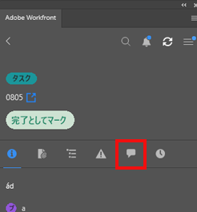

# を使用して作業内容を更新する [!DNL Adobe Workfront] プラグイン

次のいずれかから作業内容を更新できます [!DNL Adobe Creative Cloud] アプリケーション：

{{cc-app-list}}

## アクセス要件

この記事の手順を実行するには、次のアクセス権が必要です。

<table style="table-layout:auto"> 
 <col> 
 </col> 
 <col> 
 </col> 
 <tbody> 
  <tr> 
   <!--<td role="rowheader">[!DNL Adobe Workfront] plan*</td> 
   <td> 
[!UICONTROL Pro] or higher
 </td> 
  </tr> 
  <tr data-mc-conditions=""> 
   <td role="rowheader">[!DNL Adobe Workfront] license*</td> 
   <td> 
[!UICONTROL Work] or [!UICONTROL Plan]
 </td> 
  </tr> -->
  <tr> 
   <td role="rowheader">製品</td> 
   <td>次が必要です： [!DNL Adobe Creative Cloud] に加えてライセンス [!DNL Workfront] ライセンス。</td> 
  </tr> 
  <tr> 
   <td role="rowheader">オブジェクト権限</td> 
   <td> 
[!UICONTROL 表示 ]：更新するオブジェクトへのアクセス権。 
 
追加のアクセス権のリクエストについて詳しくは、 <a href="../../workfront-basics/grant-and-request-access-to-objects/request-access.md" class="MCXref xref">オブジェクトへのアクセスのリクエスト </a>.
 </td> 
  </tr> 
 </tbody> 
</table>

&#42;ご利用のプラン、ライセンスの種類、アクセス権を確認するには、 [!DNL Workfront] 管理者。

## 前提条件

{{cc-install-prereq}}

## 更新を投稿

プラグインの次の領域のいずれかから、作業内容を更新できます。

<table style="table-layout:auto"> 
 <col> 
 <col> 
 <tbody> 
  <tr> 
   <td> 
    <ul> 
     <li>プロジェクト</li> 
     <li>タスク</li> 
     <li>サブタスク</li> 
    </ul> </td> 
   <td> 
    <ul> 
     <li>問題</li> 
     <li>ドキュメント</li> 
    </ul> </td> 
  </tr> 
 </tbody> 
</table>

更新を投稿するには、次の手順に従います。

1. 次をクリック： **[!UICONTROL メニュー]** アイコンをクリックし、「 **[!UICONTROL 作業用リスト]**. メニューを使用して親オブジェクトに移動することもできます。

   

1. 次の **[!UICONTROL 作業用リスト]**「 」で、更新の投稿先の作業項目を選択します。
1. クリック **[!UICONTROL 更新]** をクリックします。\
   

1. クリック **[!UICONTROL 新しい更新]**.
1. 更新を入力します。
1. （オプション）ユーザーにタグを付けるには、@記号とユーザー名を入力し、ドロップダウンメニューから名前を選択します。
1. クリック **[!UICONTROL 送信]**. 更新は、Adobe Workfront Web アプリケーションとリアルタイムで同期されます。
