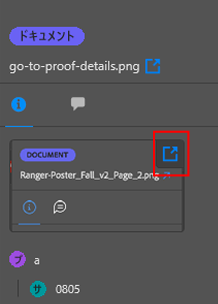
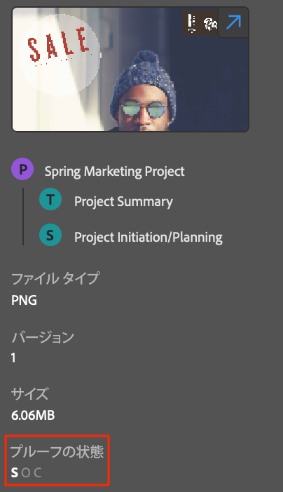

# [!DNL Adobe Workfront] プラグインを使用した作業アイテム情報の表示

プロジェクト、タスク、イシュー、ドキュメントに関する情報は、次の [!DNL Adobe Creative Cloud] アプリケーションから確認できます。

{{cc-app-list}}

## アクセス要件

この記事の手順を実行するには、次のアクセス権が必要です。

<table style="table-layout:auto"> 
 <col> 
 </col> 
 <col> 
 </col> 
 <tbody> 
  <!--<tr> 
   <td role="rowheader">[!DNL Adobe Workfront] plan*</td> 
   <td> 
[!UICONTROL Pro] or higher
 </td> 
  </tr> 
  <tr data-mc-conditions=""> 
   <td role="rowheader">[!DNL Adobe Workfront] license*</td> 
   <td> 
[!UICONTROL Work] or [!UICONTROL Plan]
 </td> 
  </tr> -->
  <tr> 
   <td role="rowheader">製品</td> 
   <td>[!DNL Workfront] ライセンスに加えて [!DNL Adobe Creative Cloud] ライセンスが必要です。</td> 
  </tr> 
  <tr> 
   <td role="rowheader">アクセスレベル設定*</td> 
   <td> 
プロジェクト、タスク、イシューへの [!UICONTROL View] アクセス権
 
メモ：まだアクセス権がない場合は、アクセスレベルに追加の制限が設定されていないかどうか [!DNL Workfront] 管理者にお問い合わせください。[!DNL Workfront] 管理者がアクセスレベルを変更する方法について詳しくは、<a href="../../administration-and-setup/add-users/configure-and-grant-access/create-modify-access-levels.md" class="MCXref xref">カスタムアクセスレベルの作成または変更</a>を参照してください。
 </td> 
  </tr> 
  <tr> 
   <td role="rowheader">オブジェクト権限</td> 
   <td> 
表示するオブジェクトへの表示アクセス権。 
 
追加のアクセス権のリクエストについて詳しくは、<a href="../../workfront-basics/grant-and-request-access-to-objects/request-access.md" class="MCXref xref">オブジェクトへのアクセス権のリクエスト</a>を参照してください。
 </td> 
  </tr> 
 </tbody> 
</table>

&#42;ご利用のプラン、ライセンスの種類、アクセス権を確認するには、[!DNL Workfront] 管理者にお問い合わせください。

## 前提条件

{{cc-install-prereq}}

## 詳細とカスタムフォームデータの表示

1. 右上隅にある&#x200B;**[!UICONTROL メニュー]**&#x200B;アイコンをクリックし、「**[!UICONTROL 作業リスト]**」を選択します。メニューを使用して親オブジェクトに移動することもできます。

   

1. 表示する作業アイテムを選択します。

   >[!TIP]
   >
   >**[!UICONTROL メニュー]**&#x200B;アイコンを使用して、作業アイテムの親オブジェクトに移動します。

1. ナビゲーションバーの&#x200B;**[!UICONTROL 詳細]**&#x200B;アイコン  をクリックして表示します。

   * [!UICONTROL 説明]
   * [!UICONTROL 予定完了日]
   * [!UICONTROL ステータス]
   * [!UICONTROL 割り当て先]
   * [!UICONTROL プロジェクト所有者]（プロジェクトのみ）
   * カスタムフォームデータ

## ドキュメントの詳細の表示

1. 右上隅にある&#x200B;**[!UICONTROL メニュー]**&#x200B;アイコンをクリックし、「**[!UICONTROL 作業リスト]**」を選択します。メニューを使用して親オブジェクトに移動することもできます。

   

1. 表示する作業アイテムを選択します。

   >[!TIP]
   >
   >**[!UICONTROL メニュー]**&#x200B;アイコンを使用して、作業アイテムの親オブジェクトに移動します。

1. ナビゲーションバーの&#x200B;**[!UICONTROL ドキュメント]**&#x200B;アイコン  をクリックして、ドキュメントをダブルクリックして表示します。

   * [!UICONTROL 説明]
   * [!UICONTROL ファイルタイプ]
   * [!UICONTROL プルーフのステータス]（プルーフに対してのみ使用可能）
   * [!UICONTROL バージョン]
   * [!UICONTROL サイズ]
   * カスタムフォームデータ

## プルーフの詳細の表示

1. 右上隅にある&#x200B;**[!UICONTROL メニュー]**&#x200B;アイコンをクリックし、「**[!UICONTROL 作業リスト]**」を選択します。メニューを使用して親オブジェクトに移動することもできます。

   

1. 表示する作業アイテムを選択します。

   >[!TIP]
   >
   >**[!UICONTROL メニュー]**&#x200B;アイコンを使用して、作業アイテムの親オブジェクトに移動します。

1. ナビゲーションバーの&#x200B;**[!UICONTROL ドキュメント]**&#x200B;アイコン  をクリックして、プルーフをダブルクリックします。

1. サムネイルの右上隅にある矢印アイコンをクリックして、[!DNL Workfront] でプルーフの詳細を開きます。

## プルーフのステータスの表示

1. 右上にある&#x200B;**[!UICONTROL メニュー]**&#x200B;アイコンをクリックし、「**[!UICONTROL 作業リスト]**」を選択します。メニューを使用して親オブジェクトに移動することもできます。

   

1. 表示する作業アイテムを選択します。

   >[!TIP]
   >
   >**[!UICONTROL メニュー]**&#x200B;アイコンを使用して、作業項目の親オブジェクトに移動します。

1. ナビゲーションバーの&#x200B;**[!UICONTROL ドキュメント]**&#x200B;アイコン  をクリックして、プルーフをダブルクリックします。

1. 下部までスクロールして、プルーフの現在のステータスを表示します。送信済み、開封済み、コメント、決定（SOCD）の詳細については、 [ドキュメントの詳細の概要](/help/quicksilver/documents/managing-documents/document-details-overview.md)を参照してください。

## サブタスクとイシューの表示

1. 右上にある&#x200B;**[!UICONTROL メニュー]**&#x200B;アイコンをクリックし、「**[!UICONTROL 作業リスト]**」を選択します。メニューを使用して親オブジェクトに移動することもできます。

   

1. 表示する作業アイテムを選択します。

   >[!TIP]
   >
   >**[!UICONTROL メニュー]**&#x200B;アイコンを使用して、作業項目の親オブジェクトに移動します。

1. **[!UICONTROL イシュー]**&#x200B;アイコンまたは&#x200B;**サブタスク**&#x200B;アイコンをクリックします。

1. タスクまたはイシューを選択し、ナビゲーションバーにある&#x200B;**[!UICONTROL 詳細]**&#x200B;アイコン  をクリックして以下を表示します。

   * [!UICONTROL 予定完了日]
   * [!UICONTROL ステータス]
   * [!UICONTROL 割り当て先]
   * カスタムフォームデータ
