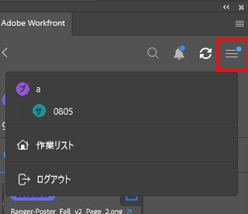

# 次を使用して作業項目情報を表示 [!DNL Adobe Workfront] プラグイン

プロジェクト、タスク、タスク、問題、ドキュメントに関する情報は、次の場所で確認できます [!DNL Adobe Creative Cloud] アプリケーション：

{{cc-app-list}}

## アクセス要件

この記事の手順を実行するには、次のアクセス権が必要です。

<table style="table-layout:auto"> 
 <col> 
 </col> 
 <col> 
 </col> 
 <tbody> 
  <!--<tr> 
   <td role="rowheader">[!DNL Adobe Workfront] plan*</td> 
   <td> 
[!UICONTROL Pro] or higher
 </td> 
  </tr> 
  <tr data-mc-conditions=""> 
   <td role="rowheader">[!DNL Adobe Workfront] license*</td> 
   <td> 
[!UICONTROL Work] or [!UICONTROL Plan]
 </td> 
  </tr> -->
  <tr> 
   <td role="rowheader">製品</td> 
   <td>次が必要です： [!DNL Adobe Creative Cloud] に加えてライセンス [!DNL Workfront] ライセンス。</td> 
  </tr> 
  <tr> 
   <td role="rowheader">アクセスレベル設定*</td> 
   <td> 
[!UICONTROL 表示 ] によるプロジェクト、タスクまたは問題へのアクセス
 
注意：まだアクセス権がない場合は、 [!DNL Workfront] 管理者（アクセスレベルに追加の制限を設定している場合） を参照してください。 [!DNL Workfront] 管理者はアクセスレベルを変更できます。詳しくは、 <a href="../../administration-and-setup/add-users/configure-and-grant-access/create-modify-access-levels.md" class="MCXref xref">カスタムアクセスレベルの作成または変更</a>.
 </td> 
  </tr> 
  <tr> 
   <td role="rowheader">オブジェクト権限</td> 
   <td> 
表示するオブジェクトへのアクセスを表示します。 
 
追加のアクセス権のリクエストについて詳しくは、 <a href="../../workfront-basics/grant-and-request-access-to-objects/request-access.md" class="MCXref xref">オブジェクトへのアクセスのリクエスト </a>.
 </td> 
  </tr> 
 </tbody> 
</table>

&#42;ご利用のプラン、ライセンスの種類、アクセス権を確認するには、 [!DNL Workfront] 管理者。

## 前提条件

{{cc-install-prereq}}

## 詳細とカスタムフォームデータの表示

1. 次をクリック： **[!UICONTROL メニュー]** アイコンをクリックし、「 **[!UICONTROL 作業用リスト]**. メニューを使用して親オブジェクトに移動することもできます。

   

1. 表示する作業項目を選択します。

   >[!TIP]
   >
   >以下を使用： **[!UICONTROL メニュー]** 作業項目の親オブジェクトに移動するアイコン

1. 次をクリック： **[!UICONTROL 詳細]** アイコン  表示するナビゲーションバー：

   * [!UICONTROL 説明]
   * [!UICONTROL 予定完了日]
   * [!UICONTROL ステータス]
   * [!UICONTROL 割り当て先]
   * [!UICONTROL プロジェクト所有者] （プロジェクトのみ）
   * カスタムフォームデータ

## ドキュメントの詳細を表示

1. 次をクリック： **[!UICONTROL メニュー]** アイコンをクリックし、「 **[!UICONTROL 作業用リスト]**. メニューを使用して親オブジェクトに移動することもできます。

   

1. 表示する作業項目を選択します。

   >[!TIP]
   >
   >以下を使用： **[!UICONTROL メニュー]** 作業項目の親オブジェクトに移動するアイコン

1. 次をクリック： **[!UICONTROL 文書]** アイコン  ナビゲーションバーで、表示するドキュメントをダブルクリックします。

   * [!UICONTROL 説明]
   * [!UICONTROL ファイル タイプ]
   * [!UICONTROL 配達確認のステータス] （配達確認に対してのみ使用可能）
   * [!UICONTROL バージョン]
   * [!UICONTROL サイズ]
   * カスタムフォームデータ

## 配達確認の詳細を表示

1. 次をクリック： **[!UICONTROL メニュー]** アイコンをクリックし、「 **[!UICONTROL 作業用リスト]**. メニューを使用して親オブジェクトに移動することもできます。

   

1. 表示する作業項目を選択します。

   >[!TIP]
   >
   >以下を使用： **[!UICONTROL メニュー]** 作業項目の親オブジェクトに移動するアイコン

1. 次をクリック： **[!UICONTROL 文書]** アイコン  ナビゲーションバーで、配達確認をダブルクリックします。

1. サムネールの右上隅にある矢印アイコンをクリックして、で配達確認の詳細を開きます。 [!DNL Workfront].

## 配達確認のステータスの表示

1. 次をクリック： **[!UICONTROL メニュー]** アイコンをクリックし、「 **[!UICONTROL 作業用リスト]**. メニューを使用して親オブジェクトに移動することもできます。

   

1. 表示する作業項目を選択します。

   >[!TIP]
   >
   >以下を使用： **[!UICONTROL メニュー]** 作業項目の親オブジェクトに移動するアイコン

1. 次をクリック： **[!UICONTROL 文書]** アイコン  ナビゲーションバーで、配達確認をダブルクリックします。

1. 下部までスクロールして、配達確認の現在のステータスを表示します。 送信済み、開封済み、コメント、決定 (SOCD) の詳細については、 [ドキュメントの詳細の概要](/help/quicksilver/documents/managing-documents/document-details-overview.md).

## サブタスクと問題の表示

1. 次をクリック： **[!UICONTROL メニュー]** アイコンをクリックし、「 **[!UICONTROL 作業用リスト]**. メニューを使用して親オブジェクトに移動することもできます。

   

1. 表示する作業項目を選択します。

   >[!TIP]
   >
   >以下を使用： **[!UICONTROL メニュー]** 作業項目の親オブジェクトに移動するアイコン

1. 次をクリック： **[!UICONTROL 問題]** アイコン  または **サブタスク** アイコン .

1. タスクまたはイシューを選択し、 **[!UICONTROL 詳細]** アイコン  表示するナビゲーションバー：

   * [!UICONTROL 予定完了日]
   * [!UICONTROL ステータス]
   * [!UICONTROL 割り当て先]
   * カスタムフォームデータ
