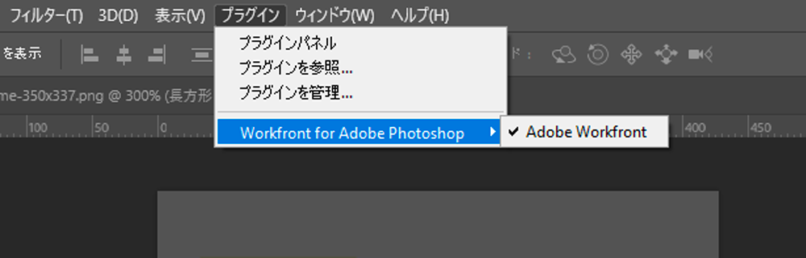

# インストールして開く [!DNL Adobe Workfront for design and video]

次をインストールできます。 [!DNL Adobe Workfront for design and video] から [!DNL Adobe Marketplace]. このプラグインは、次のCreative Cloudアプリケーションをサポートします。

{{cc-plugin-app-list}}

[!DNL Adobe Workfront for design and video] は、次の言語をサポートしています。

* 英語
* フランス語
* ドイツ語
* イタリア語
* スペイン語
* 日本語
* ポルトガル語
* 簡体字中国語
* 繁体字中国語
* 韓国語

>[!NOTE]
>
>別のインストール手順があります。 [!DNL Photoshop] および [!DNL XD]. 詳しくは、 [インストール [!DNL Adobe Workfront for Photoshop]](/help/quicksilver/workfront-integrations-and-apps/adobe-workfront-for-creative-cloud/wf-cc-install-ps.md) および [インストール [!DNL Adobe Workfront for XD]](/help/quicksilver/workfront-integrations-and-apps/adobe-workfront-for-creative-cloud/wf-adobe-xd-install.md).

## アクセス要件

この記事の手順を実行するには、次のアクセス権が必要です。

<table style="table-layout:auto"> 
 <col> 
 <col> 
 <tbody> 
 <!-- <tr> 
   <td role="rowheader">[!DNL Adobe Workfront] plan*</td> 
   <td> 
[!UICONTROL Pro] or higher
 </td> 
  </tr> 
  <tr data-mc-conditions=""> 
   <td role="rowheader">[!DNL Adobe Workfront] license*</td> 
   <td> 
[!UICONTROL Work] or [!UICONTROL Plan]
 </td> 
  </tr> -->
  <tr> 
   <td role="rowheader">製品</td> 
   <td>
次が必要です： [!DNL Adobe Creative Cloud] に加えてライセンス [!DNL Workfront] ライセンス。

詳しくは、 <a href="https://helpx.adobe.com/support/programs/cc-support-policy.html#cce" class="MCXref xref" xrefformat="{para}">Creative Cloudサポートポリシー</a>.
</td> 
  </tr> 
 </tbody> 
</table>

&#42;ご利用のプラン、ライセンスの種類、アクセス権を確認するには、 [!DNL Workfront] 管理者。

## 前提条件

* 次をインストールする必要があります： [!DNL Creative Cloud] アプリのWorkfrontプラグインをインストールする前に使用するアプリです。

## インストール [!DNL Workfront for design and video] （組織の）

次の場合、 [!DNL Adobe Admin Console] 管理者、 [!DNL Adobe Workfront for design and video] in [!DNL Creative Cloud] デプロイメントパッケージ。 詳しくは、 [パッケージにプラグインを含める](https://helpx.adobe.com/in/enterprise/using/manage-extensions.html).

[こちらでビデオチュートリアルを表示](https://www.youtube.com/watch?v=zzvXNLIBzrc){target=_blank}.

## インストール [!DNL Workfront for design and video] 個別に

次をインストールできます。 [!DNL Adobe Workfront for design and video] 自分は [!DNL Adobe Exchange].

1. 次に移動： [Adobe Workfront for Design and Video のインストールページ](https://adobe.com/go/cc_plugins_discover_plugin?pluginId=108938&amp;workflow=share) をAdobeExchange に追加します。
1. 表示されるダイアログで、 **開く [!DNL Adobe Creative Cloud] デスクトップアプリ**.
1. 1 回 [!DNL Adobe Creative Cloud] プラグインマネージャーが開き、「 **[!UICONTROL インストール]**.
1. ダイアログボックスの情報を読み、 **[!UICONTROL OK]**.
1. 1 回 [!DNL Workfront for design and video] インストール済みで、 [!DNL Creative Cloud] 必要なアプリを選択し、 [!DNL Workfront] プラグインを使用してプラグインを取得できます。

1. を開く方法については、次の節を参照してください。 [!DNL Workfront for design and video].

## 開く [!DNL Adobe Workfront for design and video]

1. 使用するCreative Cloudプラグインを開きます。

1. 新しいプロジェクトを作成するか、既存のプロジェクトを開きます。

1. 上部のメニューで、 **Windows** > **拡張機能** > **Adobe Workfrontメニュー**.

   >[!NOTE]
   >
   >Premiere Proを使用している場合、このメニューにアクセスするには、プロジェクトを開いておく必要があります。

   

   >[!TIP]
   >
   >表示されない場合 [!DNL Adobe Workfront for design and video] 拡張機能メニューから開いた後は、拡張機能アプリケーションの後ろにCreative Cloudされている可能性があります。 アプリを最小限に抑えてプラグインを見つけてみてください。

1. にログインする方法については、次の節を参照してください。 [!DNL Adobe Workfront for design and video].

## にログインします。 [!DNL Adobe Workfront for design and video]

1. 次から： **[!UICONTROL プラグイン]** 画面上部のメニューで、「 」を選択します。 **[!UICONTROL プラグインパネル]**.
1. 選択 **[!DNL Adobe Workfront for design and video]**.
1. ドメインを入力し、「 **[!UICONTROL ログイン]**. ブラウザーページが開きます。

   >[!TIP]
   >
   >* ドメインを検索するには、ブラウザーを開き、 [!DNL Workfront] インスタンスを作成し、URL の最初の部分をコピーします。\
   >
   >
   > * WorkfrontインスタンスがExperience Cloudと統合されている場合は、Admin Consoleの製品/WorkfrontにあるWorkfrontドメインを管理者に連絡し、提供してもらってください。

1. ブラウザーで、 [!DNL Workfront] 認証情報を選択し、「 **[!UICONTROL ログイン]**. シングルサインオン (SSO) を使用している場合は、SSO プロバイダのページにアクセスしてログインします。

   >[!NOTE]
   >
   >次の項目を入力するよう求められない場合があります： [!DNL Workfront] 最近ログインした場合の資格情報。

1. 画面の指示に従ってにログインします。 [!DNL Workfront].

   >[!NOTE]
   >
   >* [!DNL Workfront] 接続先 [!DNL Adobe Creative Cloud] OAuth 2.0 を使用する。これは、ほとんどの web ベースの統合で、ユーザーの認証と承認に使用される安全な標準です。
   >* 次の項目を入力するよう求められた場合、 [ドメインまたはホスト] の [!DNL Workfront] アカウントに次の形式で入力します。 *yourCompany&#39;sDomain.my.workfront.com*. 会社のドメインは通常、会社の名前です。

1. クリック **[!UICONTROL アクセスを許可]** をクリックして、ログインを完了します。
1. に戻る [!DNL Adobe Photoshop] 自分の仕事を見るために

