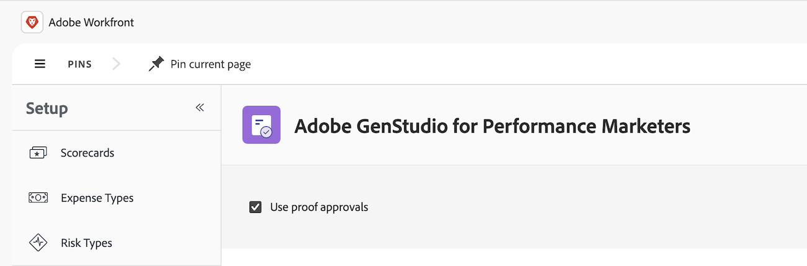

# GenStudio for Performance MarketingとWorkfront Proofの連携の詳細

GenStudio for Performance MarketingとWorkfront Proofの連携により、次のことが可能になります

* Workfrontのプルーフテンプレートを使用したレビューと承認のワークフロー

* Workfront プルーフビューアでのGenStudio for Performance Marketing ドラフトコンテンツのレビューと承認

* 最終承認と公開のために、GenStudio for Performance Marketingでレビューの決定を表示します

GenStudio for Performance Marketingでのレビューと承認について詳しくは、[Workfront ProofとGenStudio for Performance Marketingの統合](https://experienceleague.adobe.com/ja/docs/genstudio-for-performance-marketing/user-guide/approve/proof-integration)を参照してください。

## アクセス要件

+++ 展開すると、この記事の機能のアクセス要件が表示されます。

<table style="table-layout:auto"> 
 <col> 
 <col> 
 <tbody> 
 <tr> 
   <td role="rowheader">Adobe Workfront パッケージ</td> 
   <td> 
   
任意
 
   </td> 
  </tr> 
  <tr> 
   <td role="rowheader">Adobe Workfront プラン</td> 
   <td> 
   
標準 
 
   
プラン 
</td> 
  </tr> 
  <tr> 
   <td role="rowheader">その他の製品</td> 
   <td> 
   
 GenStudio for Performance Marketingが必要であり、Admin Consoleのユーザーとして商品に追加する必要があります。 
 </td> 
  </tr> 
  <tr> 
   <td role="rowheader">アクセスレベル設定</td> 
   <td> 
プロジェクトへのアクセスを編集
 </td> 
  </tr> 
 </tbody> 
</table>

詳しくは、[Workfront ドキュメントのアクセス要件](/help/quicksilver/administration-and-setup/add-users/access-levels-and-object-permissions/access-level-requirements-in-documentation.md)を参照してください。

+++

## 統合要件

* WorkfrontとGenStudio for Performance Marketingは、同じIdentity Management システム（IMS）組織にデプロイする必要があります。

* ユーザーは、IMS組織内の1つのWorkfront インスタンスにのみ属することができます。

* Workfrontの設定領域で連携を有効にする必要があります。

## Workfrontでの統合の有効化

この統合を有効にするには、システム管理者でなければなりません。

1. 左上隅の&#x200B;**[!UICONTROL メインメニュー]** アイコン をクリックし、**[!UICONTROL セットアップ]** をクリックします。
1. 左側のパネルで、**レビューと承認**/**Adobe GenStudio**&#x200B;をクリックします。
1. **プルーフ承認の使用**&#x200B;を有効にします。
   

## Workfront プルーフテンプレートを使用した承認ワークフローの定義

組織のコンテンツレビュープロセスが同じ担当者によって繰り返されたり、レビューされたりする場合は、プルーフテンプレートを使用して、レビューと承認のワークフローを自動化できます。

### Workfrontでのプルーフテンプレートの作成

1人または2人のレビュー担当者に対して、シンプルな単一ステージのテンプレートを作成することも、さまざまなステージや依存関係を持つ複雑なレビュー用に、自動化された複数ステージのテンプレートを作成することもできます。

Workfrontでの自動ワークフローとテンプレートの作成について詳しくは、「

* [自動ワークフローの概要](/help/quicksilver/review-and-approve-work/proofing/proofing-overview/automated-workflow.md)
* [自動ワークフローテンプレートの作成と管理](/help/quicksilver/administration-and-setup/manage-workfront/configure-proofing/create-manage-automated-workflow-templates.md)

### GenStudio for Performance Marketingでテンプレートを選択または変更する

利用者がGenStudio for Performance Marketingでレビューを開始すると、必要なテンプレートを選択するだけです。 レビューアーやステージの追加や削除など、任意のプルーフワークフローテンプレートをいつでも簡単に変更できます。

詳しくは、[&#x200B; レビューと承認のリクエスト &#x200B;](https://experienceleague.adobe.com/ja/docs/genstudio-for-performance-marketing/user-guide/approve/request-review)を参照してください。

## Workfront プルーフビューアでのGenStudio for Performance Marketing ドラフトコンテンツのレビューと承認

Workfront プルーフビューアでは、GenStudio for Performance Marketingでドラフトコンテンツを直接レビューおよび承認できます。

プルーフビューアーでは、次のことができます

* コメントを残す
* 変更が必要な項目を表示するマークアップのドラフト
* 決定を下す

詳しくは、[&#x200B; コンテンツのレビューと編集](https://experienceleague.adobe.com/ja/docs/genstudio-for-performance-marketing/user-guide/approve/review-and-edit)を参照してください。

>[!IMPORTANT]
>
>ユーザーは、GenStudio for Performance Marketingでドラフトのレビューを開始する前に、[Adobe Workfront レビューツールを使用してインタラクティブコンテンツをレビュー](/help/quicksilver/review-and-approve-work/proofing/reviewing-proofs-within-workfront/review-a-proof/review-proof-in-web-viewer-extension.md)する必要があります。

## 最終承認と公開のために、GenStudio for Performance Marketingでレビューの決定を表示します

アセットがレビューと承認のプロセスを経ると、レビューの決定を表示し、GenStudio for Performance Marketingから直接コンテンツを公開できます。

詳しくは、[承認済みコンテンツの公開](https://experienceleague.adobe.com/ja/docs/genstudio-for-performance-marketing/user-guide/approve/publish-content)を参照してください。
