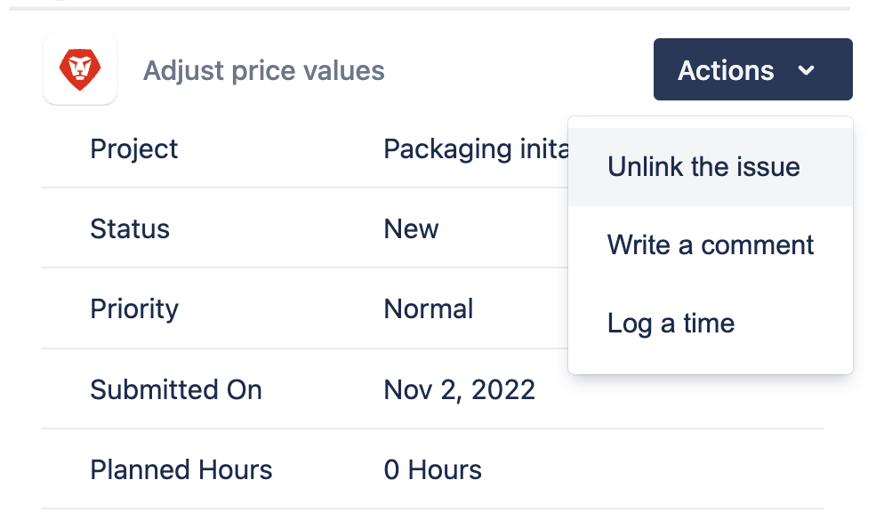

# 次の間のリンクされた項目を更新 [!DNL Jira] および [!DNL Adobe Workfront]

リンク時 [!DNL Jira] 問題 [!DNL Adobe Workfront] タスクまたはイシューを使用すると、1 つのアプリケーションのアイテムを更新し、2 つ目のアプリケーションで作業しているユーザーのアイテムを更新することもできます。

項目間のリンクの詳細 [!DNL Workfront] および [!DNL Jira]を参照してください。 [Adobe Workfrontと Jira 間の項目のリンク](../../workfront-integrations-and-apps/use-workfront-with-jira/link-items-between-wf-jira.md).

設定時に [!DNL Workfront] 対象 [!DNL Jira]、 [!DNL Jira] システム管理者は、1 つのアプリケーションの特定のフィールドを、他のアプリケーションのリンクされたアイテムのフィールドと同期するように設定できます。

リンクされたフィールド間の同期の詳細 [!DNL Jira] および [!DNL Workfront] 項目： [設定 [!DNL Adobe Workfront for Jira]](../../workfront-integrations-and-apps/use-workfront-with-jira/configure-workfront-for-jira.md).

## アクセス要件

以下が必要です。

<table style="table-layout:auto"> 
 <col> 
 </col> 
 <col> 
 </col> 
 <tbody> 
  <tr> 
   <td role="rowheader"><a href="https://www.workfront.com/plans" target="_blank">[!DNL Adobe Workfront] 計画</a>*</td> 
   <td> 
[!UICONTROL Pro] 以降
 </td> 
  </tr> 
  <tr> 
   <td role="rowheader"><a href="../../administration-and-setup/add-users/access-levels-and-object-permissions/wf-licenses.md" class="MCXref xref">Adobe [!DNL Workfront] ライセンスの概要</a>*</td> 
   <td> 
[!UICONTROL プラン ]
 </td> 
  </tr> 
  <tr> 
   <td role="rowheader">[!DNL Jira] アクセス</td> 
   <td> 
システム管理者のアクセス権
 
重要：で別々のシステム管理者アカウントを作成することをお勧めします。 [!DNL Jira] および [!DNL Workfront] ユーザーに付随する可能性のある既存の統合を使用するのではなく、この統合専用にする場合。
 </td> 
  </tr> 
  <tr> 
   <td role="rowheader">アクセスレベル設定*</td> 
   <td> 
次の条件を満たす必要があります。 [!DNL Workfront] 管理者。 詳しくは、 [!DNL Workfront] 管理者向け： <a href="../../administration-and-setup/add-users/configure-and-grant-access/grant-a-user-full-administrative-access.md" class="MCXref xref">ユーザーに完全な管理アクセス権を付与する</a>.
 
注意：まだアクセス権がない場合は、 [!DNL Workfront] 管理者（アクセスレベルに追加の制限を設定している場合） を参照してください。 [!DNL Workfront] 管理者はアクセスレベルを変更できます。詳しくは、 <a href="../../administration-and-setup/add-users/configure-and-grant-access/create-modify-access-levels.md" class="MCXref xref">カスタムアクセスレベルの作成または変更</a>.
 </td> 
  </tr> 
 </tbody> 
</table>

&#42;ご利用のプラン、ライセンスの種類、アクセス権を確認するには、 [!DNL Workfront] 管理者。

## 前提条件

次の間で項目をリンクする前に [!DNL Workfront] および [!DNL Jira]を

* インストール [!DNL Workfront for Jira].

   インストールの手順 [!DNL Workfront for Jira]を参照してください。 [インストール [!DNL Adobe Workfront for Jira]](../../workfront-integrations-and-apps/use-workfront-with-jira/install-workfront-for-jira.md).

* 設定 [!DNL Workfront for Jira].

   設定手順 [!DNL Workfront for Jira]を参照してください。 [設定 [!DNL Adobe Workfront for Jira]](../../workfront-integrations-and-apps/use-workfront-with-jira/configure-workfront-for-jira.md).

* 項目をリンク [!DNL Workfront] および [!DNL Jira].

   手順については、 [項目をリンク [!DNL Adobe Workfront] および [!DNL Jira]](../../workfront-integrations-and-apps/use-workfront-with-jira/link-items-between-wf-jira.md).

## のリンクされた項目を更新 [!DNL Workfront]

主に [!DNL Workfront]の場合、 [!DNL Workfront] そして彼らの仲間は [!DNL Jira] また、を更新します。 この更新は、 [!DNL Workfront] 対象 [!DNL Jira] これは、 [!DNL Jira] ライセンス。

あなたの [!DNL Workfront] 管理者が設定しました [!DNL Workfront for Jira] リンクされた項目間のフィールドを同期するには、 [!DNL Workfront] リンクされた [!DNL Jira] 問題。 項目の更新について詳しくは、 [!DNL Workfront]を参照してください。 [問題の編集](../../manage-work/issues/manage-issues/edit-issues.md) および [タスクを編集](../../manage-work/tasks/manage-tasks/edit-tasks.md).

次のリストは、 [!DNL Workfront] 次と同期するフィールド [!DNL Jira] リンクされた項目のフィールド：

<table style="table-layout:auto"> 
 <col> 
 <col> 
 <thead> 
  <tr> 
   <th><strong>更新済み [!DNL Workfront] フィールド</strong> </th> 
   <th><strong>同期済み [!DNL Jira] フィールド/更新</strong> </th> 
  </tr> 
 </thead> 
 <tbody> 
  <tr> 
   <td>[!UICONTROL 問題またはタスク名 ]</td> 
   <td> 
[!UICONTROL 問題名 ]
 
名前の変更に関するコメントが <strong>[!DNL Workfront]</strong> タブ [!DNL Jira] 問題。 
 </td> 
  </tr> 
  <tr> 
   <td>[!UICONTROL 問題またはタスクの説明 ]</td> 
   <td> 
 [!UICONTROL 問題の説明 ]
 
更新された説明に関するコメントが <strong>[!DNL Workfront]</strong> タブ [!DNL Jira] 問題。 
 </td> 
  </tr> 
  <tr> 
   <td> 
 [!UICONTROL アップロード済みドキュメント ]
 
注意：リンク先のドキュメント [!DNL Workfront] 外部サーバーの項目は、 [!DNL Jira] 問題。 に直接アップロードされたドキュメントのみ [!DNL Workfront] 項目もリンクされた [!DNL Jira] 問題。 
 </td> 
   <td> 
[!UICONTROL 添付ファイル ]
 
アップロードされた添付ファイルに関するコメントが <strong>[!DNL Workfront]</strong> タブ [!DNL Jira] 問題。 
 </td> 
  </tr> 
  <tr> 
   <td>[!UICONTROL 計画完了日 ]</td> 
   <td> 
[!UICONTROL 期限 ]
 
[!UICONTROL Due Date] の変更に関するコメントが [!DNL Workfront] タブ [!DNL Jira] 問題。 
 
注意：有効にする必要があります <strong>[!UICONTROL 期限 ]</strong> の [!DNL Jira] このフィールドを表示するための問題を [!UICONTROL Jira] で更新しました。 
 </td> 
  </tr> 
  <tr> 
   <td>カスタムFormsとカスタムフィールド</td> 
   <td> 
 次に表示： [!DNL Workfront] 右パネル [!DNL Jira] 問題。  実際の値を持つカスタムフィールドのみがパネルに表示されます。 
 
注意：カスタムフォームセクションが、 [!DNL Workfront] 管理者。 
 </td> 
  </tr> 
  <tr> 
   <td>[!UICONTROL 問題またはタスクの優先度 ]</td> 
   <td>次に表示： [!DNL Workfront] 右パネル [!DNL Jira] 問題。  問題は更新されません <strong>[!UICONTROL 優先度 ]</strong> ～に入る [!DNL Jira]. </td> 
  </tr> 
  <tr> 
   <td>[!UICONTROL ログ時間 ] </td> 
   <td> 
ログに記録された時間に関するコメントが <strong>[!DNL Workfront]</strong> タブ [!DNL Jira] 問題。 これには、時刻を記録するユーザーの名前と、時刻が異なる場合にその時刻を記録するユーザーが含まれます。 ログイン時間が <strong>[!UICONTROL 作業ログ ]</strong> タブ [!DNL Jira]. 
 </td> 
  </tr> 
  <tr> 
   <td>[!UICONTROL コメント ]</td> 
   <td> 
コメントが <strong>[!DNL Workfront]</strong> タブ [!DNL Jira] 問題。 この変数は、 <strong>[!UICONTROL コメント ]</strong> タブ [!DNL Jira] 問題
 
注意：2 つの既存の項目を手動でリンクすると、 [!DNL Workfront] 項目をリンクする前に [!DNL Jira] 同期しない [!DNL Jira] 問題。 
 </td> 
  </tr> 
 </tbody> 
</table>

## のリンクされた項目を更新 [!DNL Jira]

主に [!DNL Jira]の場合、 [!DNL Jira] そして彼らの仲間は [!DNL Workfront] また、を更新します。 必ずしも [!DNL Workfront] のライセンス [!DNL Workfront] リンクされた項目 [!DNL Jira] お客様が行っている更新を受け取るための問題 [!DNL Jira].

次の条件を満たし、 [!DNL Workfront] 管理者が設定しました [!DNL Workfront] 対象 [!DNL Jira] リンクされた項目間のフィールドを同期するには、 [!DNL Jira] リンクされた [!DNL Workfront] 項目。

次のリストは、 [!DNL Jira] 次と同期するフィールド [!DNL Workfront] リンクされた項目のフィールド：

<table style="table-layout:auto"> 
 <col> 
 <col> 
 <thead> 
  <tr> 
   <th><strong>更新済み [!DNL Jira] フィールド</strong> </th> 
   <th><strong>同期済み [!DNL Workfront] フィールド/更新</strong> </th> 
  </tr> 
 </thead> 
 <tbody> 
  <tr> 
   <td>[!UICONTROL 問題ステータス ]</td> 
   <td> 
 [!UICONTROL 問題またはタスクのステータス ]
 
の問題ステータス [!DNL Jira] Workfrontで、次のステータスまたはステータスに等しいステータスを同期します。
 
    <ul> 
     <li> 
[!UICONTROL 新規 ] （[!UICONTROL 新規 ]）
 </li> 
     <li> 
[!UICONTROL 処理中 ] ([!UICONTROL INP])
 </li> 
     <li> 
[!UICONTROL クローズ済み ]/[!UICONTROL 完了 ] ([!UICONTROL CLS]/[!UICONTROL CPL])
 </li> 
    </ul> 
注意：この [!DNL Jira] 最初の [!DNL Workfront] 適切なステータスに等しいステータス。
 
項目のステータスについて詳しくは、 [!DNL Workfront]を参照してください。 <a href="../../administration-and-setup/customize-workfront/creating-custom-status-and-priority-labels/create-or-edit-a-status.md" class="MCXref xref">ステータスの作成または編集</a>.
 </td> 
  </tr> 
  <tr> 
   <td>[!UICONTROL 担当者の問題 ]</td> 
   <td> 
 [!UICONTROL 問題またはタスクの担当者 ]
 
重要：項目を [!DNL Jira] を [!DNL Workfront] アカウントを使用する場合、統合により、新しいアクティブユーザーが [!DNL Workfront] 「[!UICONTROL ユーザーを自動作成」オプションが [!DNL Workfront] ( [!DNL Jira] ユーザーが [!DNL Workfront] account]」が [!UICONTROL Always] に設定されている場合にのみ有効です。 このユーザーは [!DNL Workfront] ライセンス。 アクティブなユーザーは、 [!DNL Workfront]更新に含めることはできません。 自動作成の設定の詳細 [!DNL Workfront] ユーザーから [!DNL Jira]を参照してください。 <a href="../../workfront-integrations-and-apps/use-workfront-with-jira/configure-workfront-for-jira.md">設定 [!DNL Workfront for Jira]</a>.
 </td> 
  </tr> 
  <tr> 
   <td>[!UICONTROL 添付ファイルの問題 ]</td> 
   <td> [!UICONTROL 問題またはタスクドキュメント ] での新しいドキュメントのアップロードに関するコメント [!DNL Jira] が [!DNL Workfront] 問題またはタスク。  </td> 
  </tr> 
  <tr> 
   <td>[!UICONTROL 期限 ]</td> 
   <td> 
 [!UICONTROL Due Date] の変更に関するコメント ( [!DNL Jira] が [!DNL Workfront] 問題またはタスク。 
 
注意：日付が変更されていない [!DNL Workfront] 問題またはタスク。 
 </td> 
  </tr> 
  <tr> 
   <td> ログに時刻 [!DNL Workfront] 右側のパネル、または [!DNL Jira] 問題 </td> 
   <td> 
時間 Jira にログインした時間をリンクされた [!DNL Workfront] 項目に含まれる場合、ログ時間に関するコメントが、 [!DNL Workfront] 項目。
 
リンクされたの時間のログ記録の詳細 [!DNL Jira] 更新を含む問題 [!DNL Jira] ログインしているユーザー [!DNL Workfront]を参照してください。 <a href="#log-time-for-linked-jira-and-workfront-items" class="MCXref xref">リンク済みのログ時間 [!DNL Jira] および [!DNL Workfront] 項目</a>.
 </td> 
  </tr> 
  <tr> 
   <td> コメント   </td> 
   <td> 
コメントは、 [!DNL Workfront] 問題またはタスク ( <strong>[!UICONTROL コメント ]</strong> [!UICONTROL 設定 ] タブの [!UICONTROL SYNCHRONIZE FROM JIRA TO WORKFRONT] セクションで、 <strong>[!UICONTROL Always]</strong>.
 
でのWorkfront設定について詳しくは、 [!DNL Jira]を参照してください。 <a href="../../workfront-integrations-and-apps/use-workfront-with-jira/configure-workfront-for-jira.md">設定 [!DNL Workfront for Jira]</a>.
 
リンクされた項目のコメントに関する情報 [!DNL Jira] 問題， 「 <a href="#comment-from-a-linked-jira-issue" class="MCXref xref">リンクされたからのコメント [!DNL Jira] 問題</a>.
 </td> 
  </tr> 
 </tbody> 
</table>

## リンクからのログ時間 [!DNL Jira] 問題

に対して記録する時間 [!DNL Jira] 項目 [!DNL Jira] は、リンクされた [!DNL Workfront] 項目（の場所に関係なく） [!DNL Jira] 時刻を記録します。\
Jira にログインしたとき ( [!DNL Workfront] パネルの [!DNL Workfront].\
記録する時間 [!DNL Workfront] は、 [!DNL Jira].

>[!NOTE]
>
>時刻が [!DNL Jira] リンクされた項目 [!DNL Workfront] タスク、 [!UICONTROL 時間タイプ] 当面は [!DNL Workfront] が [!UICONTROL タスク時間]. 時刻が [!DNL Jira] リンクされた項目 [!DNL Workfront] 問題 [!UICONTROL 時間タイプ] 当面は [!DNL Workfront] が [!UICONTROL 発行時間].

コメントが **[!DNL Workfront]** タブ [!DNL Jira] と **[!UICONTROL 更新]** タブ [!DNL Workfront] ログに記録する。\
時刻は、 **[!UICONTROL 時間]** タブ [!DNL Workfront] 項目。

* [リンク済みのログ時間 [!DNL Jira] および [!DNL Workfront] 項目](#log-time-for-linked-jira-and-workfront-items)
* [次の時刻からログ： [!DNL Jira] から [!DNL Workfront] 項目](#log-time-from-jira-to-a-workfront-item)

### リンク済みのログ時間 [!DNL Jira] および [!DNL Workfront] 項目

次の場所から時間をログに記録できます： [!DNL Jira] 関連する問題 [!DNL Workfront] 項目と時刻が [!DNL Jira] 問題 [!DNL Workfront] 項目。

>[!IMPORTANT]
>
>ユーザーがログイン時に [!DNL Jira] 次に存在しない： [!DNL Workfront]の場合、Workfrontに新しいアクティブなユーザーが作成されます ( **[!UICONTROL でユーザーを自動的に作成 [!DNL Workfront]&#x200B; [!DNL Jira] ユーザーが&#x200B;*[!DNL Workfront]&#x200B;account]**が**[!UICONTROL &#x200B;常に&#x200B;]**. このユーザーは [!DNL Workfront] ライセンス。 アクティブなユーザーを、 [!DNL Workfront]更新に含めることはできません。 自動作成の設定に関する情報 [!DNL Workfront] ユーザーから [!DNL Jira]を参照してください。 [設定 [!DNL Workfront for Jira]](../../workfront-integrations-and-apps/use-workfront-with-jira/configure-workfront-for-jira.md).

項目の時刻を [!DNL Jira] そして両方を記録して [!DNL Jira] および [!DNL Workfront]:

1. ログイン [!DNL Jira].
1. 次に移動： [!DNL Jira] 関連する問題 [!DNL Workfront] 項目。
1. を展開します。 **[!UICONTROL 詳細]** メニューとクリック **[!UICONTROL 作業をログに記録]**.\
   

1. 内 **[!UICONTROL 滞在時間]** 「 」フィールドで、この問題の作業に費やした時間を指定します。 次の期間を使用して時間を指定する必要があります。

   * [!UICONTROL 週] (w)
   * [!UICONTROL 日] ニ
   * [!UICONTROL 時間] チ

1. 引き続き時間エントリに情報 ( **[!UICONTROL 作業の説明]**&#x200B;を選択し、「 **[!UICONTROL ログ]**.\
   時刻が **[!UICONTROL 作業ログ]** タブ [!DNL Jira] 項目、および [!DNL Workfront] リンクされている項目。\
   時間エントリの作業説明は、 [!DNL Workfront].

### 次の時刻からログ： [!DNL Jira] から [!DNL Workfront] 項目

リンクされた [!DNL Workfront] 項目 [!DNL Jira] 今回の録画をしない問題 [!DNL Jira] 問題。

1. ログイン [!DNL Jira].
1. 次に移動： [!DNL Jira] 関連する問題 [!DNL Workfront] 項目。

   詳細 [!DNL Workfront] 項目が [!DNL Workfront] 問題の右パネル。

1. 次をクリック： **[!UICONTROL ログ時間]** アイコン

   

1. 金額を指定 **[!UICONTROL 時間]** および **[!UICONTROL 分]** 問題をログに記録します。

1. クリック **[!UICONTROL ログ時間]**.

   時刻が [!DNL Workfront] 項目。

   この時間は、 [!UICONTROL 作業ログ] タブ [!DNL Jira] 問題。

## リンクされたからのコメント [!DNL Jira] 問題 {#comment-from-a-linked-jira-issue}

次に対してコメントを入力する場合： [!DNL Jira] 項目 [!DNL Workfront] 右パネル [!DNL Jira]をクリックした場合、コメントも [!UICONTROL 更新] Workfrontのリンクされた項目のタブ。

コメント元 [!DNL Jira] から [!DNL Workfront] 項目：

1. ログイン [!DNL Jira].
1. 次に移動： [!DNL Jira] 関連する問題 [!DNL Workfront] 項目。

   詳細 [!DNL Workfront] 項目が [!DNL Workfront] 問題の右パネル。

1. 次をクリック： **[!UICONTROL コメント]** アイコン [!DNL Workfront] パネルまたは **[!UICONTROL コメント]** タブをクリックします。 

1. コメントの入力を開始し、「 **[!UICONTROL 送信]**.

   コメントが以下に追加されます。

   * この **[!DNL Workfront]** タブ [!DNL Jira] 問題。
   * この **[!UICONTROL コメント]** タブ [!DNL Jira] 問題。
   * この **[!UICONTROL 更新]** Workfrontのリンクされた項目のタブ。
