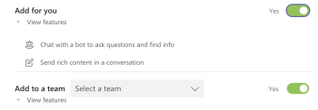

# インストール [!DNL Adobe Workfront] Microsoft Teams

この [!DNL Adobe Workfront for Microsoft Teams] アプリでは、 [!DNL Workfront] 君を置き去りにして [!DNL Microsoft Teams] チャットチャネル。

>[!NOTE]
>
>[!DNL Microsoft Teams] は、 [!DNL Internet Explorer]. 次の手順で [!DNL Adobe Workfront for Microsoft Teams integration]を使用する場合は、 [!DNL Internet Explorer].

## アクセス要件

この記事の手順を実行するには、次のアクセス権が必要です。

<table style="table-layout:auto"> 
 <col> 
 <col> 
 <tbody> 
  <tr> 
   <td role="rowheader">[!DNL Adobe Workfront] 計画*</td> 
   <td> 
任意
 </td> 
  </tr> 
  <tr> 
   <td role="rowheader">[!DNL Adobe Workfront] ライセンス*</td> 
   <td> 
[!UICONTROL Work]、[!UICONTROL Plan]
 </td> 
  </tr> 
 </tbody> 
</table>

&#42;ご利用のプラン、ライセンスの種類、アクセス権を確認するには、 [!DNL Workfront] 管理者。

## 前提条件

次のチームの所有者である必要があります： [!DNL Microsoft Teams] インストール [!DNL Workfront] 対象 [!DNL Microsoft Teams].

## インストール [!DNL Workfront for Microsoft Teams]

のチーム所有者として [!DNL Microsoft Teams]を使用する場合、 [!DNL Workfront for Microsoft Teams] 各チームのアプリは、 [!DNL Microsoft] 次の方法で提供されたファイルを保存またはファイルから [!DNL Workfront].

* [インストール [!DNL Workfront for Microsoft Teams] Microsoft Store から](#install-workfront-for-microsoft-teams-from-the-microsoft-store)
* [インストール [!DNL Workfront for Microsoft Teams] プライベートファイルから](#install-workfront-for-microsoft-teams-from-a-private-file)

### インストール [!DNL Workfront for Microsoft Teams] から [!DNL Microsoft] ストア

1. にログインします。 [!DNL Microsoft Teams] チーム所有者として。
1. をインストールするチームを選択します [!DNL Workfront for Microsoft Teams] アプリを使用します。
1. クリック **[!UICONTROL ストア]** をクリックします。

1. 内 **[!UICONTROL すべて検索]** ボックス、タイプ *[!DNL Workfront]*.

1. 次をクリック： **[!DNL Workfront]** カードに移動して、ウィザードの指示に従います。
1. （推奨） **[!UICONTROL チームに追加]** ドロップダウンメニューと **[!UICONTROL はい]** アプリをチームに追加するオプションを使用します。

   

1. チャネルの場合は、 **[!UICONTROL 一般]** 選択したチームのそのチャネルでアプリを使用するには、 **[!UICONTROL 設定]** を選択します。

1. インストールが完了すると、インストールが成功したという通知が [!UICONTROL 一般] 選択したチームのチャネル。 チームのすべてのメンバーがこの通知を表示できます。
1. （オプション）固定する [!DNL Workfront] より簡単にアクセスできるアプリ：

   1. 次をクリック： **[!UICONTROL 詳細]** アイコンをクリックします。 [!UICONTROL 一般] チャネル。

   1. マウスを [!DNL Workfront] アプリをクリックし、 **[!UICONTROL 詳細]** アイコンが右に表示されます。

   1. クリック **[!UICONTROL ピン留め]**.

      これにより、 [!DNL Workfront] アイコンをクリックします。 次の項目に素早くアクセスする [!UICONTROL 検索] ここから。

      検索の詳細 [!DNL Workfront] 項目： [検索と共有 [!DNL Adobe Workfront] 項目 [!DNL Microsoft Teams]](../../workfront-integrations-and-apps/using-workfront-with-microsoft-teams/search-for-and-share-wf-items-in-ms-teams.md).

1. クリック **[!UICONTROL にログインします。[!DNL Workfront]]** アクセスする [!DNL Workfront from Microsoft Teams].

   へのログインについて [!DNL Workfront]を参照し、 [Microsoft TeamsからWorkfrontにログイン](#log-in-to-workfront-from-microsoft-teams) 」の節を参照してください。

### インストール [!DNL Workfront for Microsoft Teams] プライベートファイルから

組織がアプリのダウンロードを制限している場合、 [!DNL Microsoft] ストア。アドビのサポートチームに連絡し、 [!DNL Workfront for Microsoft Teams] アプリをインストールします。

サポートチームへの問い合わせについては、 [カスタマーサポートに連絡](../../workfront-basics/tips-tricks-and-troubleshooting/contact-customer-support.md).

をインストールするには [!DNL Workfront for Microsoft Teams] プライベートファイルから：

1. 受け取ったプライベートファイルを保存します。 [!DNL Workfront] を使用します。
1. にログインします。 [!DNL Microsoft Teams] as a [!DNL Microsoft] チーム所有者。
1. 次をクリック： **[!UICONTROL 詳細]** インストールするチームのアイコン [!DNL Workfront for Microsoft Teams].

1. クリック **[!UICONTROL チームの管理]**.
1. を選択します。 **[!UICONTROL アプリ]** 「 」タブで、「 **[!UICONTROL カスタムアプリのアップロード]** をクリックします。

1. お使いのコンピューターに保存したプライベートファイルを参照し、インストール手順に従ってをインストールします。 [!DNL Workfront for Microsoft Teams].
1. インストールが完了すると、選択したチームの「一般」チャネルに、インストールが成功したことを示す通知が表示されます。 チームのすべてのメンバーがこの通知を表示できます。
1. （オプション） **[!UICONTROL 詳細]** （3 ドット）アイコンを **[!UICONTROL ここに質問を入力]** フィールドに入力します。

1. （オプション） [!DNL Workfront] アプリをクリックし、 **[!UICONTROL 詳細]** アイコンが右に表示されます。

1. （オプション）「 **[!UICONTROL ピン留め]**.

   これにより、 [!DNL Workfront] アイコン [!UICONTROL ここに質問を入力] フィールドに入力します。 次の項目に素早くアクセスする [!UICONTROL 検索] ここから。\
   Workfront項目の検索について詳しくは、 [検索と共有 [!DNL Adobe Workfront] 項目 [!DNL Microsoft Teams]](../../workfront-integrations-and-apps/using-workfront-with-microsoft-teams/search-for-and-share-wf-items-in-ms-teams.md).

## にログインします。 [!DNL Workfront] から [!DNL Microsoft] チーム

As a [!DNL Microsoft Teams] チーム所有者、インストールする必要があります [!DNL Workfront for Microsoft Teams] チームにログインする前にチームのアプリを作成する [!DNL Workfront from Microsoft Teams].

次にログインしたとき： [!DNL Workfront] から [!DNL Microsoft Teams]を受け取る場合、 [!DNL Workfront] 通知 [!DNL Workfront] ボットチャネルを使用するか、 [!DNL Workfront] から [!DNL Microsoft Teams].

インストールに関する情報 [!DNL Workfront] アプリの場合は、 [インストール [!DNL Workfront for Microsoft Teams]](#install-workfront-for-microsoft-teams) 」の節を参照してください。

へのアクセスについて詳しくは、 [!DNL Workfront] から [!DNL Microsoft Teams] 特定のアクションを実行するには、 [アクセス [!DNL Adobe Workfront] から [!DNL Microsoft Teams]](../../workfront-integrations-and-apps/using-workfront-with-microsoft-teams/access-workfront-from-ms-teams.md).

にログインするには [!DNL Workfront] から [!DNL Microsoft Teams]:

1. 次に移動： **[!UICONTROL 一般]** チームのチャネルで、 [!DNL Workfront for Microsoft Teams] アプリがインストールされ、「 **[!UICONTROL Workfrontにログイン]**.

   この [!DNL Workfront] ボットチャットチャネルが [!DNL Microsoft Teams] チャットチャネル。

1. 次に移動： [!DNL Workfront] のボットチャットチャネル [!DNL Microsoft Teams] と入力します。 *[!UICONTROL ログイン]* 内 **[!UICONTROL ここに質問を入力]** フィールドに入力します。

   または

   クリック **[!UICONTROL ログイン]**.

   新しいブラウザータブが開きます。

1. 画面の指示に従ってにログインします。 [!DNL Workfront] 拡張認証、OAuth 2.0、または Security Assertion Markup Language(SAML)URL を使用する。

   >[!NOTE]
   >
   >* のドメインの入力を求められたら、 [!DNL Workfront] アカウントに次の形式で入力します。 *yourCompany&#39;sDomain.my.workfront.com*. 会社のドメインは通常、会社の名前です。
   >* 拡張認証は、 [!DNL Workfront] 管理者がこの統合に対して有効にします。

1. ログインに使用したブラウザータブを閉じ、に戻ります。 [!DNL Microsoft Teams].

   通知が [!DNL Workfront] ボットチャットチャネルにログインしたことを確認 [!DNL Workfront] 正常に終了しました。
