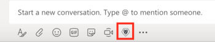

# [!DNL Microsoft Teams] での [!DNL Adobe Workfront] 項目の検索および共有

>[!IMPORTANT]
>
>[Microsoft が New Teams クライアントに移行すると](https://learn.microsoft.com/ja-jp/microsoftteams/teams-classic-client-end-of-availability)、Classic Teams クライアントは 2025年7月1日（PT）以降は使用できなくなります。 Microsoft Teams や Workfront などの統合アプリを引き続き使用するには、この日付までに New Teams クライアントに移行する必要があります。
>
>アップデートされた Workfront 統合が利用可能になりました。この統合には、New Teams エクスペリエンスとの完全な互換性があります。 ほとんどの場合、ユーザーが移行すると、Workfront が自動的に表示されます。 表示されない場合は、Microsoft Teams App Store から手動で統合をインストールできます。 New Teams クライアントで Workfront 統合をインストールまたは検証するには、Workfront for Microsoft Teams](/help/quicksilver/workfront-integrations-and-apps/using-workfront-with-microsoft-teams/install-workfront-ms-teams.md) の[インストール [!DNL Adobe Workfront] を参照してください。

[!DNL Microsoft Teams] の任意の [!DNL Adobe Workfront] チャネルで [!DNL Workfront] 項目を検索し、これらの項目をチームのメンバーと共有できます。

* [ [!DNL Microsoft Teams] で  [!DNL Workfront]  項目を共有するための前提条件](#prerequisites-for-sharing-workfront-items-in-microsoft-teams-prerequisites-for-sharing-workfront-items-in-microsoft-teams)
* [ [!DNL Microsoft Teams] での  [!DNL Workfront]  項目の検索および共有](#search-for-and-share-adobe-workfront-items-in-microsoft-teams)

## アクセス要件

+++ 展開すると、この記事の機能のアクセス要件が表示されます。

<table style="table-layout:auto"> 
 <col> 
 <col> 
 <tbody> 
  <tr> 
   <td role="rowheader">Adobe Workfront パッケージ</td> 
   <td> 
任意
 </td> 
  </tr> 
  <tr> 
   <td role="rowheader">Adobe Workfront プラン</td> 
   <td> 
標準

   
Work またはそれ以上
 </td> 
  </tr> 
 </tbody> 
</table>

詳しくは、[Workfront ドキュメントのアクセス要件](/help/quicksilver/administration-and-setup/add-users/access-levels-and-object-permissions/access-level-requirements-in-documentation.md)を参照してください。

+++

## [!DNL Microsoft Teams] で [!DNL Workfront] 項目を共有するための前提条件 {#prerequisites-for-sharing-workfront-items-in-microsoft-teams}

次の条件が満たされた場合、[!DNL Microsoft Teams] で [!DNL Workfront] 項目を検索して共有できます。

* チーム所有者がチームに対して [!DNL Workfront for Microsoft Teams] をインストールおよび設定している。
* [!UICONTROL Microsoft Teams]. から [!DNL Workfront] にログインしている。

[!UICONTROL Workfront for Microsoft Teams] のインストールと、[!DNL Microsoft Teams] から [!UICONTROL Workfront] へのログインについては、[Adobe Workfront for Microsoft Teams のインストール](../../workfront-integrations-and-apps/using-workfront-with-microsoft-teams/install-workfront-ms-teams.md) を参照してください。

>[!NOTE]
>
>[!DNL Microsoft Teams] は、[!DNL Internet Explorer] のサポートを終了しました。 [!DNL Adobe Workfront for Microsoft Teams integration] を使用する場合は、[!DNL Internet Explorer] 以外の web ブラウザーを使用する必要があります。

## [!DNL Microsoft Teams] での [!DNL Workfront] 項目の検索および共有 {#search-for-and-share-workfront-items-in-microsoft-teams}

[!DNL Microsoft Teams] チャネルから次の [!DNL Workfront] 項目を検索できます。

* プロジェクト
* タスク

  >[!NOTE]
  >
  >個人のタスクは検索できません。

* イシュー

検索した項目が見つかったら、[!DNL Microsoft Teams] で他のユーザーと共有できます。

[!DNL Microsoft Teams] から [!DNL Workfront] 項目を検索して他のユーザーと共有するには：

1. [!DNL Microsoft Teams] で任意のチャットチャネルに移動し、**[!DNL Workfront]** アイコンをクリックします。
1. 次のいずれかの操作を行って、[!DNL Workfront] 項目を検索します。

   * 会話フィールドの下にある [!DNL Workfront] アイコンをクリックします。\

     \
      設定によっては、このアイコンは&#x200B;**[!UICONTROL その他]**&#x200B;アイコンの下に表示されます。\
      \
      「**[!UICONTROL 検索]**」ボックスがデフォルトで表示されます。

   * 任意のチャネルから「*@[!DNL Workfront]*」と入力し、Workfront を選択して、「**[!UICONTROL 検索]」を選択します。**

     

1. 「[!UICONTROL 検索]」ボックスに、プロジェクト、タスク、またはイシューの名前または参照番号を入力し始めて、リストに表示されたらクリックします。\
   \
   これにより、チャットフィールドに [!DNL Workfront] 項目を含むカードが追加されます。 カードには、項目の名前、親オブジェクト、ステータス、優先度、完了率など、項目に関する情報が含まれます。

1. （オプション）[!DNL Workfront] カードの下にコメントを追加し、「**[!UICONTROL 送信]**」または Enter キーを押します。\
   これにより、[!DNL Workfront] 項目を含むメッセージがチャネルに送信されます。\
   チャネルのすべてのメンバーが、このメッセージを表示できます。これには、[!DNL Workfront] カードの情報が含まれます。

1. 「**[!UICONTROL Workfrontで表示]**」をクリックすると、[!DNL Workfront] に項目が表示されます。\
   [!DNL Workfront] ライセンスを持つユーザーのみが、[!DNL Workfront] で項目を表示できます。
