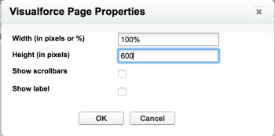

# の設定 [!DNL Adobe Workfront] セクション [!DNL Salesforce] ユーザー

A [!UICONTROL Pro] [!DNL Workfront] この機能を使用するにはプランが必要です。 利用可能な様々なプランについて詳しくは、 [[!DNL Workfront] プラン。](https://www.workfront.com/plans)

インストール後 [!DNL Adobe Workfront] 対象 [!DNL Salesforce] as a [!DNL Workfront] 管理者は、新しいセクションでユーザーの [!UICONTROL 商談] および [!UICONTROL アカウント]
ページレイアウト [!UICONTROL Salesforce].

インストールに関する情報 [!DNL Workfront for Salesforce]を参照してください。 [インストール [!DNL Adobe Workfront for Salesforce]](../../workfront-integrations-and-apps/using-workfront-with-salesforce/install-workfront-for-salesforce.md).

ユーザーが [!DNL Workfront] 両方で利用可能 [!DNL Classic] および [!DNL Lightning Experience] フレームワークの場合は、 [!DNL WorkfrontOpportunities] そして [!DNL WorkfrontAccounts] [!UICONTROL Visualforce] ページから [!UICONTROL 商談] および [!UICONTROL アカウント] ページレイアウトに含めることができます。

## アクセス要件

この記事で説明する機能を使用するには、次のアクセス権が必要です。

<table style="table-layout:auto"> 
 <col> 
 <col> 
 <tbody> 
  <tr> 
   <td role="rowheader">[!DNL Adobe Workfront] 計画*</td> 
   <td> 
[!UICONTROL Pro] 以降
 </td> 
  </tr> 
  <tr> 
   <td role="rowheader">[!DNL Adobe Workfront] ライセンス*</td> 
   <td> 
[!UICONTROL プラン ]
 </td> 
  </tr> 
 </tbody> 
</table>

&#42;ご利用のプラン、ライセンスの種類、アクセス権を確認するには、 [!DNL Workfront] 管理者。

## 前提条件

* 次をお持ちの場合は、 [!DNL Salesforce] システム管理者アカウントにアクセスできるインスタンス。
* 次をお持ちの場合は、 [!DNL Workfront] システム管理者アカウントにアクセスできるインスタンス。

## の設定 [!DNL Workfront] セクション [!DNL Salesforce Classic] 枠組み

1. にログインします。 [!DNL Salesforce] Workfront管理者。
1. クリック **[!UICONTROL 設定].**
1. 内 **[!UICONTROL ビルド]** セクション、展開 **[!UICONTROL カスタマイズ].**

1. 展開 **[!UICONTROL 商談]**&#x200B;を選択し、「 **[!UICONTROL ページレイアウト]** を追加します。 [!DNL Workfront] セクションから商談に移行します。

   または

   展開 **[!UICONTROL アカウント]**&#x200B;を選択し、「 **[!UICONTROL ページレイアウト]** を追加します。 [!DNL Workfront] セクションをアカウントに追加します。

1. クリック **[!UICONTROL 編集]** 既存のレイアウト上。

   または

   クリック **[!UICONTROL 新規]** をクリックして、新しいレイアウトを追加します。

1. （オプション） **[!UICONTROL セクション]** コンポーネントをレイアウトに追加し、目的の位置にドロップします。\
   

1. （オプション）新しいセクションの名前を指定します。

   このセクションに名前を付けることをお勧めします **[!DNL Workfront]**.

1. （オプション）目的の **[!UICONTROL レイアウト]** および **[!UICONTROL タブキーの順序]** を参照してください。

   次を選択することをお勧めします。 **[!UICONTROL 1 列]** レイアウト [!DNL Workfront] 」セクションに入力します。

1. クリック **[!UICONTROL OK]**.
1. 内 **[!UICONTROL レイアウト]** 領域、クリック **[!UICONTROL Visualforce ページ].**

1. 次をドラッグ&amp;ドロップ： **[!UICONTROL WorkfrontOpportunity]** コンポーネントを **[!UICONTROL 商談]** レイアウト。

   または

   次をドラッグ&amp;ドロップ： **[!UICONTROL WorkfrontAccounts]** コンポーネントを  **[!UICONTROL アカウント]** レイアウト。\
   ![[!DNL WorkfrontAccounts_component].png](assets/workfrontaccounts-component-350x139.png)

1. 次をクリック： **[!UICONTROL プロパティ]** 新しく追加されたコンポーネントの右上にあるアイコン\
   

1. 最適な表示を実現するには、 [!DNL Workfront Visualforce] ページ：

   * **[!UICONTROL 幅（ピクセルまたは%）]**:100%
   * **[!UICONTROL 高さ（ピクセル単位）]**:600
   * 選択 **[!UICONTROL スクロールバーを表示]**.

1. クリック **[!UICONTROL OK]**.
1. クリック **[!UICONTROL 保存]** をクリックして、レイアウトを保存します。

   このレイアウトを割り当てたすべてのユーザーが、 [!DNL Workfront] セクション [!UICONTROL 商談] または [!UICONTROL アカウント] オブジェクト。

   ユーザーには [!DNL Workfront] ログイン画面 ( [!DNL Workfront] 」セクションに入力します。 この [!DNL Workfront] アカウントを使用すると、セクションを折りたたむことはできますが、レイアウトからは削除できません。

   ![[!DNL salesforce_classic_opportunity_with_workfront_panel].png](assets/salesforce-classic-opportunity-with-workfront-panel-350x161.png)

## の設定 [!DNL Workfront] セクション [!DNL Salesforce Lightning Experience] 枠組み

次の項目を追加できます。 [!DNL Workfront] セクションから [!DNL Salesforce] [!UICONTROL 商談] または [!DNL Salesforce Lightning Experience] フレームワークは、 [!UICONTROL 設定] 領域、またはアカウントまたは [!UICONTROL 商談] オブジェクト。

* [の設定 [!DNL Workfront] セクション [!UICONTROL 設定] レベル](#configure-the-workfront-section-at-the-setup-level-configure-the-workfront-section-at-the-setup-level)
* [の設定 [!DNL Workfront] 商談またはアカウントレベルのセクション](#configure-the-workfront-section-at-the-opportunity-or-account-level-configure-the-workfront-section-at-the-opportunity-or-account-level)

### の設定 [!DNL Workfront] セクション [!UICONTROL 設定] レベル {#configure-the-workfront-section-at-the-setup-level}

1. ログイン [!DNL Salesforce] をシステム管理者として設定します。
1. 次をクリック： **[!UICONTROL 設定]** アイコンをクリックし、 **[!UICONTROL 設定]**.

1. 展開 **[!UICONTROL オブジェクトとフィールド]**&#x200B;を選択し、「 **[!UICONTROL オブジェクトマネージャ]**.

1. クリック **[!UICONTROL 商談]** をクリックして、商談のレイアウトをカスタマイズします。

   または

   クリック **[!UICONTROL アカウント]** をクリックして、アカウントのレイアウトをカスタマイズします。

1. クリック **[!UICONTROL ページレイアウト]**.
1. 既存のページレイアウトの名前をクリックして編集します。

   または

   クリック **[!UICONTROL 新規]** をクリックして、新しいページレイアウトを作成します。

1. 続行 [の設定 [!DNL Workfront] 商談またはアカウントレベルのセクション](#configure-the-workfront-section-at-the-opportunity-or-account-level-configure-the-workfront-section-at-the-opportunity-or-account-level) 下

### の設定 [!DNL Workfront] 商談またはアカウントレベルのセクション {#configure-the-workfront-section-at-the-opportunity-or-account-level}

1. にログインします。 [!DNL Salesforce] をシステム管理者として設定します。
1. 次に移動： **[!UICONTROL 商談]** または **[!UICONTROL アカウント]**.

1. 次をクリック： **[!UICONTROL 設定]** アイコンをクリックし、 **[!UICONTROL ページを編集]**.\
   

1. を展開します。 **[!UICONTROL カスタム管理]** 」セクションに入力します。
1. 次をドラッグ&amp;ドロップ： **[!DNL Workfront]** コンポーネント [!UICONTROL 商談] またはアカウントページ。

   ページの幅全体を [!DNL Workfront] 」セクションを使用します。

   ![[!DNL salesforce_lightning_builder].png](assets/salesforce-lightning-builder-350x229.png)

1. 「**[!UICONTROL 保存]**」をクリックします。

   このレイアウトを割り当てたすべてのユーザーが、 [!DNL Workfront] セクション [!UICONTROL 商談] または [!UICONTROL アカウント] オブジェクト。

   >[!NOTE]
   >
   >ユーザーには [!DNL Workfront] ログイン画面 ( [!DNL Workfront] 」セクションに入力します。 この [!DNL Workfront] アカウントを使用すると、セクションを折りたたむことはできますが、レイアウトからは削除できません。 ユーザーは、有効にした認証方法を使用してログインできます。認証またはセキュリティアサーションマークアップ言語 (SAML)URL の拡張。

   ![[!DNL salesforce_lightning__workfront_panel].png](assets/salesforce-lightning--workfront-panel-350x127.png)
