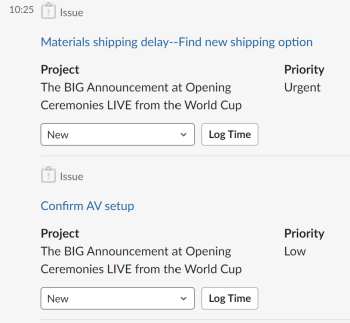

# 作業と承認を次の場所から管理 [!DNL Slack]

をインストールした後 [!DNL Adobe Workfront for Slack]を使用すると、次の操作を実行できます。

* のリストへのアクセス [!UICONTROL ホーム] 次の項目： [!DNL Slack]
* タスクと問題に関する作業を確認して承認 [!DNL Slack]
* 承認を確認し、決定する [!DNL Slack]

設定に関する詳細 [!DNL Workfront] と [!DNL Slack]を参照してください。 [設定 [!DNL Adobe Workfront for Slack]](../../workfront-integrations-and-apps/using-workfront-with-slack/configure-workfront-for-slack.md).

## アクセス要件

以下が必要です。

<table style="table-layout:auto"> 
 <col> 
 <col> 
 <tbody> 
  <tr> 
   <td role="rowheader"><a href="https://www.workfront.com/plans" target="_blank">[!DNL Adobe Workfront] 計画</a>*</td> 
   <td> 
[!UICONTROL Pro] 以降
 </td> 
  </tr> 
 </tbody> 
</table>

&#42;保有しているプラン、ライセンスの種類、アクセス権を確認するには、Workfront管理者に問い合わせてください。

## 前提条件

作業と承認を [!DNL Slack]を

* 設定 [!DNL Workfront for Slack]\
   設定手順 [!DNL Workfront for Slack]を参照してください。 [設定 [!DNL Adobe Workfront for Slack]](../../workfront-integrations-and-apps/using-workfront-with-slack/configure-workfront-for-slack.md).

## 作業を次から管理： [!DNL Slack]

1. にログインします。 [!DNL Slack] インスタンスとログイン [!DNL Workfront] から [!DNL Slack].\
   へのログインの詳細 [!DNL Workfront] から [!DNL Slack]詳しくは、 [!DNL Workfront] から [!DNL Slack]」セクション内の [アクセス [!DNL Adobe Workfront] から [!DNL Slack]](../../workfront-integrations-and-apps/using-workfront-with-slack/access-workfront-from-slack.md).

1. 任意のチャネルから、メッセージフィールドに次のコマンドを入力します。

   `/workfront home`

   >[!NOTE]
   >
   >* コマンドでは大文字と小文字が区別されます。
   >* コマンドは、 `/wf` の代わりに `/workfront`.

   タスク、イシューおよび承認のリストにアクセスできるボタンが表示されます。 ボタンの 1 つをクリックすると、 [!DNL Slack].\
   

1. （オプション）「 **[!UICONTROL タスク]** をクリックして、すべてのタスクを表示します。

   でのタスク管理の詳細 [!DNL Slack]を参照してください。 [タスクの管理元 [!DNL Slack]](#manage-your-tasks-from-slack-manage-your-tasks-from-slack).

1. （オプション）「 **[!UICONTROL 問題]** をクリックして、すべての問題を表示します。

   問題管理の詳細については、 [!DNL Slack]を参照してください。 [からの問題の管理 [!DNL Slack]](#manage-your-issues-from-slack-manage-your-issues-from-slack).

1. （オプション）「 **[!UICONTROL 承認]** ：決定を待機しているすべての承認を表示します。\
   での承認の管理について詳しくは、 [!DNL Slack]を参照してください。 [次の場所から承認を管理： [!DNL Slack]](#manage-your-approvals-from-slack-manage-your-approvals-from-slack).

## タスクの管理元 [!DNL Slack] {#manage-your-tasks-from-slack}

1. にログインします。 [!DNL Slack] インスタンスとログイン [!DNL Workfront] から [!DNL Slack].\
   へのログインについて [!DNL Workfront] から [!DNL Slack]詳しくは、 [!DNL Workfront] から [!DNL Slack]」セクション内の [アクセス [!DNL Adobe Workfront] から [!DNL Slack]](../../workfront-integrations-and-apps/using-workfront-with-slack/access-workfront-from-slack.md).

1. 任意のチャネルから、メッセージフィールドに次のいずれかのコマンドを入力します。

   `/workfront home`を選択し、「 **[!UICONTROL タスク]**

   または

   `/workfront tasks`

   >[!NOTE]
   >
   >* コマンドでは大文字と小文字が区別されます。
   >* コマンドは、 `/wf` の代わりに `/workfront`.

   リストの最初の 20 件のタスクが表示されます。\
   

1. クリック **[!UICONTROL +`<remaining number>` 詳細]** 追加のタスクを表示します。
1. 作業項目に関する次の情報を確認することを検討してください。

   * **[!UICONTROL 名前]**
   * **[!UICONTROL プロジェクト名]** または **[!DNL Parent Object Name]**

   * **[!DNL Planned Completion Date]** 作業項目の
   * **[!DNL Assigned By Name]**:タスクを割り当てたユーザーの名前です。
   * **[!UICONTROL ステータス]**

1. （オプション）項目の名前をクリックして、Workfrontの別のブラウザータブで開きます。
1. （オプション） **[!UICONTROL ステータス]** フィールドで、新しい「ステータス」を選択します。
1. （オプション）「 **[!UICONTROL ログ時間]**&#x200B;を選択し、 **[!UICONTROL 時間タイプ]** および時間数で項目に時間を記録します。

   >[!NOTE]
   >
   >* ログに記録できるのは、12 時間 30 分までの 1 時間または 30 分単位のみです。
   >* ログに記録される時間は、「Entry Date」（今日のエントリ日）です。 過去または将来の日付の時刻は、次の日付からログに記録できません： [!DNL Slack].

   時刻が記録されたことを示す確認メッセージが表示されます。

1. （オプション）「 **[!UICONTROL 作業]** タスクの作業を承認する場合。 この [!UICONTROL 作業] ボタンが表示されなくなります。

## 以下から問題を管理します： [!DNL Slack] {#manage-your-issues-from-slack}

1. にログインします。 [!DNL Slack] インスタンスとログイン [!DNL Workfront] から [!DNL Slack].\
   へのログインの詳細 [!DNL Workfront] から [!DNL Slack]を参照し、 [へのログイン [!DNL Workfront] から [!DNL Slack]](../../workfront-integrations-and-apps/using-workfront-with-slack/access-workfront-from-slack.md#logging-in-to-workfront) section in [Access [!DNL Adobe Workfront] から [!DNL Slack]](../../workfront-integrations-and-apps/using-workfront-with-slack/access-workfront-from-slack.md).

1. 任意のチャネルから、メッセージフィールドに次のいずれかのコマンドを入力します。

   `/workfront home`を選択し、「 **[!UICONTROL 問題]**

   または

   `/workfront issues`

   >[!NOTE]
   >
   >* コマンドでは大文字と小文字が区別されます。
   >* コマンドは、 `/wf` の代わりに `/workfront`.

   リストの最初の 20 件の問題が表示されます。\
   

1. クリック **[!UICONTROL +残り `<number>` 詳細]** 追加の項目を表示します。
1. 作業項目に関する次の情報を確認することを検討してください。

   * **[!UICONTROL 名前]**
   * **[!UICONTROL プロジェクト]** 名前または親オブジェクト名
   * **[!UICONTROL 期限]** 日付：作業項目の計画完了日です。
   * **[!DNL Requested by]** 名前：これは、プライマリの連絡先（問題の場合）または割り当てを行ったユーザー（タスクの場合）です。

1. （オプション）イシューの名前をクリックして、Workfrontの別のブラウザータブでイシューを開きます。
1. （オプション）「 **[!DNL Work on it]** まだ受け入れていない問題の処理を開始するには、以下を実行します。

   この [!UICONTROL 作業] ボタンが表示されなくなります。

## 次の場所から承認を管理： [!DNL Slack] {#manage-your-approvals-from-slack}

1. にログインします。 [!DNL Slack] インスタンスとログイン [!DNL Workfront] から [!DNL Slack].\
   へのログインの詳細 [!DNL Workfront] から [!DNL Slack]詳しくは、 [!DNL Workfront] から [!DNL Slack]」セクション内の [アクセス [!DNL Adobe Workfront] から [!DNL Slack]](../../workfront-integrations-and-apps/using-workfront-with-slack/access-workfront-from-slack.md).

1. 任意のチャネルから、メッセージフィールドに次のいずれかのコマンドを入力します。

   `/workfront home`を選択し、「 **[!UICONTROL 承認]**

   または

   `/workfront approvals`

   >[!NOTE]
   >
   >* コマンドでは大文字と小文字が区別されます。
   >* コマンドは、 `/wf` の代わりに `/workfront`.

   の最初の 20 項目 **[!UICONTROL 承認]** リストが表示されます。 アイテムに関する追加情報も表示されます。例えば、アイテムをリクエストしたユーザーの名前や、アイテムが属するプロジェクトの名前などです。

1. クリック **[!UICONTROL +残り `<number>` 詳細]** 追加の項目を表示します。

   

   

   

1. 次のオブジェクトの承認の管理を検討します。

   * **プロジェクト**

      クリック **[!UICONTROL 承認]** または **[!UICONTROL 拒否]** プロジェクトのステータス変更を許可または却下する場合。

   * **タスク**

      クリック **[!UICONTROL 承認]** または **[!UICONTROL 拒否]** タスクのステータス変更を許可または却下する場合。

   * **問題**

      クリック **[!UICONTROL 承認]** または **[!DNL Reject]** ：イシューのステータス変更を許可または却下します。

   * **ドキュメント**

      クリック **[!UICONTROL 承認]** 文書を承認するには **[!UICONTROL 拒否]** それを拒否するか、 **[!UICONTROL 変更点]** をクリックして、承認したがドキュメントに追加の変更が必要であることを示します。\
      （オプション）ドキュメントのサムネールの上にマウスを移動して、虫眼鏡アイコンをクリックし、ドキュメントをプレビューします。

   * **配達確認**&#x200B;配達&#x200B;確認名をクリックして開く [!DNL Workfront] を別のタブに追加し、承認を管理します。
   * **アクセス要求**

      クリック **[!UICONTROL アクセスを許可]** 要求されたオブジェクトに対して拡張権限を付与する。 **[!UICONTROL 無視]** をクリックして、追加のアクセス権の要求を無視します。

1. （オプション）承認用に送信されたオブジェクトの名前をクリックして、で開きます。 [!DNL Workfront] をクリックします。
