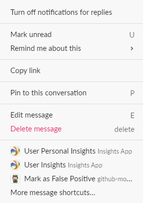

# 投稿： [!DNL Slack] 更新としてコメントする

次の項目を追加できます： [!DNL Slack] で特定のプロジェクト、タスク、またはイシューを更新したとしてコメントを付ける [!DNL Adobe Workfront].

## アクセス要件

以下が必要です。

<table style="table-layout:auto"> 
 <col> 
 </col> 
 <col> 
 </col> 
 <tbody> 
  <tr> 
   <td role="rowheader"><a href="https://www.workfront.com/plans" target="_blank">[!DNL [!DNL Adobe Workfront] 計画]</a>*</td> 
   <td> 
[!UICONTROL Pro] 以降
 </td> 
  </tr> 
 </tbody> 
</table>

&#42;ご利用のプラン、ライセンスの種類、アクセス権を確認するには、 [!DNL Workfront] 管理者。\

## 前提条件

事前に [!DNL Slack] 更新としてコメントを入力する場合は、

* 設定 [!DNL Workfront for Slack]\
   設定手順 [!DNL Workfront for Slack]を参照してください。 [設定 [!DNL Adobe Workfront for Slack]](../../workfront-integrations-and-apps/using-workfront-with-slack/configure-workfront-for-slack.md).

## 投稿： [!DNL Slack] の更新としてコメントする [!DNL Workfront]

1. 内で追加したコメントの上にマウスポインターを置きます。 [!DNL Slack] チャネルを選択し、 **[!UICONTROL その他のアクション]** アイコン

   

1. クリック **[!UICONTROL 更新を投稿] ...`<the name of your Workfront app>`**.

   >[!NOTE]
   >
   >クリックが必要な場合があります **[!UICONTROL その他のメッセージショートカット]** 下にスクロールして **[!UICONTROL 更新を投稿]** オプション。
   >
   >
   >

1. 内 **[!UICONTROL プロジェクト、タスクまたはタスク]** ボックスに、更新を追加するプロジェクト、タスク、またはタスクの名前を入力し、一覧に表示されたら、プロジェクト、タスク、またはタスクの名前をクリックします。 オブジェクトをリストに表示するには、そのオブジェクトへのアクセス権が必要です。
1. （オプション） **[!UICONTROL 別のユーザーを含める]** ボックスに、更新に含めるユーザーの名前を入力し、リストに表示されたらクリックします。
1. クリック **[!UICONTROL 送信]**.

   確認が [!DNL Slack] 更新が投稿されたことを通知するために使用します。

1. （オプション）更新を投稿したプロジェクト、タスクまたは問題の名前をクリックして、その更新にアクセスします [!DNL Workfront].

   ここに示唆がある [!DNL Workfront] 更新が [!DNL Slack].

   
