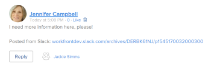

# [!DNL Slack] のコメントを更新として投稿する

[!DNL Adobe Workfront] で、[!DNL Slack] のコメントを特定のプロジェクト、タスク、またはイシューに対する更新として追加できます。

## アクセス要件

以下が必要です。

<table style="table-layout:auto"> 
 <col> 
 </col> 
 <col> 
 </col> 
 <tbody> 
  <tr> 
   <td role="rowheader"><a href="https://www.workfront.com/plans" target="_blank">[!DNL [!DNL Adobe Workfront] プラン]</a>*</td> 
   <td> 
[!UICONTROL Pro] 以降
 </td> 
  </tr> 
 </tbody> 
</table>

&#42;ご利用のプラン、ライセンスタイプ、アクセスを確認するには、[!DNL Workfront] 管理者にお問い合わせください。\

## 前提条件

[!DNL Slack] のコメントを更新として投稿するには、次のことを行う必要があります。

* [!DNL Workfront for Slack] の設定\
   [!DNL Workfront for Slack] の設定手順については、[設定 [!DNL Adobe Workfront for Slack]](../../workfront-integrations-and-apps/using-workfront-with-slack/configure-workfront-for-slack.md)を参照してください。

## [!DNL Workfront] で [!DNL Slack] のコメントを更新として投稿する

1. [!DNL Slack] チャネルに追加したコメントの上にポインタを合わせ、「**[!UICONTROL その他のアクション]**」（...）アイコンをクリックします。

1. 「**[!UICONTROL 更新を投稿] ...`<the name of your Workfront app>`**」をクリックします。

   >[!NOTE]
   >
   >「**[!UICONTROL その他のメッセージショートカット]**」をクリックし、下にスクロールして「**[!UICONTROL 更新を投稿]**」オプションを見つける必要がある場合があります。
   >
   >
1. 「**[!UICONTROL プロジェクト、タスク、またはイシュー]**」ボックスで、更新を追加するプロジェクト、タスク、またはイシューの名前の入力を開始し、リストに表示されたらプロジェクト、タスク、またはイシューの名前をクリックします。オブジェクトがリストに表示される前に、オブジェクトを表示するためのアクセス権が必要です。
1. （オプション）「**[!UICONTROL 別のユーザーを含める]**」ボックスに、更新に含める表示可能なユーザーの名前の入力を開始し、リストにそのユーザーが表示されたらクリックします。
1. 「**[!UICONTROL 送信]**」をクリックします。

   更新が投稿されたことを通知する確認メッセージが [!DNL Slack] に表示されます。

1. （オプション）更新を投稿したプロジェクト、タスク、またはイシューの名前をクリックして、[!DNL Workfront] でアクセスします。

   コメントが [!DNL Slack] で作成された場合、コメントには [!DNL Workfront] に「[!UICONTROL [!DNL Slack]] から投稿されました」というメッセージが表示されます。

   
