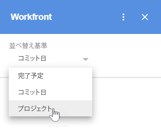

# アクセス [!DNL Adobe Workfront] [!UICONTROL ホーム] コンテンツ [!DNL G Suite]

>[!NOTE]
>
>ここに [既知の問題](https://experienceleague.adobe.com/docs/workfront-known-issues/issues/new-workfront-experience/wf-current/wf-integrations-error-when-opening-wf-for-gsuite.html?lang=en) 現在のバージョンの [!DNL Workfront for G Suite] 期待どおりに動作しない。 新しいバージョンで作業中で、このバージョンはにリリースされると予想されています [!DNL Google Marketplace] 近い将来に

次にアクセス： [!DNL Adobe Workfront] [!UICONTROL ホーム] 割り当てられているすべてのタスク、問題、承認、アクセス要求を含むコンテンツ（G Suite を離れることなく）。

## アクセス要件

この記事の手順を実行するには、次のアクセス権が必要です。

<table style="table-layout:auto"> 
 <col> 
 <col> 
 <tbody> 
  <tr> 
   <td role="rowheader">[!DNL Adobe Workfront] 計画*</td> 
   <td> 
任意
 </td> 
  </tr> 
  <tr> 
   <td role="rowheader">[!DNL Adobe Workfront] ライセンス*</td> 
   <td> 
[!UICONTROL Work]、[!UICONTROL Plan]
 </td> 
  </tr> 
 </tbody> 
</table>

&#42;ご利用のプラン、ライセンスの種類、アクセス権を確認するには、 [!DNL Workfront] 管理者。

## 前提条件

アクセスする前に [!UICONTROL ホーム] コンテンツ [!DNL G Suite]を

* インストール [!DNL Workfront for G suite]\
   手順については、 [インストール [!DNL Adobe Workfront for G Suite]](../../workfront-integrations-and-apps/workfront-for-g-suite/install-workfront-for-gsuite.md).

## アクセス [!DNL Workfront] [!UICONTROL ホーム] から [!DNL G Suite]

1. にログインしていることを確認します。 [!DNL Workfront].
1. この [!UICONTROL Workfront for G Suite] パネルが表示されない場合は、 [!DNL Workfront] アイコン  内 [!DNL G Suite] ページの右端にあるアドオンサイドバー。
1. 左向き矢印が [!DNL Workfront] 対象 [!DNL G Suite]、矢印をクリックして、 [!UICONTROL ホーム] 領域

   

1. 内 **[!UICONTROL 並べ替え基準]** 領域で、展開矢印をクリックします。 」をクリックし、作業項目をグループ化する方法を指定して、目的の項目を検索します。

   

   並べ替えの条件 **[!UICONTROL コミット日]** または **[!UICONTROL 計画完了]** 日付：最も古い作業項目が一番上に表示されます。

   並べ替えの条件 **[!UICONTROL プロジェクト]**、作業項目は親プロジェクトの順に表示され、アルファベット順に A から Z の順に表示されます。親プロジェクトのない作業項目は、下に表示されます。 **[!UICONTROL プロジェクトなし]**.

1. 展開矢印をクリックします。  表示するグループ化。

   各グループ内に含まれる項目の数は括弧で囲まれて表示されます。 この [!UICONTROL 展開] 矢印をクリックすると、グループ内のすべての作業項目が表示されます。

   作業項目は次のように表示されます。

   *  **タスク** 親プロジェクト名、タスク名、計画完了日を表示します。

   *  **問題** 親プロジェクト名、発行名、計画完了日を表示します。

   *   **承認** 請求者の名前、ドキュメント名、送信日を表示します。
   * **アクセス要求** リクエスターの名前、オブジェクト名、送信日を表示します。 オブジェクトタイプのアイコンが左側に表示されます。

1. 作業項目の任意の場所をクリックして、詳細、更新、およびドキュメントを表示します。
