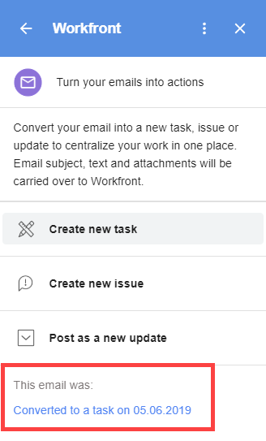

# の作成 [!DNL Adobe Workfront] 問題 [!DNL G Suite] e メールコンテンツの使用

外部 E メールを ( [!DNL Adobe Workfront]) から [!DNL Workfront] 問題。

また、外部電子メールを既存の問題に関する更新に変換することもできます。 詳しくは、 [の更新 [!DNL Adobe Workfront] 電子メールコンテンツを使用して [!DNL G Suite] から取得した項目](../../workfront-integrations-and-apps/workfront-for-g-suite/update-wf-item-using-email-content.md).

の使用に関する情報 [!DNL G Suite] 送信した通知メールを処理する [!DNL Workfront]を参照してください。 [管理 [!DNL Adobe Workfront] [!DNL G Suite] からの通知の詳細](../../workfront-integrations-and-apps/workfront-for-g-suite/manage-wf-email-notification-details-in-gsuite.md).

## アクセス要件

この記事の手順を実行するには、次のアクセス権が必要です。

<table style="table-layout:auto"> 
 <col> 
 <col> 
 <tbody> 
  <tr> 
   <td role="rowheader">[!DNL Adobe Workfront] 計画*</td> 
   <td> 
任意
 </td> 
  </tr> 
  <tr> 
   <td role="rowheader">[!DNL Adobe Workfront] ライセンス*</td> 
   <td> 
[!UICONTROL Work]、[!UICONTROL Plan]
 </td> 
  </tr> 
   </tbody> 
</table>

&#42;ご利用のプラン、ライセンスの種類、アクセス権を確認するには、 [!DNL Workfront] 管理者。

## 前提条件

からイシューを作成する前に [!DNL G Suite]を

* インストール [!DNL Workfront for G suite]\
   手順については、 [インストール [!DNL Adobe Workfront for G Suite]](../../workfront-integrations-and-apps/workfront-for-g-suite/install-workfront-for-gsuite.md).

## の作成 [!DNL Adobe Workfront] 問題 [!DNL G Suite] e メールコンテンツの使用

1. この [!UICONTROL Workfront for G Suite] パネルが表示されない場合は、 [!DNL Workfront] アイコン  内 [!DNL G Suite] ページの右端にあるアドオンサイドバー。
1. 電子メールメッセージをで開きます。 [!DNL G Suite]、「 [!DNL Workfront for G Suite] 電子メールを新しい [!DNL Workfront] 問題。

   

1. 問題を親プロジェクトに関連付ける場合は、 **[!UICONTROL プロジェクト名]**&#x200B;をクリックし、イシューを作成するプロジェクトの名前を入力し、下の一覧に表示されたら、そのプロジェクト名をクリックします。
1. 次の変更を行います。

   <table style="table-layout:auto"> 
    <col> 
    <col> 
    <tbody> 
     <tr> 
      <td role="rowheader">[!UICONTROL 問題名 ]</td> 
      <td>E メールの件名から取得した、このテキストの任意の部分を編集します。</td> 
     </tr> 
     <tr> 
      <td role="rowheader">[!UICONTROL 説明 ]</td> 
      <td>このテキストの任意の部分（E メールの本文から取得）を編集します。</td> 
     </tr> 
     <tr data-mc-conditions=""> 
      <td role="rowheader">[!UICONTROL 割り当て先 ]</td> 
      <td>クリック <strong>[!UICONTROL 割り当て先 ]</strong>、 <strong>[!UICONTROL これをに割り当て ]</strong> オプションが表示されたら、人物の名前を入力し始め、下のリストに表示されたらクリックします。 追加する各担当者に対してこの手順を繰り返し、 <strong>[!UICONTROL 保存 ]</strong>.</td> 
     </tr> 
     <tr data-mc-conditions=""> 
      <td role="rowheader">[!UICONTROL 優先度 ]</td> 
      <td>ドロップダウン矢印をクリックし、問題の優先度をクリックします。</td> 
     </tr> 
     <tr data-mc-conditions=""> 
      <td role="rowheader">[!UICONTROL 電子メールの添付ファイルを含める ]</td> 
      <td> 
（E メールに少なくとも 1 つの添付ファイルが含まれている場合にのみ使用できます）。 電子メール内の添付ファイルを問題の「[!UICONTROL ドキュメント ]」領域に保存するには、このオプションをクリックします。 
 
添付ファイルを保存しない場合は、名前の右にある X をクリックします。 
 
電子メールにドキュメントへのリンクが含まれる場合は、 [!DNL Google Drive]をクリックすると、作成中の問題の「[!UICONTROL 概要 ]」タブに保存されます。 
 
重要：これを機能させるには、 [!DNL Workfront] 管理者が認証する必要があります [!DNL Google Drive] で文書を扱う [!DNL Workfront]（を参照） <a href="../../administration-and-setup/configure-integrations/configure-document-integrations.md#configur" class="MCXref xref">ドキュメントを管理するための統合の設定</a> 記事内 <a href="../../administration-and-setup/configure-integrations/configure-document-integrations.md" class="MCXref xref">ドキュメント統合の設定</a>.
 
このオプションを有効にした場合、タスク、問題、更新に変換する他のメールに対しても有効なままになります。
 </td> 
     </tr> 
     <tr data-mc-conditions=""> 
      <td role="rowheader">電子メールファイルを含める</td> 
      <td> 
元のメールを電子メール (EML)（電子メール）ファイルとして保存するには、このオプションをクリックします を [!UICONTROL ドキュメント ] 領域に追加します。 を設定します。 ここから、ファイルをダブルクリックして、メールアプリケーションで E メールを開くことができます。
 
このオプションを有効にした場合、タスク、問題、更新に変換する他のメールに対しても有効なままになります。
 </td> 
     </tr> 
    </tbody> 
   </table>

1. クリック **[!UICONTROL イシューの作成]**.

   この **[!UICONTROL 詳細]** 新しい問題のタブが [!DNL Workfront for G Suite] パネル。 次をクリックできます。 **[!UICONTROL 更新]** また、共同作業者とすぐにコミュニケーションを取り始めることができます。

   の下部に **[!UICONTROL 詳細]** 」タブで、 **[!UICONTROL Workfrontで表示]** Workfrontの新しい問題に移る

   ブラウザーを更新すると、 [!UICONTROL Workfront for G Suite] パネルで、E メールを問題に変換したことを確認します。

   

   リンクをクリックして、 [!DNL Workfront for G Suite] パネルに表示されます。

   これらの手順を繰り返して、同じ E メールを複数のイシューに変換できます。 ブラウザーを更新したり、別の時点で電子メールに戻ったりすると、電子メールに対して作成したすべてのリンクが [!UICONTROL Workfront for G Suite] パネル。

1. （オプション） [!DNL Workfront for G Suite] パネルで次のいずれかの操作をおこないます。

   * 更新を **[!UICONTROL 更新]** タブ、クリック **[!UICONTROL 新しい更新を開始]** 更新を入力します。

   * の更新に返信するには **[!UICONTROL 更新]** タブ、クリック **[!UICONTROL 返信]** 返信を入力します。

      上記の両方のアクションについて、コメントに関して特定のユーザーに通知できます。 クリック **[!UICONTROL 通知]**&#x200B;をクリックし、ユーザーの名前を入力し始めて、ドロップダウンリストに表示されたら名前をクリックします。 通知する他のユーザーに対してこのプロセスを繰り返し、 **[!UICONTROL 投稿]**.

   * 次をクリック： **[!UICONTROL ドキュメント]** タブに移動して、イシューに保存されたドキュメントを表示します。
