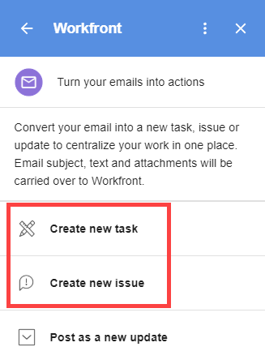

# [!DNL G Suite] でメールコンテンツを使用して [!DNL Adobe Workfront] イシューを作成する

>[!NOTE]
>
>Google 用の Adobe Workfront プラグインの最新バージョンは、2023年6月26日にリリースされました。

外部メール（[!DNL Adobe Workfront] 以外で生成）を [!DNL Workfront] イシューに変換できます。

また、外部メールを既存のイシューのアップデートに変換することもできます。詳しくは、[メールコンテンツを使用して [!DNL G Suite] から  [!DNL Adobe Workfront]  アイテムを更新する](../../workfront-integrations-and-apps/workfront-for-g-suite/update-wf-item-using-email-content.md)を参照してください。

[!DNL G Suite] を使用して [!DNL Workfront] から送信された通知メールを操作する方法については、[[!DNL G Suite] から  [!DNL Adobe Workfront]  通知の詳細を管理する](../../workfront-integrations-and-apps/workfront-for-g-suite/manage-wf-email-notification-details-in-gsuite.md)を参照してください。

## アクセス要件

この記事の手順を実行するには、次のアクセス権が必要です。

<table style="table-layout:auto"> 
 <col> 
 <col> 
 <tbody> 
  <tr> 
   <td role="rowheader">[!DNL Adobe Workfront] プラン*</td> 
   <td> 
任意
 </td> 
  </tr> 
  <tr> 
   <td role="rowheader">[!DNL Adobe Workfront] ライセンス*</td> 
   <td> 
[!UICONTROL Work]、[!UICONTROL Plan]
 </td> 
  </tr> 
   </tbody> 
</table>

&#42;ご利用のプラン、ライセンスタイプ、アクセス権を確認するには、[!DNL Workfront] 管理者にお問い合わせください。

## 前提条件

[!DNL G Suite] からイシューを作成する前に、次を実行する必要があります。

* [!DNL Workfront for G suite] のインストール\
   手順については、[ [!DNL Adobe Workfront for G Suite]](../../workfront-integrations-and-apps/workfront-for-g-suite/install-workfront-for-gsuite.md) のインストールを参照してください。

## メールコンテンツを使用して [!DNL G Suite] で [!DNL Adobe Workfront] イシューを作成する

1. [!UICONTROL Workfront for G Suite] パネルが表示されない場合は、ページの右端にある [!DNL G Suite] アドオンサイドバーで [!DNL Workfront] アイコンをクリックしてください。
1. メールメッセージを [!DNL G Suite] で開いたまま、[!DNL Workfront for G Suite] でメールを新しい [!DNL Workfront] イシューに変換するオプションをクリックします。

   

1. イシューを親プロジェクトに関連付ける場合は、**[!UICONTROL プロジェクト名]**&#x200B;をクリックし、イシューを作成するプロジェクトの名前を入力し、下の一覧に表示されたら、そのプロジェクトの名前をクリックします。
1. 次の変更を行います。

   <table style="table-layout:auto"> 
    <col> 
    <col> 
    <tbody> 
     <tr> 
      <td role="rowheader">[!UICONTROL Issue Name]</td> 
      <td>このテキストの任意の部分（メールの件名から取得）を編集します。</td> 
     </tr> 
     <tr> 
      <td role="rowheader">[!UICONTROL Description]</td> 
      <td>このテキストの任意の部分（メールの本文から取得）を編集します。</td> 
     </tr> 
     <tr data-mc-conditions=""> 
      <td role="rowheader">[!UICONTROL Assign To]</td> 
      <td>「<strong>[!UICONTROL Assign To]</strong>」をクリックし、「<strong>[!UICONTROL Assign this to] </strong>」オプションが表示されたらクリックします。ユーザーの名前を入力し始め、下のリストに表示されたらクリックします。追加する各ユーザーに対してこの手順を繰り返し、「<strong>[!UICONTROL Save]</strong>」をクリックします。</td> 
     </tr> 
     <tr data-mc-conditions=""> 
      <td role="rowheader">[!UICONTROL Priority]</td> 
      <td>ドロップダウン矢印をクリックし、イシューの優先度をクリックします。</td> 
     </tr> 
     <tr data-mc-conditions=""> 
      <td role="rowheader">[!UICONTROL Include email attachments]</td> 
      <td> 
（メールに 1 つ以上の添付ファイルが含まれている場合にのみ使用できます。）メール内の添付ファイルをイシューの[!UICONTROL Documents]エリアに保存するには、このオプションをクリックします。 
 
添付ファイルを保存しない場合は、名前の右にある X をクリックします。 
 
メールに [!DNL Google Drive] でのドキュメントへのリンクが含まれる場合は、作成中のイシューの [!UICONTROL Overview] タブに保存されます。 
 
重要：これを機能させるには、<a href="../../administration-and-setup/configure-integrations/configure-document-integrations.md" class="MCXref xref">ドキュメント統合の構成</a>の記事の<a href="../../administration-and-setup/configure-integrations/configure-document-integrations.md#configur" class="MCXref xref">ドキュメントを管理するための統合の構成</a>の節で説明されているように、[!DNL Workfront] 管理者は [!DNL Google Drive] が [!DNL Workfront] でドキュメントを操作できるように承認する必要があります。
 
このオプションを有効にした場合、タスク、イシュー、更新に変換する他のメールに対しても有効なままになります。
 </td> 
     </tr> 
     <tr data-mc-conditions=""> 
      <td role="rowheader">メールファイルを含める</td> 
      <td> 
元のメールをメール（EML）（メール）ファイルとしてイシューの[!UICONTROL Documents]領域に保存するには、このオプションをクリックします。ここから、ファイルをダブルクリックして、メールアプリケーションでメールを開くことができます。
 
このオプションを有効にした場合、タスク、イシュー、更新に変換する他のメールに対しても有効なままになります。
 </td> 
     </tr> 
    </tbody> 
   </table>

1. **[!UICONTROL イシューを作成]**&#x200B;をクリックします。

   新しいイシューの「**[!UICONTROL 詳細]**」タブが [!DNL Workfront for G Suite] パネルに表示されます。「**[!UICONTROL アップデート]**」をクリックすると、受信ボックスから離れることなく、すぐに共同編集者とのコミュニケーションを開始できます。

   「**[!UICONTROL 詳細]**」タブの下部で「**[!UICONTROL Workfront で表示]**」をクリックして、Workfront で新しいイシューに移動することもできます。

   ブラウザーを更新すると、[!UICONTROL Workfront for G Suite] パネルの下部に、メールがイシューに変換されたことを確認する、リンクを含むメッセージが表示されます。

   リンクをクリックすると、[!DNL Workfront for G Suite] パネル内の作成したイシューの詳細ビューに移動できます。

   これらの手順を繰り返して、同じメールを複数のイシューに変換できます。ブラウザーを更新したり、別の時点でメールに戻ったりすると、メールに対して作成したすべてのリンクが [!UICONTROL Workfront for G Suite] パネルの下部に表示されます。

1. （オプション）[!DNL Workfront for G Suite] パネルで次のいずれかの操作を行って、イシューでの作業を続行します。

   * 「**[!UICONTROL アップデート]**」タブに更新を追加するには、「**[!UICONTROL 新しい更新を開始]**」をクリックして更新を入力します。

   * 「**[!UICONTROL アップデート]**」タブのアップデートに返信するには、「**[!UICONTROL 返信]**」をクリックして返信を入力します。

     上記の両方のアクションについて、コメントに関して特定のユーザーに通知できます。「**[!UICONTROL 通知]**」をクリックし、ユーザーの名前を入力し始めて、ドロップダウンリストに表示されたら名前をクリックします。通知する他のユーザーに対してこのプロセスを繰り返し、「**[!UICONTROL 投稿]**」をクリックします。

   * 「**[!UICONTROL ドキュメント]**」タブをクリックして、イシュー付きで保存されたドキュメントを表示します。
