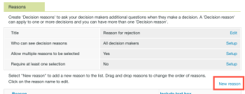

# [!DNL Workfront Proof] での承認決定オプションの設定

>[!IMPORTANT]
>
>この記事では、[!DNL Workfront Proof] スタンドアロン製品の機能について説明します。[!DNL Adobe Workfront] 内でのプルーフについて詳しくは、[プルーフ](../../../review-and-approve-work/proofing/proofing.md)を参照してください。

セレクトエディションプランまたはプレミアムエディションプランを使用する [!DNL Workfront Proof] 管理者は、組織内の [!DNL Workfront Proof] ユーザーが作成したすべてのプルーフに対して次の方法で承認決定オプションを設定できます。

* 決定の名前を変更する
* プルーフビューアに表示される決定の順序を変更する
* 表示する決定を決める

この記事では以下について説明します。

## 決定設定の指定

1. 「**[!UICONTROL アカウント設定]**」をクリックします。
1. 「**[!UICONTROL 決定]**」タブを開きます。
1. 次のいずれかの変更を加えます。

   * 決定を非表示にするには、不要な決定の右側にある「**[!UICONTROL 非表示]**」をクリックします。
   * 決定の名前を変更するには、決定名をクリックして編集したあと、ボックスの外側をクリックします（または Enter キーを押します）。システム内のすべての既存プルーフに関する決定の名前を [!DNL Workfront Proof] が更新します。

     >[!IMPORTANT]
     >
     >名前を変更する際には、決定のロジックは保持します。例えば、デフォルトの決定「却下」を「新しいバージョンが必要」に変更することはできますが、「プリンターへ送信」には変更しないでください。

     [!DNL Workfront Proof] のデフォルトに戻したい場合は、「デフォルトの決定に戻す」をクリックします。

>[!NOTE]
>
>* 様々なレベルの複数の決定がある場合、プルーフワークフローの全体的なステータスを計算するために、決定の背後にあるロジックが使用されます。
>* 「承認済み」および「変更して承認済み」の決定により、自動ワークフローの次のステージがトリガーされます。
>* 決定の名前を変更し、ロジックを確認したい場合は、左側のナビゲーションパネルで「**[!UICONTROL アクティビティ]**」をクリックし、元の決定が角括弧内に表示されているアクティビティログを確認します。
>
>  >

## 決定理由の作成

決定理由は、プルーフに関する決定の追加情報を取得するのに役立ちます。

1. **[!UICONTROL 設定]**／**[!UICONTROL アカウント設定]**&#x200B;をクリックします。

1. 「**[!UICONTROL 決定]**」タブを開きます。
デフォルトでは、プルーフに関するすべての意思決定者が理由を使用できますが、それを主な意思決定者のみに制限することもできます。
要件に応じて、複数の理由を選択できるようにすることも、単一の選択リストにすることもできます。理由を必須にすることもできます。つまり、レビュー担当者はプルーフに関する決定を保存する前に理由を選択する必要があります。
   

1. 「**[!UICONTROL 理由]**」セクションで、「**[!UICONTROL 新しい理由]**」をクリックします。
   

1. **[!UICONTROL 理由]**&#x200B;の下に表示されるテキストボックスに「理由」セクションのタイトルを入力します。
1. テキストボックスを含める場合は、「**[!UICONTROL テキストボックスを含める]**」を選択します。
1. 「**[!UICONTROL 保存]**」をクリックします。
   
最も重要な手順は、理由を表示する決定を選択することです。それを忘れると、その理由はプルーフに表示されなくなります。

1. ページ上部にある決定リストの&#x200B;**[!UICONTROL 理由を表示]**列のチェックボックスをオンにします。理由に対応する決定を 1 つ以上選択できます。
   

## 決定後メッセージの作成

レビュー担当者がプルーフに関する決定を保存した後に表示する決定後メッセージを作成できます。

1. **[!UICONTROL 設定]**／**[!UICONTROL アカウント設定]**&#x200B;をクリックします。

1. 「**[!UICONTROL 決定]**」タブを開きます。
1. 「**[!UICONTROL 決定後メッセージ]**」セクションで、**[!UICONTROL メッセージ]**&#x200B;行の最後にある「**[!UICONTROL 編集]**」をクリックします。
また、メッセージをすべての意思決定者に表示するか、主な意思決定者にのみ表示するかを決定することもできます。
   

1. **[!UICONTROL メッセージを表示]**列で、このメッセージを表示する決定を指定します。
1 つ以上の決定を選択しない場合、メッセージはプルーフに表示されません。この列の 1 つ以上のボックスを必ずクリックしてください。
   
