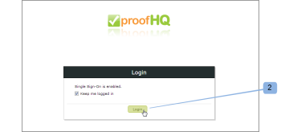

# シングルサインオンの設定対象 [!DNL Workfront Proof] ユーザー

>[!IMPORTANT]
>
>この記事では、スタンドアロン製品の機能について説明します [!DNL Workfront Proof]. 内部での検証に関する情報 [!DNL Adobe Workfront]を参照してください。 [校正](../../../review-and-approve-work/proofing/proofing.md).

Select または Premium プランをお持ちの場合は、既存の組織のユーザー名とパスワードを使用して [!DNL Workfront Proof] アカウント

つまり、ユーザーは、 [!DNL Workfront Proof] ログインページ。

>[!NOTE]
>
>カスタムのサブドメインまたはドメインを [!DNL Workfront Proof] アカウントで SAML を有効にします。 カスタムサブドメインは自由に設定できます。 詳しくは、 [ブランディング](https://support.workfront.com/hc/en-us/sections/115000921208-Branding) 詳細は、 [ブランド化 [!DNL Workfront Proof] サイト — 詳細](../../../workfront-proof/wp-acct-admin/branding/brand-wp-site-advanced.md).

## 内での SSO の有効化 [!DNL Workfront Proof]

シングルサインオン機能は、 [!UICONTROL シングルサインオン] 」タブから [!UICONTROL アカウント設定]に設定され、 [!DNL Workfront Proof] アカウント 詳しくは、 [アカウント設定](https://support.workfront.com/hc/en-us/sections/115000912147-Account-settings) を参照してください。

## エンティティ ID

サービスプロバイダーとして、エンティティ ID をここに公開しました。

[https://yoursubdomain.my.workfront.com/proof/saml/module.php/saml/sp/metadata.php/phq](https://yoursubdomain.my.workfront.com/proof/saml/module.php/saml/sp/metadata.php/phq) （「サブドメイン」はアカウントのサブドメインです）。

[!DNL Workfront Proof] では、ユーザーの電子メールアドレスを一意の識別子として使用する必要があります。この識別子は、次の属性の 1 つとして渡すことができます。

* 骨:mace:dir:attribute-def:emailAddress
* http://schemas.xmlsoap.org/ws/2005/05/identity/claims/emailaddress
* http://schemas.xmlsoap.org/claims/EmailAddress
* 骨:oid:0.9.2342.19200300.100.1.3
* http://axschema.org/contact/email
* openid.sreg.email
* メール
* 電子メール
* emailAddress

SSO を設定するには、次の手順に従います。

1. を開きます。 **[!UICONTROL シングルサインオン]** 」タブ (1) をクリックします。
1. 次を入力します。 **SSO URL** (2)
これは SSO サーバーへのリンクです ( 例： **https://sso.mycompany.com/opensso**) をクリックします。

1. 次を入力します。 **ログイン URL** (3)
ユーザーを ID プロバイダーにリダイレクトするために呼び出される URL です。

1. これは、ブラウザーに入力する実際の URL ではなく、ログイン画面を表示するために送信する情報を処理するエンドポイントです。

次を入力します。 **ログアウト URL** (4)
これは、ログアウト後に返される URL です（例： ）。

**https://www.yourcompany.com/services/logout.asp**

1. 次を入力します。 **証明書のフィンガープリント** (5)
1. SAML ID プロバイダーから提供される SAML 証明書の SHA1 フィンガープリント。
1. ID プロバイダーでこれを設定して、必ずキー情報を含めてください。
1. 切り替え **SSO** から **[!UICONTROL 有効]** (6)
SSO が有効になると、アカウント上の他のユーザーは、独自の認証メカニズムを使用してログインします。 つまり、ユーザーが [!DNL Workfront Proof] アカウントのログイン画面 ( 例： **yourcompany.proofhq.com/login**) の場合は、独自の認証ログインページへの転送ウィンドウが表示されます。

1. （オプション）有効にする **ユーザーを自動的にプロビジョニング** (7)
このオプションを有効にすると、独自のアカウントを持たないユーザーに対して、ユーザーアカウントが自動的に作成されます [!DNL Workfront Proof] プロファイルを選択しますが、 [!DNL Workfront Proof] アカウントを使用して、シングルサインオン資格情報を設定します。 これは、ユーザーの上限に達していないアカウントでのみ実行されます。

1. 新しくプロビジョニングされたユーザーには、デフォルトで Manager プロファイルの権限が割り当てられます。 詳しくは、 [の配達確認権限プロファイル [!DNL Workfront Proof]](../../../workfront-proof/wp-acct-admin/account-settings/proof-perm-profiles-in-wp.md).

## Satellite アカウントの SSO の有効化

Satellite アカウントをハブアカウントに接続している場合は、ハブアカウントレベルで管理できます。

シングルサインオンは Select と Premium の機能なので、シングルサインオンは Select と Premium のプランにある衛星でのみ有効にできます。

1. クリック **[!UICONTROL 設定]** > **[!UICONTROL アカウント設定]** (1)

1. ドロップダウンメニューで Satellite アカウントをクリックします (2)。
1. を開きます。 **[!UICONTROL シングルサインオン]** 」タブ (3) をクリックします。
1. SSO 設定 (4) の編集を開始します。
1. 
次に、2 つの設定方法 (5) を示します。

1. **継承：** ハブアカウントから取得した設定での SSO
ユーザーが [!DNL Workfront Proof] から **デフォルトのログインページ** ([https://www.proofhq.com/login](https://www.proofhq.com/login)) そこに **2 つのレベルの承認**:まず、次を使用してログインするように求められます。 [!DNL Workfront Proof] データにアクセスする（電子メールとパスワード）次に、SSO ウィンドウを介して SSO ログインページに転送されます。
したがって、SSO サービスを有効にして、独自のを使用してログインすることをお勧めします [!DNL Workfront Proof] サブドメイン/ドメイン。

   >[!NOTE]
   >
   >現在、 [!DNL Workfront Proof] アカウントにログインしない場合、これらの資格情報を使用してiPhoneアプリにログインすることはできません。

   1. **手動** （デフォルト）:別の設定の SSO（別の ID プロバイダーを指すなど）

      >[!NOTE]
      >
      >Satellite アカウントがハブアカウントから SSO 設定を継承している場合、ログイン画面はハブアカウントの SSO 設定になります。 Satellite アカウントユーザーがこのページの SSO ログインの詳細を入力すると、Satellite アカウントにリダイレクトされます。

      

   1. クリック **[!UICONTROL 保存]** (6)

## ハブアカウントから継承された SSO 設定

設定をハブアカウントから継承する場合は、すべてのフィールドにハブアカウント (7) のデータが入力され、メインアカウントと同様にシングルサインオンが自動的に有効/無効 (8) になります。 また、Satellite アカウントの SSO 設定全体がハブアカウントから設定および管理されるようになったので、フィールドには編集リンクもなくなりました。

ハブアカウント (9) では、 [!UICONTROL SSO の使用] フィールドは、この設定がサテライトアカウント (10) で使用されていることを示します。\

## SSO を手動で設定

Satellite アカウント (1) に対して手動 SSO 設定が選択されている場合は、シングルサインオンのデータを手動で入力する必要があります。

1. クリック **[!UICONTROL 設定]** > **[!UICONTROL アカウント設定]** (1)

1. を開きます。 **[!UICONTROL シングルサインオン]** タブをクリックします。
1. クリック **[!UICONTROL 編集],** フィールドに値を入力し、 **[!UICONTROL 保存]** (2)

1. の **[!UICONTROL SSO]** 行、クリック **[!UICONTROL 有効]** (3)

## SSO ログイン

1. クリック **[!UICONTROL 設定]** > **[!UICONTROL アカウント設定]** (1)

1. を開きます。 **[!UICONTROL シングルサインオン]** タブをクリックします。
1. 次を確認します。 [!DNL Workfront Proof] ドメイン/サブドメイン (1) が設定され、ユーザーが [!DNL Workfront Proof] このカスタマイズされたドメインまたはサブドメインを通じてアカウントを作成する。
   
シングルサインオンが有効な場合、サブドメインログイン URL( 例： yourcompany.proofhq.com/login) には、SSO ログインページに直接移動する転送画面 (2) が表示されます。
   

1. ユーザーが [!DNL Workfront Proof] から **デフォルトのログインページ** ([https://www.proofhq.com/login](https://www.proofhq.com/login)) そこに **2 つのレベルの承認**. まず、次を使用してログインするように求められます。 [!DNL Workfront Proof] データにアクセスします（電子メールとパスワード）。 次に、SSO ウィンドウ 2 を介して SSO ログインページに転送する。\
   したがって、SSO サービスを有効にして、独自のを使用してログインすることをお勧めします [!DNL Workfront Proof] サブドメイン/ドメイン。

1. 現時点では、Workfront Proof アカウントでシングルサインオンが有効になっている場合、これらの資格情報を使用してiPhoneアプリにログインすることはできません。

## 新しいユーザーの追加について

シングルサインオン機能が [!DNL Workfront Proof] アカウントが自動的にアクティブ化され、使用できる状態になるので、新しいユーザーには確認電子メールは送信されません。

お使いの [!DNL Workfront Proof] ログインページで、 [!UICONTROL ログイン] 」ボタンをクリックすると、ユーザーは SSO ログインページに移動し、シングルサインオンのログイン資格情報を入力するように求められます。

>[!IMPORTANT]
>
>ユーザーは、認証プロセス中に電子メールアドレスを通じて識別されます。つまり、SSO ログインに使用する電子メールアカウントは、アカウント内に登録されているユーザーの電子メールアドレスにする必要があります。

## Active Directory フェデレーションサービス (AD FS)

Active Directory フェデレーションサービス (AD FS) は [!DNL Microsoft] 組織の境界を越えたシステムやアプリケーションへのシングルサインオンアクセスをユーザーに提供するために、Windows Server オペレーティングシステムにインストールできるソフトウェアコンポーネント。 詳細については、Microsoft Developer Network の Web サイトの「Active Directory フェデレーションサービス」を参照してください。

この [!DNL Workfront Proof] システムは SAML 2.0 をサポートし、AD FS バージョン 2.0 以降とのみ互換性があります。

詳しくは、 [シングルサインオン [!DNL Workfront Proof]:AD FS の構成](../../../workfront-proof/wp-acct-admin/account-settings/sso-in-wp-adfs-configuration.md) を参照してください。
