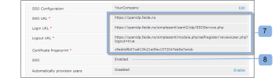

# [!DNL Workfront Proof] ユーザー向けのシングルサインオンの設定

>[!IMPORTANT]
>
>この記事では、スタンドアロン製品の [!DNL Workfront Proof] の機能について説明します。[!DNL Adobe Workfront] 内のプルーフについて詳しくは、[プルーフ](../../../review-and-approve-work/proofing/proofing.md)を参照してください。

Select プランまたは Premium プランがある場合は、既存の組織のユーザー名とパスワードを使用して [!DNL Workfront Proof] アカウントにアクセスできる、シングルサインオン（SSO）機能を提供することができます。

すなわち、[!DNL Workfront Proof] ログインページではなく、自分のログインシステムに対して認証するわけです。

>[!NOTE]
>
>SAML を有効にするには、[!DNL Workfront Proof] アカウントにカスタムのサブドメインまたはドメインを設定する必要があります。カスタムサブドメインは自由に設定できます。詳しくは、[ブランディング](https://support.workfront.com/hc/en-us/sections/115000921208-Branding)を参照してください。完全にカスタマイズされたドメインの詳について詳しくは、アドビの[ [!DNL Workfront Proof] サイトのブランド - 詳細](../../../workfront-proof/wp-acct-admin/branding/brand-wp-site-advanced.md)を参照してください。

## [!DNL Workfront Proof] 内で SSO を有効化

シングルサインオン機能は、[!UICONTROL アカウント設定]の「[!UICONTROL シングルサインオン]」タブで有効化でき、[!DNL Workfront Proof] アカウントのすべてのユーザーに適用されます。詳しくは、[アカウント設定](https://support.workfront.com/hc/ja-jp/sections/115000912147-Account-settings)を参照してください。

## エンティティ ID

サービスプロバイダーとして、次のようにエンティティ ID を公開しました。

[https://yoursubdomain.proofhq.com/saml/module.php/saml/sp/metadata.php/phq](https://yoursubdomain.proofhq.com/saml/module.php/saml/sp/metadata.php/phq)（「yoursubdomain」はアカウントのサブドメインです）。

[!DNL Workfront Proof] では、一意の識別子としてユーザーのメールアドレスが必要です。これは、以下の属性のいずれかとして渡すことができます。

* urn:mace:dir:attribute-def:emailAddress
* http://schemas.xmlsoap.org/ws/2005/05/identity/claims/emailaddress
* http://schemas.xmlsoap.org/claims/EmailAddress
* urn:oid:0.9.2342.19200300.100.1.3
* http://axschema.org/contact/email
* openid.sreg.email
* mail
* メール
* emailAddress

SSO を設定するには、以下のように行います。

1. 「**[!UICONTROL シングルサインオン]**」タブを開きます（1）。
1. **SSO URL** を入力します（2）。
これは SSO サーバーへのリンクです（例：**https://sso.mycompany.com/opensso**）。

1. **ログイン URL** を入力します（3）。
これは、ユーザーを ID プロバイダーにリダイレクトするために呼び出される URL です。

1. ブラウザーに入力する実際の URL ではなく、むしろログイン画面を表示するために送信された情報を処理するエンドポイントです。

**ログアウト URL** を入力します（4）。
これは、ログアウト後に返される URL です。例：

**https://www.yourcompany.com/services/logout.asp**

1. **証明書フィンガープリント**&#x200B;を入力します（5）。
1. SAML ID プロバイダーによって提供される SAML 証明書の SHA1 フィンガープリント。
1. ID プロバイダーにこれを設定して、必ずキー情報を含めてください。
1. **SSO** を「**[!UICONTROL 有効]**」に切り替えます（6）。
SSO が有効になると、ご自身と他のユーザーはアカウント上で、独自の認証メカニズムを使用してログインします。これは、ユーザーが[!DNL Workfront Proof]アカウントのログイン画面（例えば、**yourcompany.proofhq.com/login**）にアクセスすると、認証ログインページへの転送ウィンドウが表示されることを意味します。

1. （オプション）「**ユーザーを自動的にプロビジョニング**」を有効にします（7）。
このオプションを有効にすると、独自の [!DNL Workfront Proof] プロファイルを持たないユーザーに対してユーザーアカウントが自動的に作成されますが、そのようなユーザーは、シングルサインオン資格情報を使用して [!DNL Workfront Proof] アカウントにアクセスします。これは、アカウントのユーザー制限にまだ達していない場合にのみ実行されます。

1. 新しくプロビジョニングされたユーザーには、デフォルトでマネージャープロファイルの権限が割り当てられます。詳しくは、[ [!DNL Workfront Proof]](../../../workfront-proof/wp-acct-admin/account-settings/proof-perm-profiles-in-wp.md) のプルーフ権限プロファイルを参照してください。

## サテライトアカウントでの SSO の有効化

サテライトアカウントをハブアカウントに接続している場合は、ハブアカウントレベルで管理できます。

シングルサインオンは Select と Premium の機能なので、シングルサインオンは Select と Premium のプランにあるサテライトでのみ有効にできます。

1. **[!UICONTROL 設定]**／**[!UICONTROL アカウント設定]**&#x200B;をクリックします（1）。

1. ドロップダウンメニューでサテライトアカウントをクリックします（2）。
1. 「**[!UICONTROL シングルサインオン]**」タブを開きます（3）。
1. SSO 設定の編集を開始します（4）。
1. 
ここでは次の 2 つの設定方法（5）を示します。

1. **継承：**ハブアカウントから取得した設定での SSO。
ユーザーが**デフォルトのログインページ** から [!DNL Workfront Proof] にアクセスする場合（[https://www.proofhq.com/login](https://www.proofhq.com/login)）、そこに **2 段階認証**&#x200B;があります：まず、ユーザーは [!DNL Workfront Proof] アクセスデータ（メールとパスワード）を使用してログインするように求められます。次に、ユーザーは SSO ウィンドウから SSO ログインページに転送されます。
したがって、SSO サービスを有効にした上で、自身の [!DNL Workfront Proof] サブドメインまたはドメインからログインすることをお勧めします。

   >[!NOTE]
   >
   >現時点で [!DNL Workfront Proof] アカウントでシングルサインオンが有効である場合、これらの資格情報を使用して iPhone アプリにログインすることはできません。

   1. **手動**（デフォルト）：別の設定（別の ID プロバイダーを指すなど）の SSO。

      >[!NOTE]
      >
      >サテライトアカウントがハブアカウントから SSO 設定を継承している場合、ログイン画面はハブアカウントの SSO 設定になります。サテライトアカウントユーザーがこのページの SSO ログインの詳細を入力すると、サテライトアカウントにリダイレクトされます。

      

   1. 「**[!UICONTROL 保存]**」をクリックします（6）。

## ハブアカウントから継承された SSO 設定

設定をハブアカウントから継承する場合は、すべてのフィールドにハブアカウント（7）のデータが入力され、メインアカウントと同様にシングルサインオンが自動的に有効／無効（8）になります。また、サテライトアカウントの SSO 設定全体がハブアカウントから設定および管理されるようになるため、フィールドにはもう編集リンクもありません。

ハブアカウント（9）では、「[!UICONTROL SSO の使用]」フィールドは、この設定がサテライトアカウント（10）で使用されていることを示します。\

## 手動で設定された SSO

サテライトアカウント（1）に対して手動 SSO 設定が選択されている場合は、シングルサインオンのデータを手動で入力する必要があります。

1. **[!UICONTROL 設定]**／**[!UICONTROL アカウント設定]**&#x200B;をクリックします（1）。

1. 「**[!UICONTROL シングルサインオン]**」タブを開きます。
1. 「**[!UICONTROL 編集]」をクリックして、「**」フィールドに値を入力し、「**[!UICONTROL 保存]**」をクリックします（2）。

1. **[!UICONTROL SSO]** 行で、「**[!UICONTROL 有効]**」に切り替えます（3）。

## SSO ログイン

1. **[!UICONTROL 設定]**／**[!UICONTROL アカウント設定]**&#x200B;をクリックします（1）。

1. 「**[!UICONTROL シングルサインオン]**」タブを開きます。
1. [!DNL Workfront Proof] ドメインまたはサブドメイン（1）が設定され、ユーザーがこのカスタマイズされたドメインまたはサブドメインから [!DNL Workfront Proof] アカウントにアクセスできることを確認します。
   
シングルサインオンが有効な場合、サブドメインログイン URL（例：yourcompany.proofhq.com/login）には、SSO ログインページに直接移動する転送画面（2）が表示されます。
   

1. ユーザーが&#x200B;**デフォルトのログインページ**&#x200B;から [!DNL Workfront Proof] にアクセスする場合（[https://www.proofhq.com/login](https://www.proofhq.com/login)）、そこに&#x200B;**2 段階認証**&#x200B;があります。まず、ユーザーは [!DNL Workfront Proof] アクセスデータ（メールとパスワード）を使用してログインするように求められます。次に、ユーザーは SSO ウィンドウ（2）から SSO ログインページに転送されます。\
   したがって、SSO サービスを有効にした上で、自身の [!DNL Workfront Proof]サブドメインまたはドメインからログインすることをお勧めします。

1. 現時点で Workfront Proof アカウントでシングルサインオンが有効である場合、これらの資格情報を使用して iPhone アプリにログインすることはできません。

## 新しいユーザーの追加について

シングルサインオン機能が [!DNL Workfront Proof] アカウントで有効である場合、自動的にアクティブ化され、使用できる状態になるので、新しいユーザーには確認メールは送信されません。

[!DNL Workfront Proof] ログインページで「[!UICONTROL ログイン]」ボタンをクリックすると、ユーザーは SSO ログインページに転送され、シングルサインオンのログイン資格情報を入力するように求められます。

>[!IMPORTANT]
>
>ユーザーは、認証プロセス中にメールアドレスで識別されます。つまり、SSO ログインに使用するメールアカウントは、アカウント内に登録されているユーザーのメールアドレスにする必要があります。

## Active Directory フェデレーションサービス（AD FS）

Active Directory フェデレーションサービス（AD FS）は、組織の境界を越えたシステムやアプリケーションへのシングルサインオンアクセスをユーザーに提供するために、Windows Server オペレーティングシステムにインストールできる [!DNL Microsoft] ソフトウェアコンポーネントです。詳細情報については、Microsoft Developer Network の Web サイトの「Active Directory フェデレーションサービス」を参照してください。

[!DNL Workfront Proof] システムは SAML 2.0 をサポートし、AD FS バージョン 2.0 以降とのみ互換性があります。

詳しくは、[シングルサインオン [!DNL Workfront Proof]：AD FS 設定](../../../workfront-proof/wp-acct-admin/account-settings/sso-in-wp-adfs-configuration.md)を参照してください。
