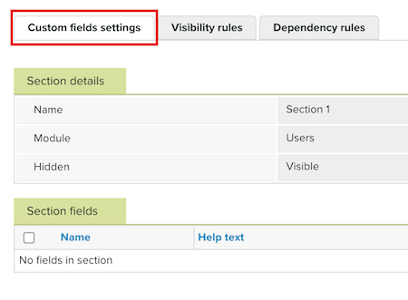

# [!DNL Workfront Proof] でカスタムフィールドを作成および管理

<!-- Audited: 4/2025 -->

>[!IMPORTANT]
>
>この記事では、スタンドアロン製品の [!DNL Workfront Proof] の機能について説明します。 [!DNL Adobe Workfront] 内のプルーフについて詳しくは、[プルーフ](../../../review-and-approve-work/proofing/proofing.md)を参照してください。

この機能を使用するには、Select または Premium[!DNL Workfront] プランが必要です。 利用可能な様々なプランについて詳しくは、[Workfront プラン](https://business.adobe.com/jp/products/workfront/pricing.html)を参照してください。

カスタムフィールドを使用すると、新しいプルーフ、ユーザー、またはゲストを作成する際に追加のデータを取得できます。 例えば、新しいプルーフを作成するユーザーは、ジョブ番号、部門コードまたはサプライヤー参照を取り込むための追加セクションを含めることができます。

>[!NOTE]
>
>* カスタムフィールドを使用して新しいプルーフページでこのタイプの情報をキャプチャすると、プルーフ名の長さを短くすることもできます。これは、これらの詳細を名前に含める必要がないためです。
>
>* プルーフ、ユーザー、または連絡先でカスタムフィールドを使用した後は、それを削除したり、フィールドタイプを編集したりすることはできません。 ただし、カスタムフィールド設定ページで非表示にできるため、新しい項目には使用されません。
>
>* カスタムフィールドセクションを非表示にすると、個々のフィールドが表示として設定されている場合でも、セクション内のすべてのフィールドも非表示になります。

## カスタムフィールドを作成

{{step1-to-proofing}}

1. ページの右上隅にある「**アカウント設定**」をクリックします。

1. **アカウント設定** ページで、「**カスタムフィールド**」タブを選択します。

1. カスタムフィールドを追加するモジュール （**Proof**、**Users**、または&#x200B;**Contacts**）の右側にある「**[!UICONTROL カスタムフィールドセクションを追加]**」をクリックします。 「**セクションの詳細**」タブが開きます。

1. カスタムフィールドセクションに&#x200B;**名前**&#x200B;を入力し、「**[!UICONTROL 保存]**」をクリックします。

1. 「**[!UICONTROL カスタムフィールド設定]**」タブをクリックして、ページを更新します。 新しいカスタムフィールドセクションが、割り当てられたモジュールの下に表示されます。

   

1. 新しいカスタムフィールドセクションの名前をクリックして、**カスタムフィールドセクション** タブを開きます。

1. ページの右上にある「**[!UICONTROL 新しいカスタムフィールド]**」ボタンをクリックします。 **新しいカスタムフィールド** ページが表示されます。

1. **フィールドの詳細**&#x200B;を指定します。

   * **名前**: カスタムフィールド名を入力します。
   * **Help**: ツールチップに表示されるヘルプテキストを入力します。
   * **必須**：このチェックボックスをオンにすると、ユーザーはフィールドを完了する必要があります。
   * **検索可能** （条件付き）: カスタムフィールドを検索可能にするには、このチェックボックスをオンにします。
   * **非表示**：このチェックボックスをオンにすると、**新しいプルーフ**、**新しいゲスト**、**新しいユーザー** ページのカスタムフィールドが非表示になります。

1. **フィールドタイプ**&#x200B;と詳細を指定します。

   * **種類**: カスタムフィールドタイプを選択します。
   * **リスト項目**: （条件付き）カスタムフィールドに表示されるリスト項目を追加します。
   * **デフォルト値**：このカスタムフィールドのデフォルト値を選択します。 このオプションは、選択したカスタムフィールドタイプによって異なります。

1. 「**[!UICONTROL 保存]**」をクリックします。

1. フィールドの設定をさらに変更します。

   * カスタムフィールドセクション名の右側にある&#x200B;**詳細**  メニューをクリックし、**[!UICONTROL セクションを非表示]**&#x200B;または&#x200B;**[!UICONTROL セクションを再表示]**&#x200B;をクリックして、カスタムフィールドセクションを非表示または再表示します。
   * カスタムフィールドセクション名の右側にある&#x200B;**詳細**  メニューをクリックし、**[!UICONTROL カスタムフィールドを非表示]**&#x200B;または&#x200B;**[!UICONTROL カスタムフィールドを再表示]**&#x200B;をクリックして、カスタムフィールドを非表示または再表示します。
   * フィールド名の右側に表示される上向きおよび下向きの矢印を使用して、フィールドの順序を変更します（セクションに複数のフィールドを追加した場合）。

1. 「**[!UICONTROL 表示ルール]**」タブをクリックします。

   表示ルールを使用すると、最初のカスタムフィールドの完了に基づいて、表示する追加フィールドを指定できます。 例えば、依存フィールドが A で制御フィールドが X の場合、フィールド A はフィールド X が入力された場合にのみ表示されます。

   制御値を使用して制御フィールドの値を指定し、依存フィールドを表示するかどうかを決定することができます。 例えば、依存フィールドが A で、制御フィールドが X であり、X の制御値をオプション 1 と 2 のみに設定したとします。 これは、フィールド X のオプション 1 または 2 が選択された場合にのみフィールド A が表示されることを意味します。 さらに、フィールド X オプション 3または4が選択されている場合、フィールド Aは表示されません。

   >[!NOTE]
   >
   >表示ルールの制御フィールドにはリストおよびラジオのカスタムフィールドタイプのみを使用できますが、依存フィールドには任意のフィールドタイプを使用できます。

   表示ルールを追加する手順は、次のとおりです。

   1. ルールを追加するモジュールの&#x200B;**[!UICONTROL 新しい表示ルール]**&#x200B;をクリックします。

   1. ルールに必要な設定を選択し、「**[!UICONTROL 保存]**」をクリックします。

1. 「**[!UICONTROL 依存関係ルール]**」タブを開きます。

   依存関係ルールを使用すると、制御フィールドで特定のオプションが選択された場合に、依存フィールドで使用できるオプションを決定できます。 例えば、依存フィールドが B で、制御フィールドが Y である場合、次のように設定できます。

   * フィールド Y のオプション 1 が選択された場合、フィールド B のオプション 1 と 2 のみが表示されます。

   * フィールド Y のオプション 2 が選択された場合、フィールド B のオプション 3 と 4 のみが表示されます。

   >[!NOTE]
   >
   >依存関係ルールの依存フィールドと制御フィールドに使用できるのは、リストとラジオのカスタムフィールドタイプのみです。

   依存関係ルールを追加する手順は、次のとおりです。

   1. ルールを追加するモジュールの&#x200B;**[!UICONTROL 新しい依存関係ルール]**&#x200B;をクリックします。

   1. 依存関係に必要な設定を選択し、「**[!UICONTROL 保存]**」をクリックします。

## カスタムフィールドを管理する

カスタムフィールドセクションまたは個々のカスタムフィールドの詳細を表示および編集できます。

{{step1-to-proofing}}

1. ページの右上隅にある「**アカウント設定**」をクリックします。

1. **アカウント設定** ページで、「**カスタムフィールド**」タブを選択します。

1. カスタムフィールドセクションまたは個々のカスタムフィールドの名前をクリックします。

1. （条件付き）カスタムフィールドセクションを管理している場合、**[!UICONTROL カスタムフィールドセクション]**&#x200B;ページで次のいずれかの変更を加えます。

   * セクションの名前を編集します。
   * 別のモジュールに移動します。
   * セクションを表示／非表示にします。

1. （条件付き）カスタムフィールドを管理している場合、**[!UICONTROL カスタムフィールド]**&#x200B;ページで次のいずれかの変更を加えます。

   * フィールドを別のセクションに移動します。
   * フィールドの名前を編集します。
   * ヘルプテキストを編集します。
   * フィールドの&#x200B;**[!UICONTROL 必須]**&#x200B;設定を有効または無効にします。
   * （条件付き）フィールドの&#x200B;**[!UICONTROL 検索可能]**&#x200B;設定を有効または無効にします。
   * フィールドを表示／非表示にします。
   * フィールドタイプを編集します。
   * フィールドのデフォルト値を設定または編集します。
   * 表示と依存関係のルールを設定します。
