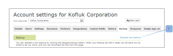

# で新しいデータバックアップをリクエスト [!DNL Workfront Proof]

>[!IMPORTANT]
>
>この記事では、スタンドアロン製品の機能について説明します [!DNL Workfront Proof]. 内部での検証に関する情報 [!DNL Adobe Workfront]を参照してください。 [校正](../../../review-and-approve-work/proofing/proofing.md).

校正データのバックアップをリクエストした後、新しいデータのバックアップを作成するようにリクエストできます。 データのバックアップの詳細については、 [バックアップ [!DNL Workfront Proof] データ](../../../workfront-proof/wp-work-proofsfiles/organize-your-work/back-up-data.md).

1. ウィンドウの右上隅で、 **[!UICONTROL 設定]**.
1. クリック **[!UICONTROL アカウント設定]** ドロップダウンメニューから、 **[!UICONTROL バックアップ]** タブをクリックします。

1. クリック **[!UICONTROL 新しいバックアップをリクエスト]**.
   
データは zip ファイルとして送信されます。
