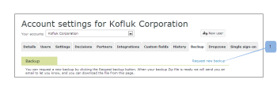

# [!DNL Workfront Proof] での新しいデータバックアップの要求

>[!IMPORTANT]
>
>この記事では、スタンドアロン製品の [!DNL Workfront Proof] の機能について説明します。 [!DNL Adobe Workfront] 内のプルーフについて詳しくは、[プルーフ](../../../review-and-approve-work/proofing/proofing.md)を参照してください。

プルーフデータのバックアップをリクエストした後、データの新しいバックアップを作成するように要求できます。 データのバックアップについて詳しくは、[&#x200B; [!DNL Workfront Proof] データのバックアップ](../../../workfront-proof/wp-work-proofsfiles/organize-your-work/back-up-data.md)を参照してください。

1. ウィンドウの右上隅で、「**[!UICONTROL 設定]**」をクリックします。
1. ドロップダウンメニューから「**[!UICONTROL アカウント設定]**」をクリックして、「**[!UICONTROL バックアップ]**」タブを開きます。

1. 「**[!UICONTROL 新しいバックアップを要求]**」をクリックします。
   
   データはzip ファイルとして送信されます。
