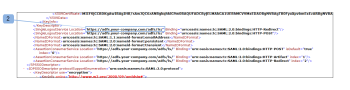

# [!DNL Workfront Proof] でのシングルサインオン：AD FS の設定

>[!IMPORTANT]
>
>この記事では、スタンドアロン製品 [!DNL Workfront Proof] の機能について説明します。[!DNL Adobe Workfront] 内でのプルーフについて詳しくは、[プルーフ](../../../review-and-approve-work/proofing/proofing.md)を参照してください。

AD サーバーの管理者は、AD FS をインストールして設定できます。

## AD FS のインストールと設定

1. [AD FS 2.0](http://www.microsoft.com/en-us/download/details.aspx?id=10909) をコンピューターにダウンロードします。
1. ダウンロードした AdfsSetup.exe ファイルを開き、ADFS（Active Directory フェデレーションサービス）インストールウィザードを起動します。
1. サーバーの役割画面で、オプションの 1 つを選択します（少なくともフェデレーションサーバーが必要です）。
1. AD サーバー上の IIS をインターネットに公開しない場合（HTTP と HTTPS のポート 80 と 443）、まず、ファイアウォールの背後にフェデレーションサーバーを設定し、次に、ファイアウォールを介してフェデレーションサーバーに要求を渡す 2 つ目のフェデレーションサーバープロキシを作成します。
1. AD FS の設定が完了したら、「**[!UICONTROL AD FS 2.0 管理スナップインを開始する]**」を選択し、次に「**[!UICONTROL 完了]**」をクリックします。これが完了したら、AD FS 2.0 管理ウィンドウがすぐに開きます。表示されない場合は、**[!UICONTROL 開始]**／**[!UICONTROL 管理ツール]**／**[!UICONTROL AD FS 2.0 管理]**&#x200B;から開くことができます。これは、メインの AD FS 制御アプリケーションです。

1. 「AD FS 2.0 フェデレーションサーバー設定ウィザード」をクリックして開始します。
これにより、AD FS を設定し、IIS 経由のインターネットと AD の両方に接続することができます。
1. 新しい AD FS サーバーを設定する場合は、「**[!UICONTROL 新しいフェデレーションサービ®スを作成]**」を選択します。
1. 「**[!UICONTROL スタンドアロンフェデレーションサーバー]**」を選択します（テストおよび評価の目的で使用）。

1. 高可用性と負荷分散を実現するには、「新しいフェデレーションサーバーファーム」をクリックします。
1. フェデレーションサービス名を指定します。
デフォルトでは、構成ウィザードは IIS のデフォルト web サイトにバインドされた SSL 証明書を取得し、そこで指定されたサブジェクト名を使用します。ワイルドカード証明書を使用する場合は、フェデレーションサービス名を入力する必要があります。
IIS で SSL 証明書が設定されていない場合、設定ウィザードはローカルコンピューターの証明書ストアで有効な証明書を検索します。これらは、SSL 証明書ドロップダウンに表示されます。証明書が見つからない場合は、IIS の Server Certificate Generator を使用して証明書を作成できます。

1. 設定を続行し、完了したら「**[!UICONTROL 閉じる]**」をクリックします。

## [!DNL Workfront Proof] シングルサインオンの設定

[!DNL Workfront Proof] 管理者の場合、[!DNL Workfront Proof] 側でシングルサインオンを設定できます。詳しくは、[ [!DNL Workfront Proof]](../../../workfront-proof/wp-acct-admin/managing-security/single-sign-on-overview.md) でのシングルサインオンを参照してください。

1. **[!UICONTROL 設定]**／**[!UICONTROL アカウント設定]**&#x200B;をクリックし、「**[!UICONTROL シングルサインオン]**」タブをクリックします。

1. **SSO URL** ボックスに、自分のエンティティ ID を貼り付けます。
エンティティ ID の例を次に示します。
http://*&lt;adfs.your-company.com>*/adfs/services/trust
エンティティ ID は、フェデレーションメタデータ XML ファイルにあります。
   

1. フェデレーションメタデータは、AD FS 2.0 スナップイン／サービス／エンドポイントフォルダーにあります。「メタデータ」セクションで、フェデレーションメタデータタイプのメタデータを探します。メタデータを表示するには、このエンドポイントをブラウザーに貼り付けます。次のリンクから直接アクセスすることもできます。https://*&lt;adfs.your-company.com>*/FederationMetadata/2007-06/FederationMetadata.xml。{adfs.your-company.com} を自身の内容に置き換えて追加します。
1. 「**[!UICONTROL ログイン URL]**」ボックスに、SSO ログインを貼り付けます。
1. SSO ログインの例を次に示します。
1. http://*&lt;adfs.your-company.com>*/adfs/ls
1. このリンクは、フェデレーションメタデータ XML ファイルにあります。
   

1. 「**[!UICONTROL ログアウト URL]**」ボックスにリンクを入力し、保存します。
ログアウト URL の例を次に示します。
https://*&lt;adfs.your-company.com>*/adfs/ls/?wa=wsignout1.0

   1. AD FS の管理／信頼関係／証明書利用者の信頼で、ProofHQ プロパティに移動します。
   1. エンドポイントの下で、次の詳細を入力し、「[!UICONTROL 追加]」をクリックします。

      * Endpoint Type = SAML Logout
      * Binding = POST
      * URL = https://*&lt;adfs.your-company.com*>/adfs/ls/?wa=wsignout1.0
      * この手順は、AD FS で証明書利用者の信頼（以下を参照）を構成した後に完了できます。
   1. 「**[!UICONTROL 証明書のフィンガープリント]**」ボックスに、証明書のデータを入力します。
   1. ADFS 2.0 スナップインに移動して、サービス／証明書／トークン署名に移動します。
   1. このエントリを右クリックして、証明書を表示します。
   1. 「[!UICONTROL 証明書の詳細]」タブで拇印をコピーし、それを「**[!UICONTROL Workfront Proof シングルサインオン]**」設定タブで貼り付けます。

   1. フィンガープリント文字はコロンやスペースで区切ることができますが、削除することをお勧めします。シングルサインオンの設定に問題がある場合は、カスタマーサポートチームにお問い合わせください。

## 証明書利用者の信頼を追加

設定が完了したら、AD FS の「証明書利用者の信頼」セクションで作業する必要があります。

1. **[!UICONTROL 信頼関係]**／**[!UICONTROL 証明書利用者の信頼]**&#x200B;フォルダーに移動し、「**[!UICONTROL 証明書利用者の信頼を追加]**」をクリックして、設定ウィザードを開始します。

1. データソースを選択します。
[!DNL ProofHQ] アカウントのすべてのメタデータは、次のようなリンクの下にあります。
https://`<yoursubdomain*>`.proofhq.com/saml/module.php/saml/sp/metadata.php/phq
これは、ほとんどの証明書利用者の信頼を設定します。

   >[!NOTE]
   >
   >* URL からの接続の確立で問題が発生した場合は、メタデータをファイルとして保存し、ファイルからデータを読み込むことを選択します。
   >* [!DNL ProofHQ] アカウントに完全なカスタムドメイン（www.your-proofing.com など）が設定されている場合は、「{yoursubdomain}.proofhq.com」の部分全体を独自のドメインに置き換えて、[!DNL ProofHQ] メタデータリンクを作成します。

## 要求ルールを設定

証明書利用者の信頼の設定が完了したら、要求ルールを設定して設定を完了する準備が整います。ProofHQ に対して 2 つの要求ルール（メールと名前 ID）を設定します。

1. **[!UICONTROL 要求ルールを編集]**&#x200B;ダイアログボックスを開きます。
1. 「**[!UICONTROL ProofHQ 証明書利用者の信頼]**」に移動し、「**[!UICONTROL 要求ルールを編集]**」をクリックします（1）。\
   信頼の設定の最後でこのオプションを選択した場合は、ポップアップが自動的に開きます。

1. 「**[!UICONTROL ルールを追加]**」（2）をクリックして、要求設定ウィンドウを開きます。

   * メール（LDAP 属性を要求ルールテンプレートとして送信）
   * 名前 ID（受信要求ルールテンプレートを変換）
