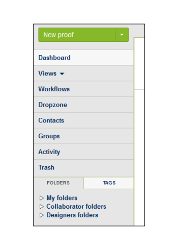
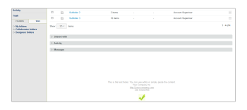
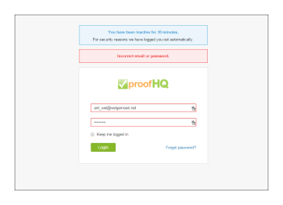

# ブランド化 [!DNL Workfront Proof] サイト — 詳細

>[!IMPORTANT]
>
>この記事では、スタンドアロン製品の機能について説明します [!DNL Workfront Proof]. 内部での検証に関する情報 [!DNL Adobe Workfront]を参照してください。 [校正](../../../review-and-approve-work/proofing/proofing.md).

アドバンスブランディングは、Select プランと Premium プランで利用でき、プランのコストに含まれます。

ログインページ、電子メール通知、配達確認など、基本的なブランディングについて詳しくは、 [ブランド化 [!DNL Workfront Proof] サイト](../../../workfront-proof/wp-acct-admin/branding/brand-wp-site.md).

アドバンスブランディングオプションには、次の領域のカスタマイズが含まれます。

* ヘッダーとテキストの色
* Web アプリケーションヘッダー
* メニューバーとテキストカラー
* ダッシュボードのようこそボックスとクイックスタートボックス
* フッターテキスト
* Favicon
* ページタイトル
* ヘルプリンク

以下の節では、高度なブランディングについて詳しく説明します。

## 高度なブランディングの概要

次の項目が見つかります。 [!UICONTROL ブランディング設定] 」セクション ( [アカウント設定](https://support.workfront.com/hc/en-us/sections/115000912147-Account-Settings) ページ。 アカウントに変更を適用するには、「ブランディング」オプションが [!UICONTROL 有効] (1)

アドバンスブランディングオプション (2 ～ 14) の設定方法の詳細については、以下の節を参照してください。

## 高度なブランディング設定

以下の領域でブランディングが可能です。 [!DNL Workfront Proof]:

* [Web アプリケーション](#web-application)
* [ヘッダー](#header)
* [ヘッダーリンク](#header-links)
* [サイドバー](#sidebar)
* [ウェルカムボックス](#welcome-box)
* [セクションヘッダー](#section-headers)

### Web アプリケーション {#web-application}

Web アプリケーションヘッダーに対して、次の 3 つのブランディングオプションから選択できます (2)。

* ヘッダーのブランディング画像
* ヘッダー内のアカウント名
* ブランディングを無効にした場合、 [!DNL Workfront Proof] ロゴは web アプリのヘッダーに残ります

ブランディング画像 — サイズが最大 550 x 90 px に変更されます。 JPG、GIF、PNG を使用でき、透明な背景がサポートされています。

アカウント名 — アカウントの詳細から取得され、白のフォントで表示されます。 アカウント名は 60 文字までです（スペースや句読点を含む）。

### ヘッダー {#header}

このフィールド (3) では、ヘッダーの背景を設定し、べた塗りまたは背景画像を選択できます。

色 — ここでは、カラースキーム設定の他のすべてのブランディングフィールドと同様に、任意の 16 進数カラー値を入力するか、便利なカラーピッカー（テキストフィールドをクリックするとポップアップが開きます）を使用できます。 ヘッダーのデフォルトの背景色は#232d2eです。

背景画像 — ブランディング画像と組み合わせることができます。

* 透明度が白の背景色が表示されるファイルには、JPG、GIF、または PNG を使用できます。
* ヘッダーの高さが 96px で、アップロードした画像は [!UICONTROL 繰り返しなし] オプション。
* 背景画像は左上に配置されます。

### ヘッダーリンク {#header-links}

このフィールド (4) では、アカウントの右上隅に表示されるヘッダーメニューで、リンクのユーザー名の色と色を変更できます。

### サイドバー {#sidebar}

メニューバー (5) とメニューフォント (6) の色を選択して、サイドバーをカスタマイズします

>[!NOTE]
>
>選択したメニューバーの色に定数の 16 進数値を追加すると、カーソルの色が自動的に調整されます。

「新しい配達確認」ボタンの色はカスタマイズできません。

### ウェルカムボックス {#welcome-box}

このフィールド (7) では、ダッシュボードページに表示されるようこそボックスの色を設定できます。

### セクションヘッダー {#section-headers}

これらのフィールドを使用すると、 [[!UICONTROL アカウント設定]](https://support.workfront.com/hc/en-us/sections/115000912147-Account-Settings) ページ。

**フッター**

ブランディング設定のこのフィールド (10) では、すべてのアカウントページの下部に表示されるフッターを作成できます。 組み込みの WYSIWYG エディターを使用することも、独自のデザインを貼り付けることもできます。

>[!NOTE]
>
>フッターのテキストエディターではHTMLを編集できませんが、コピーしたデザイン（すべてのリンクと画像を含む）を貼り付けることができます。

**Favicon とページのタイトル**

この [!DNL Workfront Proof] ページは、ブラウザーで独自の favicon 画像（.ICO ファイル）(11) およびページタイトル (12) を設定することで表示されます。これらは、すべてのアカウントページのブラウザーのタブ/ウィンドウヘッダーに表示されます。

>[!NOTE]
>
>お気に入りのアイコンは、 [!DNL Workfront Proof] アカウントで作成されたすべての配達確認のビューアウィンドウ。

**ヘルプリンク**

ユーザーやレビュー担当者が自分のコンテンツを参照できるように、独自のヘルプリンクをカスタマイズできます。 これを有効化するには、 [!UICONTROL ヘルプリンク] オプション (13) を選択し、次のフィールド (14) にリンクを追加します。 最大 4 つのリンクを設定でき、次のリンクを使用できます。

* 内 [!UICONTROL ヘッダー] メニュー [!UICONTROL ヘルプ] リンク
   

* 内 [!UICONTROL ヘルプ] パネル [!DNL Workfront Proof] [!UICONTROL 閲覧者] サイドバー
   

追加料金の場合、エンタープライズプランのお客様は、次の項目を完全にカスタマイズすることもできます。

* ランディングページを完全にカスタマイズする（ログインページ、ログアウトページ、パスワードを忘れたページなど）
* ドメインを完全にカスタマイズする

その他のブランディングオプションの詳細については、sales.team@workfront.comまでお問い合わせください。

<!--
<h2 data-mc-conditions="QuicksilverOrClassic.Draft mode">Custom Domains</h2>
-->

<!--

Our Select and Premium plans include the option to purchase a fully-branded domain. This means that you can customize your URL as well as all links included in notification emails.&nbsp;

-->

<!--

For more information, please see&nbsp;<a href="../../../workfront-proof/wp-acct-admin/branding/configure-branded-domain-in-wp.md" class="MCXref xref">Configure a branded domain in Workfront Proof</a>.

-->

<!--
<h2 data-mc-conditions="QuicksilverOrClassic.Draft mode">Custom Page Branding</h2>
-->

<!--

Custom branding of the Workfront Proof pages is a paid service and by default&nbsp;includes full customization of the following:

-->

<!--
  <li data-mc-conditions="QuicksilverOrClassic.Draft mode"><a href="https://app.proofhq.com/login">Log in/landing page</a> </li>
  -->

<!--
  <li data-mc-conditions="QuicksilverOrClassic.Draft mode"><a href="https://app.proofhq.com/logout">Logout page</a> </li>
  -->

<!--
  <li data-mc-conditions="QuicksilverOrClassic.Draft mode"><a href="https://app.proofhq.com/login/password">Forgot password page</a> </li>
  -->

<!--
<h3 data-mc-conditions="QuicksilverOrClassic.Draft mode">Design Elements</h3>
-->

<!--

Please create your design&nbsp;in&nbsp;a .PSD file with all the elements placed in the separate layers - this will allow us to prepare the scalable pages for you.

-->

<!--

There are no particular restrictions on the .PSD files, and the look and layout of the pages is completely up to you. However please make sure that the key elements are included in your design:

-->

<!--

<strong>Login Page</strong>    

-->

<!--

<strong>Logout page</strong>    

-->

<!--

<strong>Forgot password</strong>    

-->

<!--

<strong>Inactivity alert</strong>    

-->

<!--

<strong>Invalid email address</strong>    

-->

<!--

<strong>Inactivity and incorrect email address</strong>    

-->

<!--
<note type="note">
&nbsp;The separate designs for the alerts are not required. If you'd like us to leave the default style of the messages, as shown on the screencasts above, please let us know. The team will match the colors with your design.
</note>
-->

<!--

If you'd like to have placeholder text in the text fields, please include this in your designs.

-->

<!--
<note type="note">
The wording of the alerts cannot be changed as these are the system messages.
</note>
-->

<!--

<strong>2. Fonts</strong> 

-->

<!--

Please make sure that the text is not rasterized but kept as the text layers, unless you want the particular elements to be displayed as images on your landing pages.

-->

<!--

If you use custom fonts in your design, please make sure to include the following font files: EOT + .TTF + OTF + SVG + WOFF for support in all browsers.

-->

<!--
<note type="note">
&nbsp; You need to hold an appropriate license, which allows implementing your selected fonts on the web pages.
</note>
-->

<!--

If you use the standard and widely available fonts, the font files are not required. Please see the following lists for reference:

-->

<!--
  <li data-mc-conditions="QuicksilverOrClassic.Draft mode"><a href="http://www.w3schools.com/cssref/css_websafe_fonts.asp">Websafe fonts listed in the standard Font families</a> </li>
  -->

<!--
  <li data-mc-conditions="QuicksilverOrClassic.Draft mode"><a href="https://www.google.com/fonts">Open Source Google fonts</a> </li>
  -->

<!--

<strong>3. Screen resolution</strong> 

-->

<!--

We support 1024x768 screen resolution (1366x768 for wide screens) and upwards. However, for the landing pages designs we do recommend using higher resolution for the better results on the various screens. The best practice would be to determine what screen resolution is the most common on your users' machines and prepare a slightly bigger design.

-->

<!--

<strong>4. Browsers compatibility</strong> 

-->

<!--

The newer browsers generally don't require any custom code to display the pages properly. However, if your users have the older browser versions installed on their machines some code adjustments may be needed.

-->

<!--

By default we do prepare the pages compatible with the following browsers:

-->

<!--
  <li data-mc-conditions="QuicksilverOrClassic.Draft mode">Internet Explorer 9+</li>
  -->

<!--
  <li data-mc-conditions="QuicksilverOrClassic.Draft mode">Safari 6.x+</li>
  -->

<!--
  <li data-mc-conditions="QuicksilverOrClassic.Draft mode">Chrome 22+ *</li>
  -->

<!--
  <li data-mc-conditions="QuicksilverOrClassic.Draft mode">Firefox 15+ *</li>
  -->

<!--

* Preferred browsers 

-->

<!--
<note type="note"> Workfront Proof will not design your custom pages, the PSD files must be supplied by you, but if you have any questions, please contact our Support team.
</note>
-->
