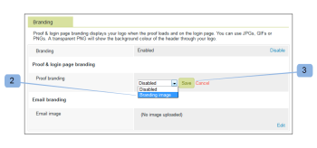

# [!DNL Workfront Proof] サイトをブランド化する

>[!IMPORTANT]
>
>この記事では、スタンドアロン製品である [!DNL Workfront] Proof の機能について説明します。[!DNL Adobe Workfront] 内でのプルーフについて詳しくは、[プルーフ](../../../review-and-approve-work/proofing/proofing.md)を参照してください。

[!DNL Workfront Proof] 管理者は、[!DNL Workfront Proof] アカウントをブランド化して、自分とユーザーにさらにカスタマイズされたエクスペリエンスを提供できます。

基本的なアカウントのブランド化は、追加費用なしですべてのプランで利用できます。

ヘッダー、メニューバー、ダッシュボードのブランド化など、高度なブランディングについて詳しくは、[ [!DNL Workfront Proof]  サイトのブランディング - 高度](../../../workfront-proof/wp-acct-admin/branding/brand-wp-site-advanced.md)を参照してください。高度なブランディングは、Select プランと Premium プランでのみ利用できます

[!DNL Workfront] Proof サイトの様々な側面をブランド化する方法については、次の節を参照してください。

## [!DNL Workfront Proof] ログインページでのブランディングの有効化

アカウントでブランディングを有効にするには、以下の手順を実行します。

1. [!DNL Workfront Proof] 管理者として [!DNL Workfront Proof] にログインします。
1. [!DNL Workfront Proof] インターフェイスの右上隅にある「**[!UICONTROL アカウント設定]**」をクリックします。

   設定できる様々なアカウント設定について詳しくは、[アカウント設定](https://support.workfront.com/hc/ja-jp/sections/115000912147-Account-settings)を参照してください。

1. 「**[!UICONTROL 設定]**」タブをクリックします。
1. 「**[!UICONTROL ブランディング]**」セクションで、「**[!UICONTROL 有効にする]**」をクリックします。（1）

   

   ブランディング画像がログインページに表示されます。

   >[!NOTE]
   >
   >メインの [!DNL Workfront] Proof ログイン URL 経由でアクセスした場合、ブランディングの画像はログインページに表示されません。例えば、`https://www.proofhq.com/login`。カスタムサブドメインまたは完全ブランディングドメインを使用してログインページにアクセスした場合にのみ表示されます。カスタムログインページにアクセスするには、ブラウザーにアカウントの URL を入力します。例：`http://<yoursubdomain>.proofhq.com.` <!--For more information about fully branded domains, see "Fully Branded Domains" in the article [Configure a branded domain in [!DNL Workfront Proof]](../../../workfront-proof/wp-acct-admin/branding/configure-branded-domain-in-wp.md).-->

   

## プルーフに対するブランディングの有効化

アカウントで作成されたすべてのプルーフの[!UICONTROL プルーフの読み込み]ページに独自のブランディング画像を追加するには、以下の手順を実行します。

1. [!DNL Workfront Proof] 管理者として [!DNL Workfront Proof] にログインします。
1. [!DNL Workfront Proof] インターフェイスの右上隅にある「**[!UICONTROL アカウント設定]**」をクリックします。

   設定できる様々なアカウント設定について詳しくは、[アカウント設定](https://support.workfront.com/hc/ja-jp/sections/115000912147-Account-settings)を参照してください。

1. 「**[!UICONTROL 設定]**」タブをクリックします。
1. 「**[!UICONTROL ブランディング]**」セクションで、「**[!UICONTROL プルーフのブランディング]**」の横にある「**[!UICONTROL 設定]**」をクリックします。（1）

   

1. ドロップダウンメニューから、「**[!UICONTROL ブランディング画像]**」を選択します。
「**[!UICONTROL 無効にする]**」を選択した場合、[!DNL Workfront Proof] ロゴがプルーフの読み込みページに表示されます

1. 「**[!UICONTROL 保存]**」をクリックします。（3）

   

1. 「**[!UICONTROL 編集]**」をクリックして、ブランディング画像を選択します（4）。

   JPG、GIF、または PNG を使用できます。透明度がサポートされています。推奨される画像サイズは 150 x 300 px です。ログインページとログアウトページの画像は、これらの寸法に合わせてサイズ変更されます。

   

1. アップロードする画像を選択します。（5）
1. 「**[!UICONTROL 保存]**」をクリックします。

   これで、自身のアカウントで作成されたすべてのプルーフのプルーフ読み込みページに、ブランディング画像が表示されます。

   

## ブランディングメール通知

レビュアーに送信されるメール通知に含めるブランディング画像を設定できます。この画像は、最大サイズである 90 x 550px にサイズ変更されます。

メールのブランディングを設定するには、次の手順を実行します。

1. [!DNL Workfront Proof] 管理者として [!DNL Workfront Proof] にログインします。
1. [!DNL Workfront Proof] インターフェイスの右上隅にある「**[!UICONTROL アカウント設定]**」をクリックします。

   設定できる様々なアカウント設定について詳しくは、[アカウント設定](https://support.workfront.com/hc/ja-jp/sections/115000912147-Account-settings)を参照してください。

1. 「**[!UICONTROL 設定]**」タブをクリックします。
1. 「**[!UICONTROL ブランディング]**」セクションで、メールアプリケーション画像の横にある「**[!UICONTROL 編集]**」をクリックします（1）。
   

1. メールのブランディングに使用する画像を選択します。（2）

   既にメールのブランディングが設定されていて、無効にする場合は、「**[!UICONTROL クリア]**」をクリックします。（4）

   

1. 「**[!UICONTROL 保存]**」をクリックします。

   これで、すべてのプルーフ通知メールに画像が表示されます。（3）

   

<!--
<h2 data-mc-conditions="QuicksilverOrClassic.Draft mode">Custom Sub-Domains</h2>
-->

<!--

You can add your brand name to your Workfront Proof account URL. For example, your URL might look like this:

-->

<!--

<strong>http://yoursubdomain.proofhq.com</strong> 

-->

<!--

This customization is also included in all your proof links, as well as in the 'From' email address for your proof notifications.

-->

<!--

For more information on how to set up a branded sub-domain, see <a href="../../../workfront-proof/wp-acct-admin/branding/configure-branded-domain-in-wp.md" class="MCXref xref">Configure a branded domain in Workfront Proof</a>

-->

## API を使用したボタンおよびリンクの抑制

[!DNL Workfront Proof] API を使用してプルーフを作成する場合に、ボタンやリンクを抑制し、独自のカスタムリンクを作成できます。

詳しくは、[[!DNL Workfront Proof] API](https://api.proofhq.com/) を参照してください。
