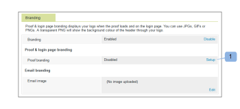

# ブランド化 [!DNL Workfront Proof] サイト

>[!IMPORTANT]
>
>この記事では、スタンドアロン製品の機能について説明します [!DNL Workfront] 配達確認。 内部での検証に関する情報 [!DNL Adobe Workfront]を参照してください。 [校正](../../../review-and-approve-work/proofing/proofing.md).

As a [!DNL Workfront Proof] 管理者は、 [!DNL Workfront Proof] アカウントを使用して、ユーザーとユーザーに対してよりカスタマイズされたエクスペリエンスを提供する。

基本的なアカウントのブランディングは、追加費用なしですべてのプランで利用できます。

ヘッダー、メニューバー、ダッシュボードのブランディングなど、高度なブランディングについて詳しくは、 [ブランド化 [!DNL Workfront Proof] サイト — 詳細](../../../workfront-proof/wp-acct-admin/branding/brand-wp-site-advanced.md). 高度なブランディングは、Select プランと Premium プランでのみ利用できます

以下の節で、 [!DNL Workfront] 配達確認サイト：

## でのブランディングの有効化 [!DNL Workfront Proof] ログインページ

アカウントでブランディングを有効にするには：

1. にログインします。 [!DNL Workfront Proof] として [!DNL Workfront Proof] 管理者。
1. クリック **[!UICONTROL アカウント設定]** の右上隅に [!DNL Workfront Proof] インターフェイス。

   設定できる様々なアカウント設定について詳しくは、 [アカウント設定。](https://support.workfront.com/hc/en-us/sections/115000912147-Account-Settings)

1. 次をクリック： **[!UICONTROL 設定]** タブをクリックします。
1. Adobe Analytics の **[!UICONTROL ブランディング]** セクションで、 **[!UICONTROL 有効にする]**. (1)

   

   ブランディング画像がログインページに表示されます。

   >[!NOTE]
   >
   >メインの [!DNL Workfront] 配達確認ログイン URL。 例： `https://www.proofhq.com/login`. カスタムサブドメインまたは完全ブランディングドメインを使用してログインページにアクセスした場合にのみ表示されます。 カスタムログインページにアクセスするには、ブラウザーにアカウントの URL を入力します。 例：`http://<yoursubdomain>.proofhq.com.`<!--For more information about fully branded domains, see "Fully Branded Domains" in the article [Configure a branded domain in [!DNL Workfront Proof]](../../../workfront-proof/wp-acct-admin/branding/configure-branded-domain-in-wp.md).-->

   

## 配達確認に対するブランディングの有効化

独自のブランディング画像を [!UICONTROL 配達確認の読み込み] アカウントで作成されたすべての配達確認のページ：

1. にログインします。 [!DNL Workfront Proof] として [!DNL Workfront Proof] 管理者。
1. クリック **[!UICONTROL アカウント設定]** の右上隅に [!DNL Workfront Proof] インターフェイス。

   設定できる様々なアカウント設定について詳しくは、 [アカウント設定。](https://support.workfront.com/hc/en-us/sections/115000912147-Account-Settings)

1. 次をクリック： **[!UICONTROL 設定]** タブをクリックします。
1. Adobe Analytics の **[!UICONTROL ブランディング]** セクションで、 **[!UICONTROL 設定]** 次の **[!UICONTROL 配達確認のブランディング]**. (1)

   

1. ドロップダウンメニューから、 **[!UICONTROL ブランディング画像]**.
次を選択した場合、 **[!UICONTROL 無効にする]**、 [!DNL Workfront Proof] ロゴが配達確認の読み込みページに表示されます

1. 「**[!UICONTROL 保存]**」をクリックします。(3)

   

1. クリック **[!UICONTROL 編集]** をクリックして、ブランディング画像を選択します (4)。

   JPG、GIFまたは PNG を使用できます。 透明度がサポートされています。 推奨される画像サイズは 150 x 300 px です。 ログインページとログアウトページの画像は、これらのサイズに合わせてサイズ変更されます。

   

1. アップロードする画像を選択します。 (5)
1. 「**[!UICONTROL 保存]**」をクリックします。

   これで、アカウントで作成されたすべての配達確認の配達確認読み込みページにブランディング画像が表示されます。

   

## ブランディングメール通知

レビュー担当者に送信される電子メール通知に含めるブランディング画像を設定できます。 この画像は、90 x 550px の最大サイズにサイズ変更されます。

電子メールのブランディングを設定するには：

1. にログインします。 [!DNL Workfront Proof] として [!DNL Workfront Proof] 管理者。
1. クリック **[!UICONTROL アカウント設定]** の右上隅に [!DNL Workfront Proof] インターフェイス。

   設定できる様々なアカウント設定について詳しくは、 [アカウント設定。](https://support.workfront.com/hc/en-us/sections/115000912147-Account-Settings)

1. 次をクリック： **[!UICONTROL 設定]** タブをクリックします。
1. Adobe Analytics の **[!UICONTROL ブランディング]** セクションで、 **[!UICONTROL 編集]** をクリックします (1)。
   

1. 電子メールのブランディングに使用する画像を選択します。 (2)

   既に電子メールのブランディングが設定されていて、無効にする場合は、「 **[!UICONTROL クリア]**. (4)

   

1. 「**[!UICONTROL 保存]**」をクリックします。

   すべての配達確認通知 E メールに画像が表示されるようになりました。 (3)

   

<!--
<h2 data-mc-conditions="QuicksilverOrClassic.Draft mode">Custom Sub-Domains</h2>
-->

<!--

You can add your brand name to your Workfront Proof account URL. For example, your URL might look like this:

-->

<!--

<strong>http://yoursubdomain.proofhq.com</strong> 

-->

<!--

This customization is also included in all your proof links, as well as in the 'From' email address for your proof notifications.

-->

<!--

For more information on how to set up a branded sub-domain, see <a href="../../../workfront-proof/wp-acct-admin/branding/configure-branded-domain-in-wp.md" class="MCXref xref">Configure a branded domain in Workfront Proof</a>

-->

## API を介したボタンおよびリンクの抑制

配達確認を [!DNL Workfront Proof] API を使用すると、ボタンやリンクを抑制し、独自のカスタムリンクを作成できます。

詳しくは、 [[!DNL Workfront Proof] API](https://api.proofhq.com/) を参照してください。
