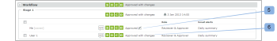

# [!DNL Workfront Proof] での電子サインに関する理解

>[!IMPORTANT]
>
>この記事では、スタンドアロン製品 [!DNL Workfront Proof] の機能について説明します。[!DNL Adobe Workfront] 内でのプルーフについて詳しくは、[プルーフ](../../../review-and-approve-work/proofing/proofing.md)を参照してください。

電子サインを使用すると、プルーフに関するセキュリティを強化し、ISO などの業界の標準規格に準拠できます。

この設定は、アカウントレベルで必須または必須以外に設定できます。デフォルトで必須の場合は、アカウントで作成されるすべてのプルーフで有効になり、プルーフレベルで無効にすることはできません。この設定がデフォルトで必須以外に設定されている場合は、それをプルーフレベルで有効／無効に切り替えることができます。

詳細情報は、以下を参照してください。

プルーフで電子サイン設定が有効になっている場合、電子サインボックスが表示され、プルーフに関する決定を行ったレビュアーに対して、メールとパスワードの入力を求めます。

## [!UICONTROL プルーフ詳細]ページの電子サイン

レビュアーが、[!UICONTROL プルーフ詳細]ページ（1）で決定を選択し決定を行ったら、[!UICONTROL 電子サイン]ポップアップボックスが表示され、詳細（2）を入力し、その決定（3）を確認するように求められます。

ポップアップにデフォルトメッセージセットが表示され（存在する場合）、レビュアーはメールとパスワードを入力する必要があります。

レビュアーがそのレベルから決定を行う場合は、[!UICONTROL 電子サイン]ポップアップがプルーフビューアや[!UICONTROL プルーフ詳細]ページでも表示されます。

「[!UICONTROL シングルサインオン]」オプションがプルーフで有効になっている場合、決定する際にメールとパスワード詳細は、[!UICONTROL 電子サイン]ポップアップで表示されません。

代わりに、このポップアップで「[!UICONTROL 確認]」（4）ボタンをクリックした後に、レビュアーは[!UICONTROL シングルサインオン]ページにリダイレクトされます。

SSO 資格情報を入力すると、レビュアーは自動的に[!UICONTROL プルーフ詳細]ページ（またはそこから決定を行う場合は[!UICONTROL プルーフビューア]）に戻るようリダイレクトされます。

>[!NOTE]
>
> 決定に電子サインが行われた場合は、**[!UICONTROL 署名アイコン]**（5）が[!UICONTROL プルーフ詳細]ページの「[!UICONTROL ワークフロー]」セクションの決定の横に表示されます。レビュアーではなく、プルーフの編集権限を持つ他のユーザーによって決定が変更された場合、そのユーザーは決定に電子サインを求められず、決定（6）の横に署名アイコンは表示されません。

シングルサインオンについては、[Workfront プルーフでのシングルサインオン](../../../workfront-proof/wp-acct-admin/managing-security/single-sign-on-overview.md)を参照してください。

プルーフの詳細ページについて詳しくは、[ [!DNL Workfront]  プルーフでプルーフを管理](../../../workfront-proof/wp-work-proofsfiles/manage-your-work/manage-proof-details.md)を参照してください。
