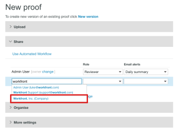

# [!DNL Workfront Proof] でパートナーと項目を共有

>[!IMPORTANT]
>
>この記事では、[!DNL Workfront Proof] スタンドアロン製品の機能について説明します。[!DNL Adobe Workfront] 内でのプルーフについて詳しくは、[プルーフ](../../../review-and-approve-work/proofing/proofing.md)を参照してください。

別の組織（クライアントや社内の他の部門など）と [!DNL Workfront Proof] パートナー関係がある場合は、プルーフ、ファイル、フォルダー、連絡先の詳細をパートナーと共有できます。パートナー関係について詳しくは、[Workfront Proof アカウント間のパートナー関係を管理](../../../workfront-proof/wp-acct-admin/partner-accounts/manage-partner-relationship-between-wp-accts.md)を参照してください。

## パートナーと項目を共有について

パートナーと項目を共有する際は、次の点を考慮してください。

* 新しいプルーフを作成する場合にのみ、パートナーアカウント内のユーザーをプルーフの所有者に選択できます。既存のプルーフまたは新しいバージョンのプルーフに対してこれを行うことはできません。
* 項目をパートナーと共有する場合、プルーフの編集権限をパートナーアカウントのスーパーバイザーおよび管理者に渡します。プルーフが作成されたアカウントのスーパーバイザーと管理者は、プルーフの編集権限を持ちません（プルーフの作成者を含む）。[!DNL Workfront] Proof の権限について詳しくは、[ [!DNL Workfront]  Proof のプルーフ権限プロファイル](../../../workfront-proof/wp-acct-admin/account-settings/proof-perm-profiles-in-wp.md)を参照してください。
* プルーフは、（プルーフが作成されたアカウントではなく）プルーフが所有されているアカウントに保存されます。
* プルーフのブランディングは、（プルーフが作成されたアカウントではなく）プルーフが所有されているアカウントから取得されます。

## パートナーと項目を共有

パートナーと良好な関係を築いたら、フォルダー、ファイル、プルーフなどの項目を簡単に共有できます。

1. プルーフまたはファイルの共有を開始します。\
   共有について詳しくは、[ [!DNL Workfront Proof]](../../../workfront-proof/wp-work-proofsfiles/share-proofs-and-files/share-proof.md) でプルーフを共有、[ [!DNL Workfront Proof]](../../../workfront-proof/wp-work-proofsfiles/share-proofs-and-files/share-files.md) でファイルを共有、および[ [!DNL Workfront Proof]](../../../workfront-proof/wp-work-proofsfiles/organize-your-work/share-folders.md) でフォルダーを共有を参照してください。

1. 「[!UICONTROL 新規プルーフ]」または「[!UICONTROL 新規ファイル]」ページの「**[!UICONTROL 共有]**」セクションで、システム内の別のユーザーと共有しているかのように、オートコンプリートフィールドに名前を入力し始めると、パートナーの名前が表示されます。\
   

## パートナーアカウント内のユーザーをプルーフ所有者にする

他の [!DNL Workfront Proof] アカウントとパートナー関係を設定している場合、パートナーアカウントからユーザーを選択してプルーフの所有者にすることができます。

>[!NOTE]
>
>次の条件が満たされた場合にのみ、パートナーアカウントからユーザーを選択できます。
>
>* カスタムフィールドがありません
>* フォルダーが選択されていません
>* タグが適用されていません
>

パートナーアカウント内のユーザーをプルーフの所有者にするには、次の手順を実行します。

1. [!UICONTROL 新しいプルーフ]ページで、**[!DNL Change]** リンクをクリックします。（1）\
   

1. パートナーアカウントからプルーフの所有者になるユーザーを選択します。（2）\
   
