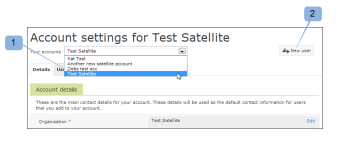

# [!DNL Workfront Proof] でサテライトアカウントを設定

>[!IMPORTANT]
>
>この記事では、[!DNL Workfront Proof] スタンドアロン製品の機能について説明します。[!DNL Adobe Workfront] 内でのプルーフについて詳しくは、[プルーフ](../../../review-and-approve-work/proofing/proofing.md)を参照してください。

サテライトアカウントとは、[!DNL Workfront Proof] アカウント内でお客様自身が設定および管理する有料アカウントです。詳しくは、[ [!DNL Workfront]  Proof のサテライトアカウント](../../../workfront-proof/wp-acct-admin/satellite-accounts/sat-accts-in-wp.md)を参照してください。

請求管理者なら誰でもサテライトアカウントを作成できます。請求管理者について詳しくは、[[!UICONTROL  [!DNL Workfront Proof]](../../../workfront-proof/wp-acct-admin/account-settings/proof-perm-profiles-in-wp.md) のプルーフ権限プロファイル]を参照してください。

>[!NOTE]
>
> サテライトアカウントは、[!UICONTROL 標準]以上のいずれかのプランで設定する必要があります。

## サテライトアカウントの作成 {#creating-a-satellite-account}

サテライトアカウントを作成するには：

1. [!UICONTROL 請求]ページに移動します。\
   請求ページについて詳しくは、[ [!DNL Workfront Proof] [!UICONTROL  の請求]ページ](../../../workfront-proof/wp-billingsettings/manage-your-billing/wp-billing-page.md)を参照してください。

1. 「**[!UICONTROL 新しいサテライト]**」アカウントボタンをクリックします。（1）

   ポップアップウィンドウが表示されます。

   

1. 関連するプロモーションコードを含む、クライアントの詳細を入力します。
1. 「**[!UICONTROL 保存]**」をクリックします。サテライトアカウントは、[!UICONTROL 請求]ページの上部にある[!UICONTROL アカウント]ドロップダウンメニュー内に自動的に表示されます。
1. ドロップダウンメニューから新しいサテライトアカウントを選択します。
1. [サテライトアカウントのプランの選択](#selecting-a-plan-for-your-satellite-account)を続行して、サテライトアカウントをアップグレードします。

## サテライトアカウントのプランの選択 {#selecting-a-plan-for-your-satellite-account}

[サテライトアカウントの作成](#creating-a-satellite-account)の説明に従ってサテライトアカウントを設定した後、目的のプランにアップグレードする必要があります。

1. [!UICONTROL 請求]ページに移動します。\
   請求ページについて詳しくは、[ [!DNL Workfront Proof] [!UICONTROL  の請求]ページ](../../../workfront-proof/wp-billingsettings/manage-your-billing/wp-billing-page.md)を参照してください。

1. ページ上部の&#x200B;**[!UICONTROL アカウント]**&#x200B;ドロップダウンメニュー（1）で、該当するサテライトアカウントを選択します。

   サテライトアカウントの請求ページが表示され、アカウントの請求連絡先の詳細が自動的に複製されます。

   

1. ページの右上にある「**[!UICONTROL プランの変更]**」ボタンをクリックします。（2）\
   または\
   現在のプラン名または次のプラン名をクリックして、ポップアップを開きます。(3)

1. プランをアップグレードまたはダウングレードします。

## サテライトアカウントへのユーザーの追加

サテライトアカウントを選択したプランにアップグレードした後、アカウントにユーザーを追加する必要があります。

1. [!DNL Workfront Proof] 管理者として [!DNL Workfront Proof] にログインします。
1. 「**[!UICONTROL アカウント設定]**」をクリックします。
1. ページ上部のドロップダウンメニューで、該当するサテライトアカウントを選択します。（1）\
   サテライトアカウントのアカウント設定ページが表示されます。
1. ページの右上にある「**[!UICONTROL 新規ユーザー]**」ボタンをクリックします。（2）\
   [!DNL New User]ページが表示されます。

1. ユーザーの詳細を入力し、「**[!UICONTROL 保存]**」をクリックします。\
   ユーザーに、アカウントへのアクセス権を付与するメール通知が送信されます。

サテライトアカウントに追加されたユーザーは、ハブアカウントの連絡先リストにメンバーとして表示されます。

同様に、ハブアカウントのユーザーは、サテライトアカウントの連絡先にメンバーとして表示されます。

サテライトアカウントのユーザー全員の完全なリストを表示するには、「**[!UICONTROL ユーザー]**」タブをクリックします。

## 既存の個別のアカウントとハブアカウントをリンク

以前にクライアント用に個別のアカウントを作成した場合は、これらをサテライトアカウントに変換できます。

アドビでは、この操作を実行するために、これらのアカウントを [!DNL Workfront Proof] アカウントにリンク（ハブアカウントに指定）します。

必要な操作は、以下の詳細をアドビに提供することだけです。

* 自分の [!DNL Workfront Proof] アカウントの名前と、その設定に使用したメールアドレス
* アカウントにリンクする個別のアカウントの名前と、個別のアカウントの設定に使用したメールアドレス。
